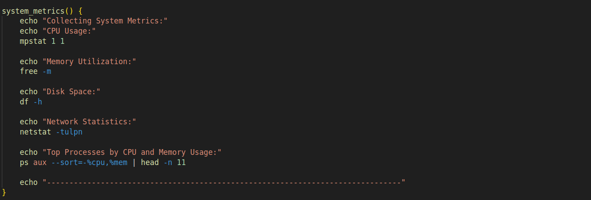

## Developing a shell script for sysops to automate system monitoring and generate detailed reports.
The script will leverage advanced Linux shell scripting techniques to monitor system metrics, capture logs, and provide actionable insights for system administrators.


#### 1. Script Initialization: 

* create the script file script.sh and give the execution permission as shown below
```
touch script.sh
chmod 744 script.sh
vim script.sh
```
* Initialize script with necessary variables and configurations.


* Validate required commands and utilities availability.


#### 2. System Metrics Collection:

* for monitoring CPU usage, memory utilization, disk space, and network statistics and also capturing top processes consuming resources with their process information by create below function



#### 3. Log Analysis:

* below function is to parse system logs (e.g., syslog) for critical events and errors and we generate summaries of recent log entries based on severity.


based on the severity in the SEVERITY array we created in the Initialise state we generate the logs and store it in the REPORT_FILE

#### 4. Health Checks:

* Checking the status of essential services (like Apache and MySQL) if the are installed and running and we are also verifing connectivity to external services and checking if mysql database is accessible.


#### 5. Alerting Mechanism:

* we create a function to check the usage of the CPU and Memory of the service and check if resources are above thresholds and triggering alerts. If alert is triggered then we send email notifications to sysadmins with critical alerts.


#### 6. User Interaction:
* Providing options for interactive mode to allow sysadmins to manually trigger checks or view specific metrics and ensuring that script is user-friendly with clear prompts and outputs.


#### 7. Report Generation:
* collecting all the data into a detailed REPORT_FILE. If script is not runned in interactive mode then it will generate report file of all the above steps with the timestamp


#### 8. Automation and Scheduling:
* Configuring the script to run periodically via cron for automated monitoring.<br>
> crontab -e <br>

* and schedule the cron job to run at minute 30 and provide the path to the script as shown below


* to verify the cronjob is placed run this command
> crontab -l <br>

