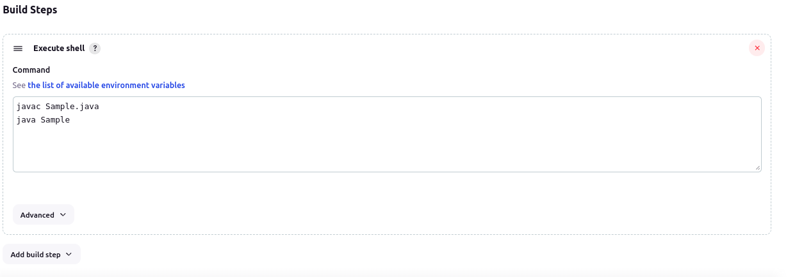
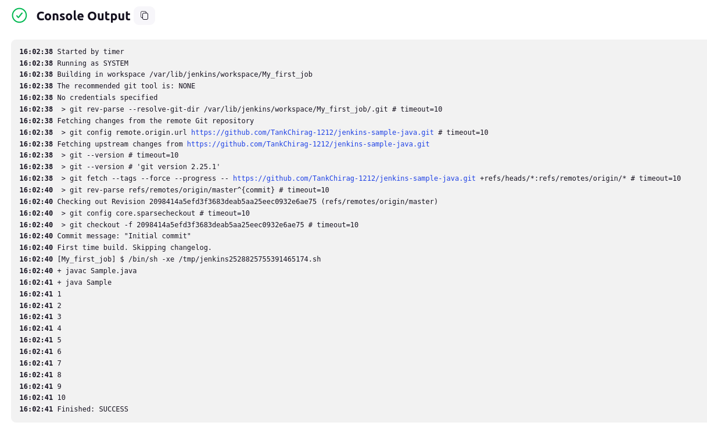

## Jenkins First Day

#### 1. Performing installation of Jenkins.

before installing jenkins we must install latest openJDK inside local machine.<br>


Now to install the latest version of jenkins add apt repository and perform installation using following commands.


**post installation jenkin will run on port 8080 on your localhost.** to access Jenkins open Browser and enter URL. http://localhost:8080/


now run the below command to get the initial Admin Password. The command will print the password at console.
```bash
sudo cat /var/lib/jenkins/secrets/initialAdminPassword
```

#### 2. Running a free style Job.

1. after installing the plugins and configuring the jenkins create a simple free style job shown below


2. add description for Project pipeline (its optional).


3. enter SCM details for fetching the code from the github and building code.
Note: choose correct branch name to be fetched and build from SCM.


4. we can use the build trigger to run the build after every 2 minutes by scheduling to run at every 5 minutes using below.


5. in build steps use the execute shell option and write the command to compile and run the Sample.java which is on the github repo we provided

    
    
6. after configing the sample_java_job run build command to build the job and all the logs can be seen in console output of the build #1



7. as we use the build trigger and scheduled the job tu build at every 2 minutes as shown below 
