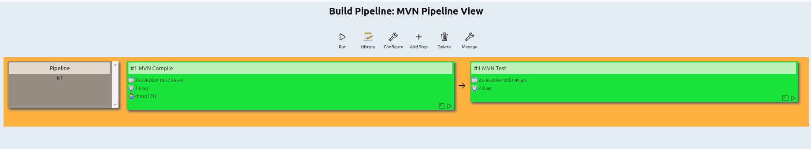

Jenkins Day 2
====================
on Day2 of jenkins training we learn about how to fetch the code from the private github repo and ` build & test ` the Java based code using the maven build tool. we also learned about the ` Build Pipeline plugin `, how it is used to create the custom view to see the flow of pipeline. we learned about pom.xml file how jenkins use it to automatically download the dependencies and required plugins written in it to build and test the java code automatically.

---------------

1. First we create new job for simply compiling the java code  

- 
---------------
2. Add description as required, its optional  

- 
---------------
3. we add our private github repo in the **source code management** section and as it is private we have to provide the credentials
and provide the correct branch from where jenkins have to fetch the code. Here it is master  

- 

`
if you have not created the github login cridentials in jenkins then add one as shown in below image
`
- 
---------------
4. In **Build Steps** select the option `Invoke top-level Maven target` and in that select the maven version and provide the goal that is compile in this case

- 
---------------
5. In **Post-Build Actions** select the `build other projects` option from the drop down list and enter project to build after this build is successful in this case its `MVN Test` and save the configuration of `MVN Compile` job

- 
---------------
6. Now we will create the `MVN Test` job by following the step from 1 to 4 and save the job.  
- **`
there is only 1 change in 4th step i.e. instead of compile use test. Here we don't have to provide the post-build actions
`**
---------------
7. Now before running the jobs we first create the `New View` at the Dashboard so that we can see the actual working of pipeline we created. Name the new view as `MVN Pipeline` and select the `Build Pipeline view` option and click create

- 
---------------
8. in pipeline flow step provide the initial job from where pipeline will start i.e. MVN Compile

- 
---------------
9. Change the `Display options` as required and click the **ok** button to create the view

- 
---------------
10. it will display this interface after creating MVN pipeline view. click the run button to start the pipeline

- 
---------------
11. after running the pipeline you will see output like this

- 
---------------