Jenkins Pipeline Project
=========================

## 1. Setting Up Jenkins job on the Jenkins:
+ Open the jenkins at http://localhost:8080/ click on New Item
    * 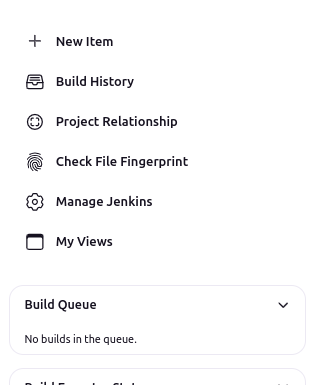

+ Then create the new pipeline job `First_Pipeline_project` and click **ok** as shown below
    * 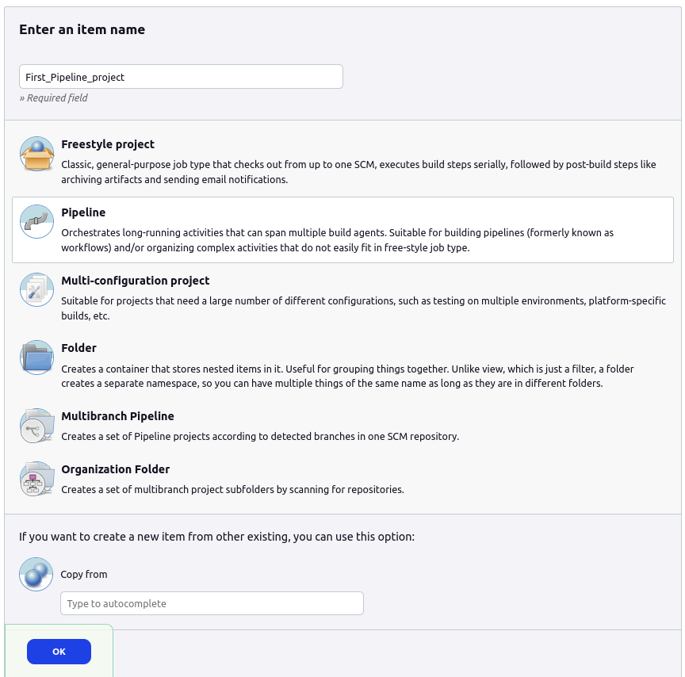
<br>

+ configure the project based on the need, provide the description if you need like given below
    * 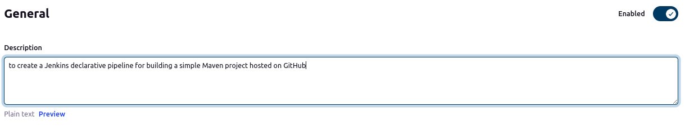
<br>
<br>

+ In the **`Pipeline Step`** select the `Pipeline script from SCM` option and in `SCM` option choosse Git. Now provide the project github repo and credentials if the repo is private (in this case my repo is private) and click Save to configure the project
    * 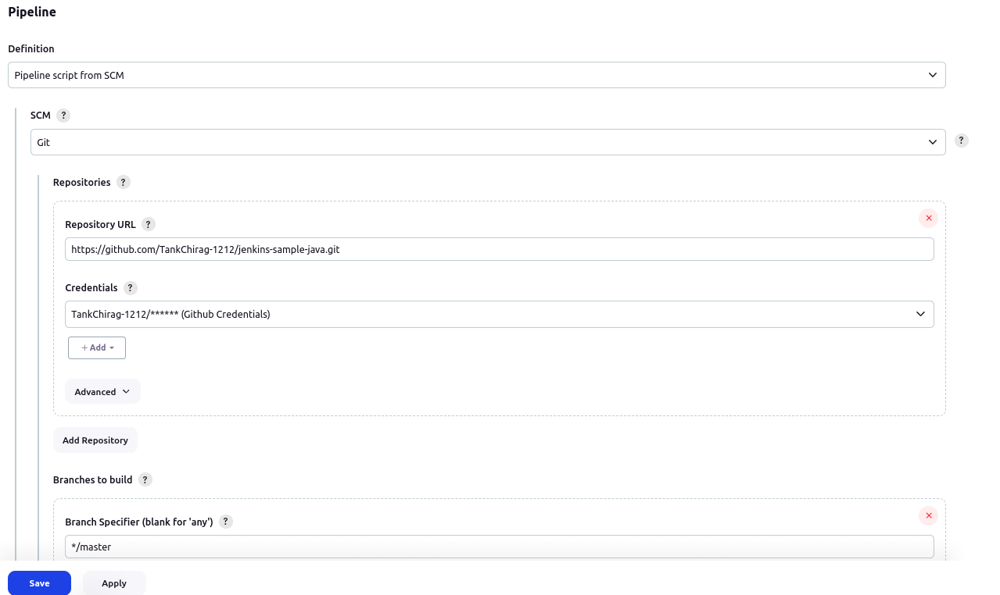

## 2. Writting a Jenkinsfile:
+ Writing a declarative pipeline script **Jenkinsfile** that includes the following stages:
    
    - **Clone Repository:** Clone the Maven project from the GitHub repository.
    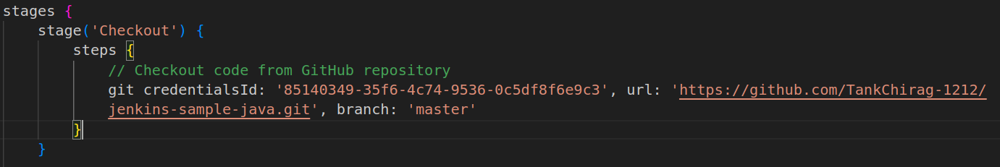

    - **Build:** Execute the Maven build process `(mvn build install)`, first create the env variable and provide it as parameter in Build stage
    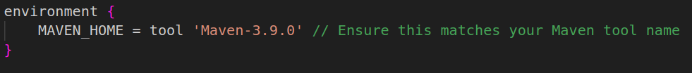
    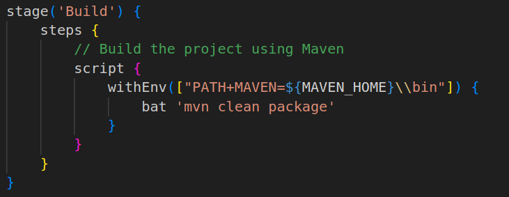    
    
    - **Test:** Run unit tests as part of the Maven build.<br>
    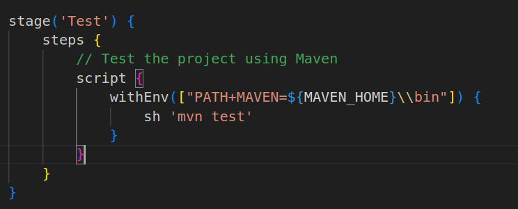

    - **Archive Artifacts:** Archive the build artifacts for future use.<br>
    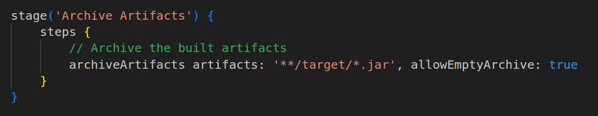
    
## 3. Building Project:
+ First commit and push the Jenkins file we created above in the project repo and it must in the root directory of the project
    ```bash
    git add Jenkinsfile
    git commit -m "adding jenkinsfile"
    git push origin master
    ```
+ Now go to the `First_Pipeline_project` and click on **Build Now** option to start the build
    - 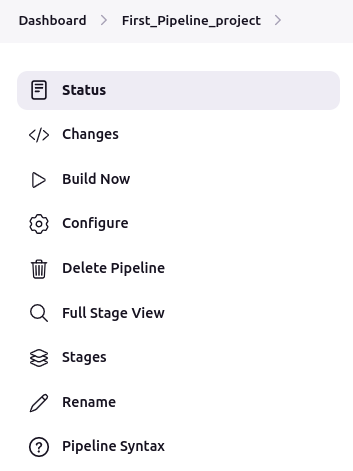
    <br>
    <br>
+ After complition of Build the dashboard will look like this. we can see the artificate `addressbook.war` above the Stage View
    - 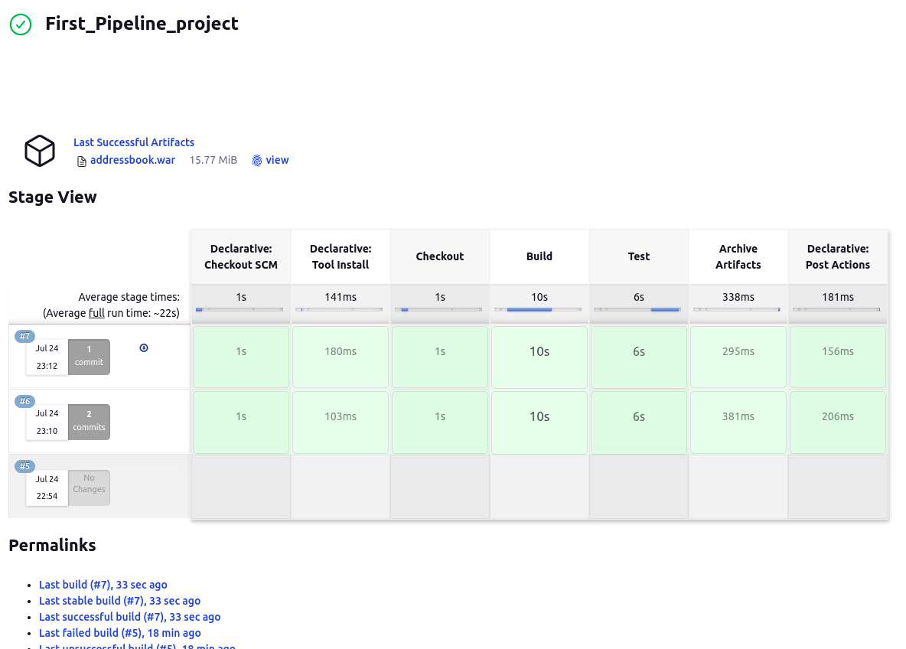