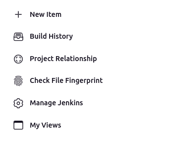
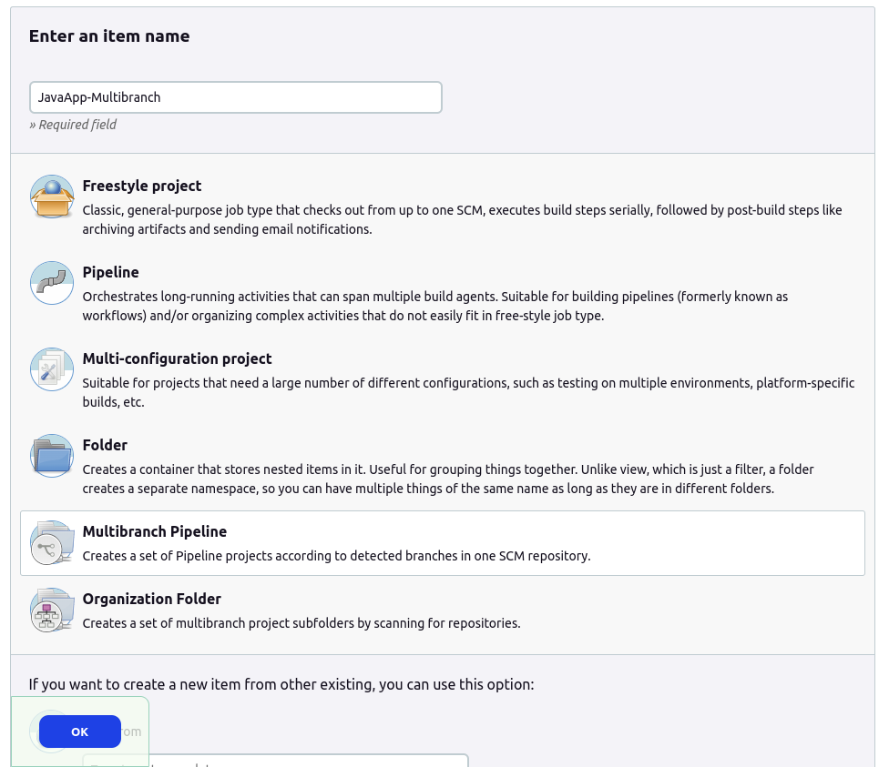
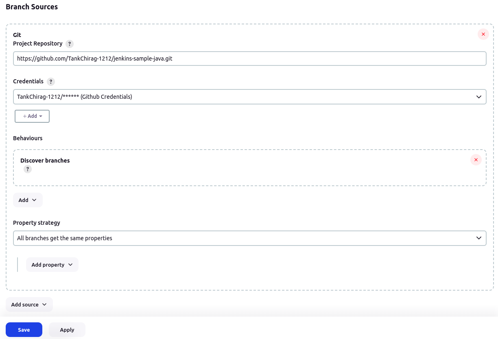
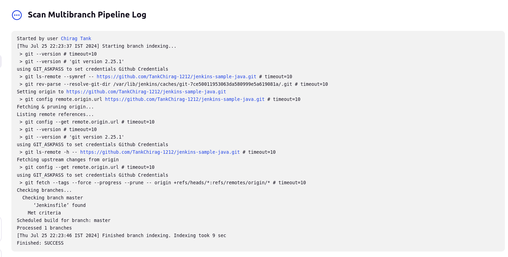
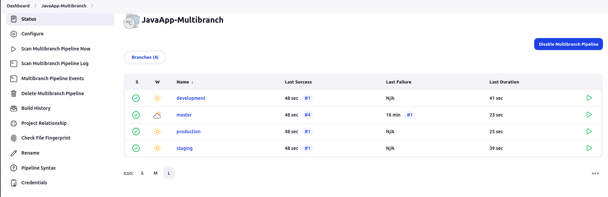
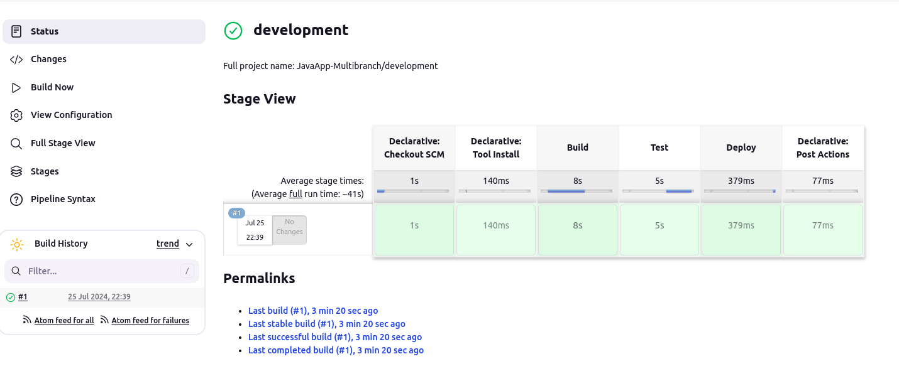

Jenkins Multi-Branch Project 
==============
                        
### 1. Creating Java Maven project:

+ In the folder named my-java-app, first create the **App.java** file under the path `src/main/java/com/example/` and enter the code given below
    ```
    package com.example;

    public class App {
        public static void main(String[] args) {
            System.out.println("Hello Maven!");
        }
    }
    ```

### 2. Git Repository:

+ create the git repository in the my-java-app for enabling the version-control follow the below steps to set do the initial commit
    ```
    git init
    git status
    git add src/main/java/com/example/App.java
    git commit -m "Initial commit: adding App.java file"
    ```

+ create the remote repository on the Github to push the code on remote repo, after creating remote repo follow below steps to push the code on remote repo
    ```
    git remote add origin https://github.com/TankChirag-1212/jenkins-sample-java.git
    git push -u origin master
    ```

### 3. POM.xml and Jenkins file:

+ create the **pom.xml** file in the remote directory of project i.e. `my-java-app/` and copy-paste the below code in it
    ```
    <?xml version="1.0" encoding="UTF-8"?>
    <project xmlns="http://maven.apache.org/POM/4.0.0" xmlns:xsi="http://www.w3.org/2001/XMLSchema-instance" xsi:schemaLocation="http://maven.apache.org/POM/4.0.0 http://maven.apache.org/POM/4.0.0/maven-4.0.0.xsd">
        <modelVersion>4.0.0</modelVersion>
        <groupId>com.example</groupId>
        <artifactId>my-java-app</artifactId>
        <version>1.0-SNAPSHOT</version>
        <properties>
            <maven.compiler.source>1.8</maven.compiler.source>
            <maven.compiler.target>1.8</maven.compiler.target>
        </properties>
    </project>
    ```

+ Similarly, create the **Jenkinsfile** in the same location as pom.xml file and copy-paste the following code
    ```
    pipeline {
        agent any
        tools {
            maven 'Maven_3.9.0'
        }
        stages {    
            stage('Build') {
                steps {
                    echo 'Building the Java application...'
                    sh "mvn clean install"
                }
            }
            stage('Test') {
                steps {
                    echo 'Running tests...'
                    sh "mvn test"
                }
            }
            stage('Deploy') {
                steps {
                    sh "echo 'Deploying App.java..'"
                    sh "cd src/main/java/com/example/"
                    sh "javac App.java"
                    sh "java App"
                }
            }
        }
        post {
            success {
                echo 'Build and test succeeded!'
            }
            failure {
                echo 'Build or test failed!'
            }
        }
    }
    ```

+ After saving the pom.xml and Jenkinsfile now push all the changes to the remote repo on the **master branch**

### 4. Creating Multi-branch:

+ First create the new **development** branch and after making same changes in the App.java commit and push the changes using the following steps
    ```
    git checkout -b development
    git add .                    # after making some changes in the App.java file
    git commit -m "Updated the App.java on dev branch"
    git push origin development
    ```
+ **Follow same process for the other 2 more Branches named Staging and Production**
+ So finally we will have 4 Branches **master, development, production and staging**

### 5. Creating MultiBranch Pipeline:

+ At the Dashboard select the New Item to create the new Jenkins project <br>


+ Select the **Multibranch Pipeline** and give the name of the project as **JavaApp-MultiBranch** then click on the `OK` button


+ Configure the Jenkins project as shown below and click on `Save`


+ After saving jenkins will start building the code by checking the github repo we provided and searches for all the other branches on the repo.


### 6. JavaApp-Multibranch Overview:
+ After scanning every branch on the provided github repo it will run every branch as an individual jenkins project as it will find the jenkins file in each branch and after completing it will look like this


+ In Each branch-jenkins project i.e. in development/staging/production we can check the logs and stage view of each job as shown below
