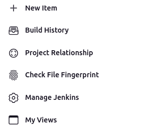
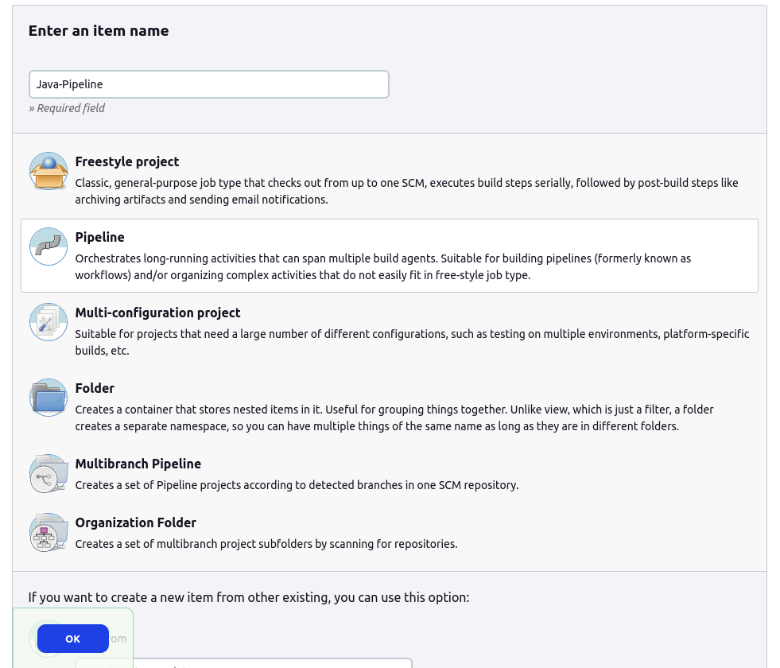
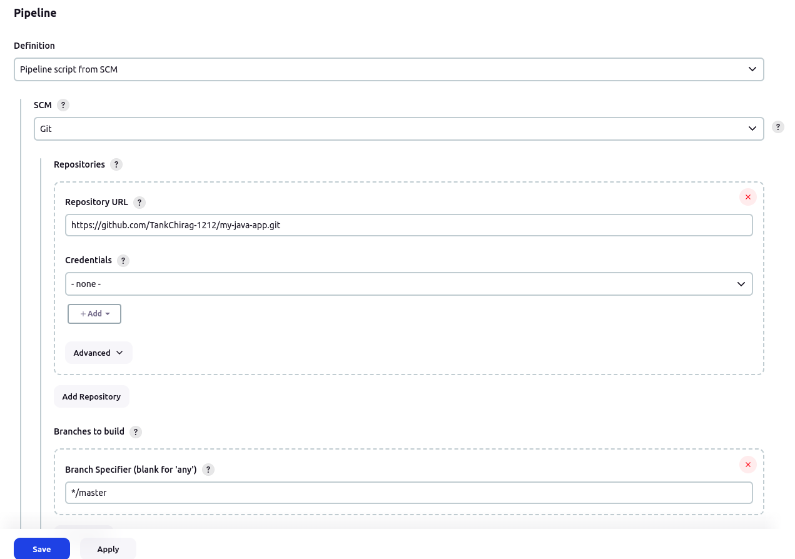
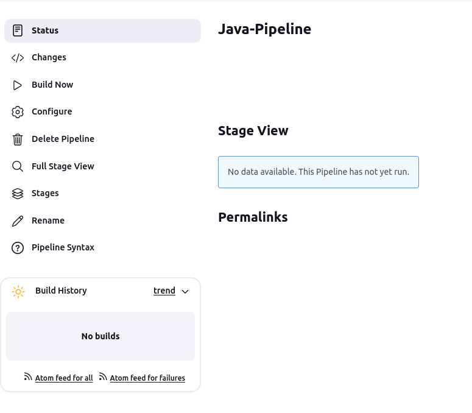
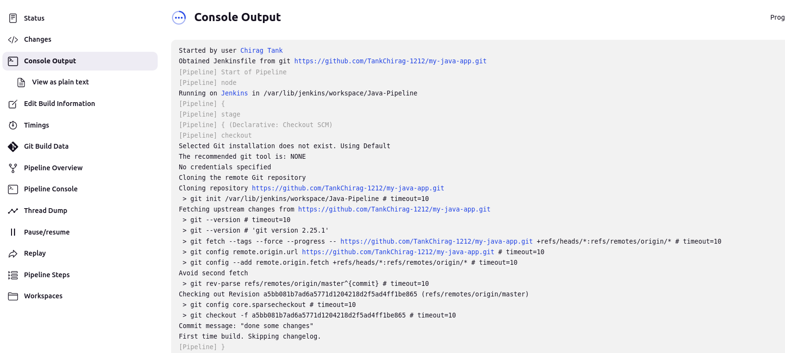
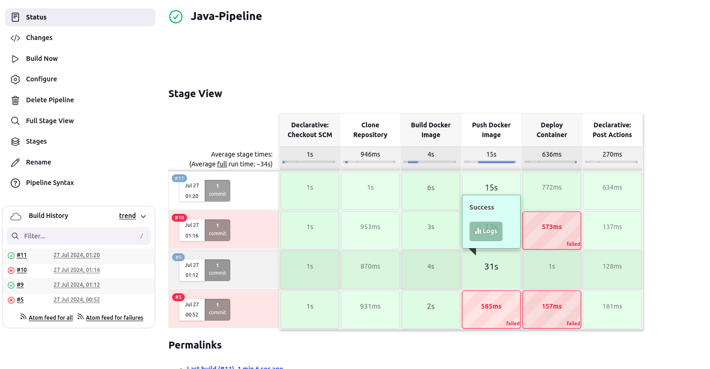

Jenkins Docker Project
===========

## Problem Statement:
+ You are tasked with setting up a CI/CD pipeline using Jenkins to streamline the deployment process of a simple Java application. The pipeline should accomplish the following tasks:
    1. **Fetch the Dockerfile:** The pipeline should clone a GitHub repository containing the source code of the Java application and a Dockerfile.
    2. **Create a Docker Image:** The pipeline should build a Docker image from the fetched Dockerfile.
    3. **Push the Docker Image:** The pipeline should push the created Docker image to a specified DockerHub repository.
    4. **Deploy the Container:** The pipeline should deploy a container using the pushed Docker image.

## Step 1: Create Git Repository: 
+ Create on folder with the project name `Docker-java-app` and create one **Sample.java, Dockerfile & Jenkinsfile** file use
```bash
mkdir Docker-java-app
cd Docker-java-app
touch Sample.java Dockerfile Jenkinsfile
```

+ Now initiate the git repo and push the repo to the github after commiting the above created files
```bash
git init
git add .
git commit -m "Initial commit: added Dockerfile, jenkinsfile and Sample.java file"
git remote add origin https://github.com/your-username/my-java-app.git
git push -u origin master
```
+ Open the Sample.java file and paste the below code which just prints the value from 1 to 10
```java
public class Sample {
    public static void main(String[] args) {

        for(int i=1; i<=10;i++){

            System.out.println(i);
        }

    }
}
```

## Step 2: Create Dockerfile and Jenkinsfile: 
+ Open the Dockerfile and paste the below lines of code in it. the below code simply used to build the image which then uses openjdk image as a base image then copy the Sample.java file at the `/usr/src/myapp` then goes to the Working Dir and compile and runs the Sample.java file 
```Dockerfile
FROM openjdk:11
COPY Sample.java /usr/src/myapp
WORKDIR /usr/src/myapp
RUN javac Sample.java
CMD ["java", "Sample"]
```

+ Now open the Jenkinsfile and paste the below code
```
pipeline {
    agent any
    environment {
        DOCKERHUB_CREDENTIALS = credentials('d784ec34-84a6-4363-8d99-5ac8be4a8df8')
        REPO_NAME = 'chirag1212/my_repo'
    }
    stages {
        stage('Clone Repository') {
            steps {
                git 'https://github.com/TankChirag-1212/my-java-app.git'
            }
        }
        stage('Build Docker Image') {
            steps {
                script {
                    dockerImage = docker.build("${env.REPO_NAME}")
                }
            }
        }
        stage('Push Docker Image') {
            steps {
                script {
                    docker.withRegistry('DOCKERHUB_CREDENTIALS') {
                        // dockerImage.push("${env.BUILD_NUMBER}")
                        dockerImage.push('latest')
                    }
                }
            }
        }
        stage('Deploy Container') {
            steps {
                script {
                    sh """
                    docker run -d --name java-container \
                    ${env.REPO_NAME}:latest
                    """
                }
            }
        }
    }
    post {
        success {
            echo 'Build and test succeeded!'
        }
        failure {
            echo 'Build or test failed!'
        }
    }
}
```

+ Now push the Changes to the Github repo after commiting the changes locally
```bash
git commit -am "changing the Dockerfile and Jenkinsfile"
git push origin master
```

## Step 3: Create Jenkins Project:
+ **Pre-Requisites:**
    - Install Docker Pipeline Plugin
    - Add DockerHub Credentials in Jenkins Credentials

+ Go to Jenkins dashboard and click on "New Item" <br>


+ Create new pipeline job and give the name `Java-Pipeline` and click on OK


+ Now provide the github repo under the Pipeline Section and choose SCM as git while configuring the Java-Pipeline job and provide the credentials if repo is private then click on `SAVE`


## Step 4: Build Project:
+ After configuring the Java-Pipeline job click on `Build Now` to run the build


+ In the console Output of '#1' build we will be able to see the logs


+ After successfully building the Job the dashboard will look like this
