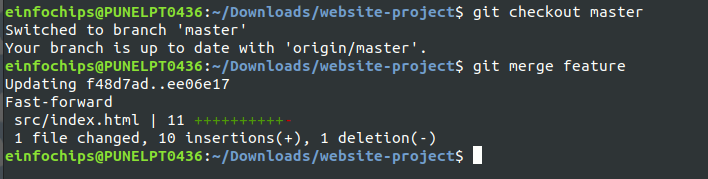

Project Problem Statement
========

A development team needs to establish a basic CI/CD pipeline for a web application. The goal is to automate version control, containerization, building, testing, and deployment processes.

-----------------
**Deliverables**
1. Git Repository:
- Create a Git repository: Initialize a new repository for the web application.
<br>
- Branching Strategy:
Set up main and developer branches.<br>

Create a feature branch for a new feature or bug fix.<br>
<br>
<br>

- Add Configuration Files:
Create a .gitignore file to exclude files like logs, temporary files, etc.
Create a README.md file with a project description, setup instructions, and contribution guidelines.<br>
<br>
<br>
<br>

2. Docker Configuration:
- Dockerfile:
Write a Dockerfile to define how to build the Docker image for the web application.<br>


- Docker Ignore File:
Create a .dockerignore file to exclude files and directories from the Docker build context.<br>


- Image Management:
Build a Docker image using the Dockerfile.

Push the built Docker image to a container registry (e.g., Docker Hub).


3. Jenkins Configuration:
- Jenkins Job Setup:
Create a Jenkins job to pull code from the Git repository.
<br>


Configure Jenkins to build the Docker image using the Dockerfile.
```
pipeline {
    agent any
    environment {
        DOCKERHUB_CREDENTIALS = 'd784ec34-84a6-4363-8d99-5ac8be4a8df8'
        REPO_NAME = 'chirag1212/nginx_webapp'
    }
    stages {
        stage('Clone Repository') {
            steps {
                git 'https://github.com/TankChirag-1212/website-project.git'
            }
        }
        stage('Build Docker Image') {
            steps {
                script {
                    dockerImage = docker.build("${env.REPO_NAME}:v2.0")
                }
            }
        }
    }
}
```
Set up Jenkins to run tests on the Docker image.
Configure Jenkins to push the Docker image to the container registry after a successful build.
```
stages{
    stage('Push Docker Image') {
        steps {
            script {
                docker.withRegistry('', DOCKERHUB_CREDENTIALS) {
                    // dockerImage.push("${env.BUILD_NUMBER}")
                    dockerImage.push('v2.0')
                }
            }
        }
    }
    stage('Deploy Container') {
        steps {
            script {
                sh """
                docker run -itd --name nginx-webapp-container \
                ${env.REPO_NAME}:v2.0
                """
            }
        }
    }
}
post {
    success {
        echo 'Build and test succeeded!'
        script{
            sh """
            docker rm --force nginx-webapp-container
            """
        }
    }
    failure {
        echo 'Build or test failed!'
    }
}
```

- Jenkins Pipeline:
Create a Jenkinsfile to define the CI/CD pipeline stages, including build, test, and deploy.<br>


4. Ansible Playbook:
- Basic Playbook Creation:
Develop an Ansible playbook to automate the deployment of the Docker container.
```yml
- hosts: all
  become: true
  vars:
    container_count: 2
    container_name: docker-container
    container_image: nginx
    container_command: sleep 1d

  tasks:
    - name: Pull default Docker image
      community.docker.docker_image:
        name: "{{ container_image | default('ubuntu') }}"
        source: pull

    - name: Create default containers
      community.docker.docker_container:
        name: "{{ container_name | default('container') }}{{ item }}"
        image: "{{ container_image | default('ubuntu') }}"
        command: "{{  container_command | default('sleep 2') }}"
        state: present
      with_sequence: count={{ container_count }}
```
- Playbook Tasks:
Install Docker on the target server (if Docker is not already installed).
Pull the Docker image from the container registry.
Run the Docker container with the required configurations.
```yml
---
- hosts: all
  become: true

  tasks:
    - name: Install aptitude
      apt:
        name: aptitude
        state: latest
        update_cache: true

    - name: Install required system packages
      apt:
        pkg:
          - apt-transport-https
          - ca-certificates
          - curl
          - software-properties-common
          - python3-pip
          - virtualenv
          - python3-setuptools
        state: latest
        update_cache: true

    - name: Add Docker GPG apt Key
      apt_key:
        url: https://download.docker.com/linux/ubuntu/gpg
        state: present

    - name: Add Docker Repository
      apt_repository:
        repo: deb https://download.docker.com/linux/ubuntu focal stable
        state: present

    - name: Update apt and install docker-ce
      apt:
        name: docker-ce
        state: latest
        update_cache: true

    - name: Install Docker Module for Python
      pip:
        name: docker
```
- Inventory File:
Create an inventory file specifying the target server(s) for deployment.
```ini
[target]
managed1
managed2
```
