Project 1: Deploying Ansible
===========

Problem Statement: You are tasked with deploying Ansible in a multi-node environment consisting of multiple Linux servers. The goal is to set up Ansible on a control node and configure it to manage several managed nodes. This setup will be used for automating system administration tasks across the network.<br>

**Control Node Setup:**<br>
- Install Ansible on the control node.
    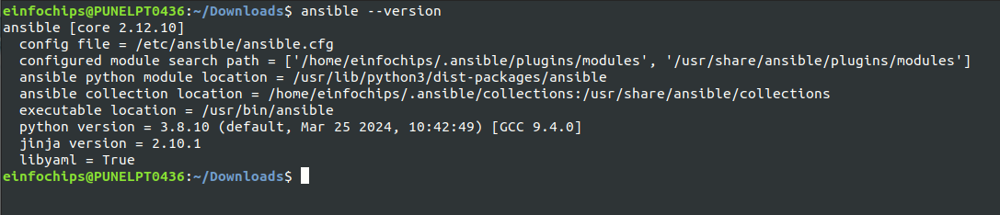<br>
- Configure SSH key-based authentication between the control node and managed nodes.<br>
    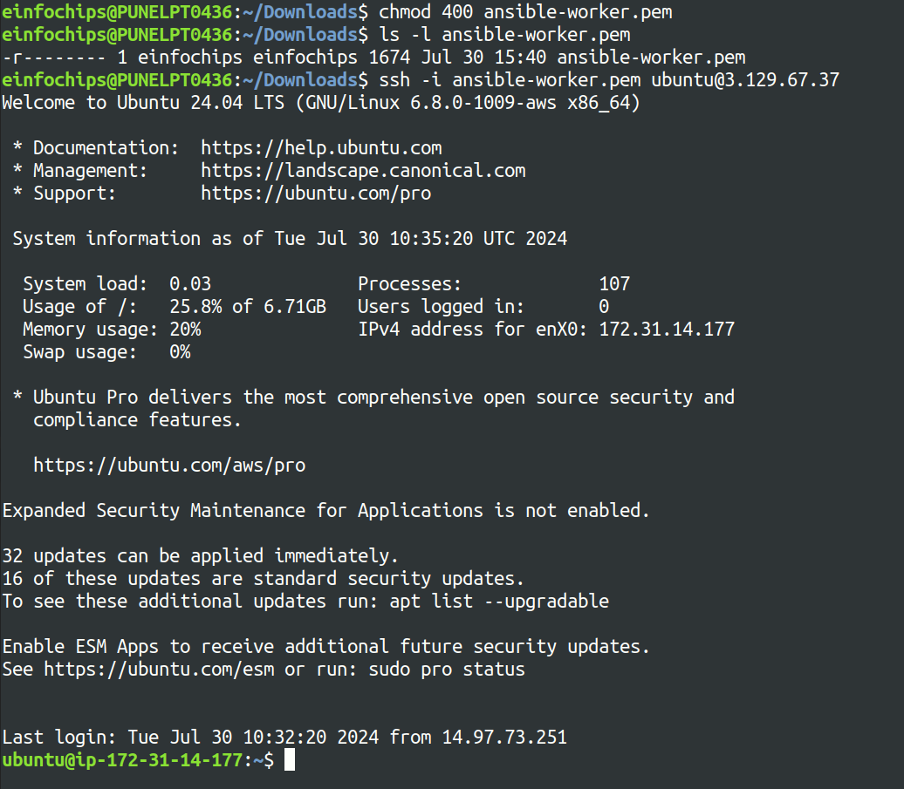

**Managed Nodes Configuration:**<br>
- Ensure all managed nodes are properly configured to be controlled by Ansible.
- Verify connectivity and proper setup between the control node and managed nodes.
    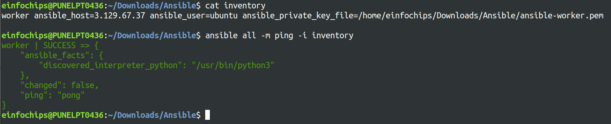<br>

**Documentation:**<br>
- Detailed installation and configuration steps.
- Troubleshooting guide for common issues encountered during deployment.

Project 2: Ad-Hoc Ansible Commands
=========

Problem Statement: Your organization needs to perform frequent, one-off administrative tasks across a fleet of servers. These tasks include checking disk usage, restarting services, and updating packages. You are required to use Ansible ad-hoc commands to accomplish these tasks efficiently.<br>

**Task Execution:**<br>
- Installed nginx service on all the managed nodes<br>
    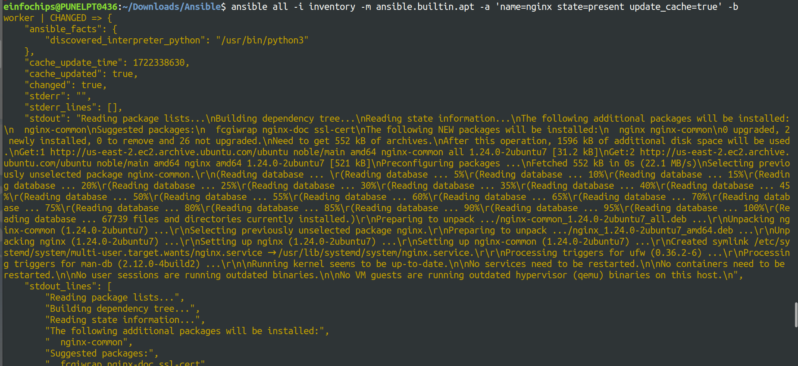
- Execute commands to check disk usage across all managed nodes.<br>
    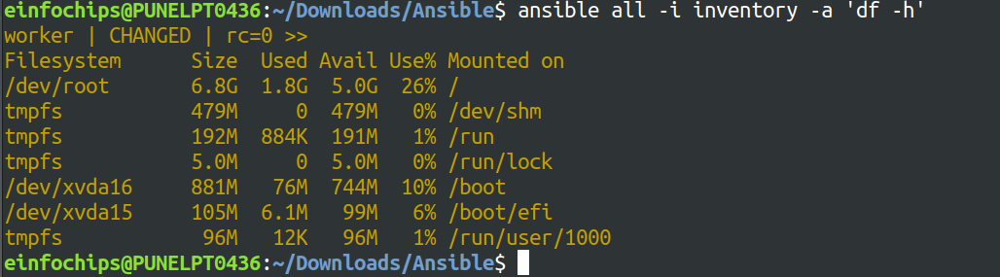
- Restart a specific service on all managed nodes.<br>
    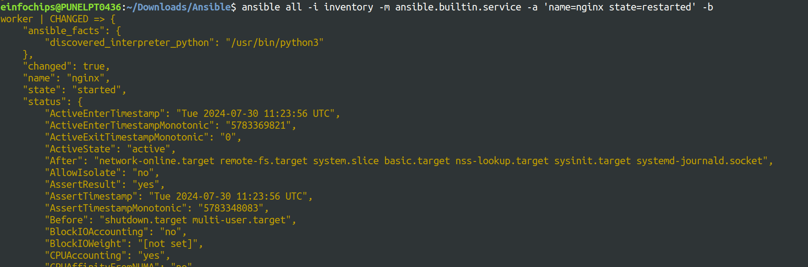
- Update all packages on a subset of managed nodes.<br>
    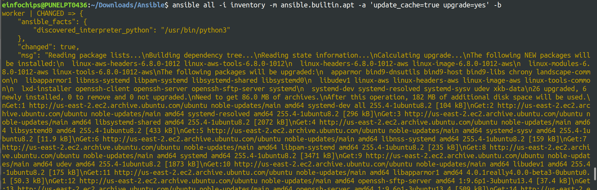

**Documentation:**<br>
- Provide a comprehensive guide on using Ansible ad-hoc commands.
- Include examples of common administrative tasks that can be performed with ad-hoc commands.


Project 3: Working with Ansible Inventories
===========

Problem Statement: You need to manage a dynamic and diverse set of servers, which requires an organized and flexible inventory system. The project involves creating static and dynamic inventories in Ansible to categorize servers based on different attributes such as environment (development, staging, production) and roles (web servers, database servers).<br>

**Static Inventory:**<br>
- Create a static inventory file with different groups for various environments and roles.<br>
    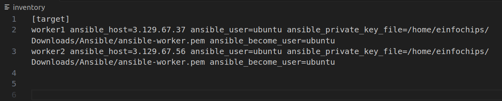
- Verify that the inventory is correctly structured and accessible by Ansible.<br>
    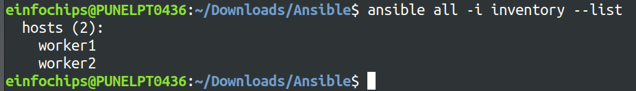<br>

**Dynamic Inventory:**<br>
- Implement a dynamic inventory script or use a dynamic inventory plugin.
- Configure the dynamic inventory to categorize servers automatically based on predefined criteria.<br>
    
**Documentation:**<br>
- Instructions for setting up and using static and dynamic inventories.
- Examples of playbooks utilizing both types of inventories.
<br>

Project 4: Ansible Playbooks: The Basics
===========

Problem Statement: Your team needs to automate repetitive tasks such as installing packages, configuring services, and managing files on multiple servers. The project involves writing basic Ansible playbooks to automate these tasks, ensuring consistency and efficiency in the operations.<br>

**Playbook Creation:**<br>
- Write a playbook to install a specific package on all managed nodes.<br>
```yml
- name: Installing apache2 server
  hosts: target
  become: yes
  tasks:
    - name: Update apt cache
      apt:
        update_cache: yes

    - name: Install Apache2
      apt:
        name: apache2
        state: present
```
- Create a playbook to configure a service with specific parameters.
```yml
- hosts: target
  name: Configure Apache2 service
  become: yes
  tasks:
    - name: Ensure Apache2 is running and enabled on boot
      service:
        name: apache2
        state: started
        enabled: yes
 
    - name: Customising configuration for Apache2
      copy:
        dest: /etc/apache2/sites-available/000-default.conf
        content: |
          <VirtualHost *:80>
              ServerAdmin webmaster@localhost
              DocumentRoot /var/www/html
              ErrorLog ${APACHE_LOG_DIR}/error.log
              CustomLog ${APACHE_LOG_DIR}/access.log combined
              # Custom configuration here
              LogLevel info
          </VirtualHost>
 
    - name: Reloading Apache2
      service:
        name: apache2
        state: reloaded
```
- Develop a playbook to manage files, such as creating, deleting, and modifying files on managed nodes.
```yml
- hosts: target
  name: Managing files on managed nodes
  become: yes
  tasks:
    - name: Create file if not present
      ansible.builtin.file:
        path: /home/ubuntu/file.txt
        state: touch
 
    - name: Create file with content
      ansible.builtin.copy:
        dest: /home/ubuntu/file_with_content.txt
        content: "This is the content of the file.\n"
 
    - name: Delete a file
      ansible.builtin.file:
        path: /home/ubuntu/abc.txt
        state: absent
 
    - name: Modify a file
      ansible.builtin.lineinfile:
        path: /home/ubuntu/file_with_content.txt
        line: "New line to be added to the file."
 
    - name: Ensure a directory is present
      ansible.builtin.file:
        path: /home/ubuntu/.ssh
        state: directory
 
    - name: Delete a directory
      ansible.builtin.file:
        path: /home/ubuntu/abc
        state: absent
```
**Testing and Verification:**
- Test the playbooks to ensure they run successfully and perform the intended tasks.<br>
- Validate the changes made by the playbooks on the managed nodes.<br>
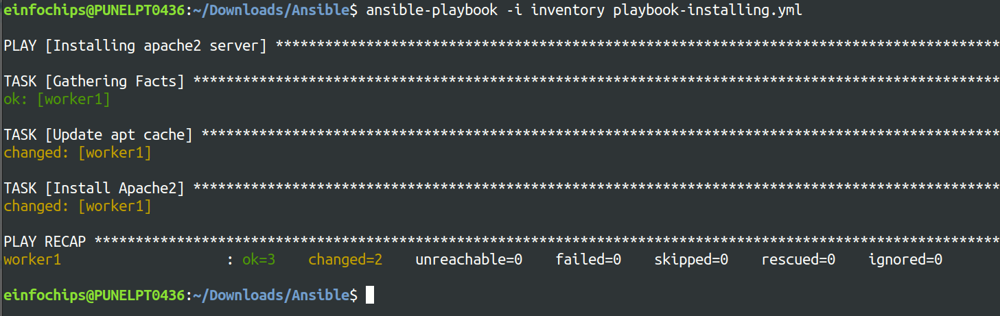<br>
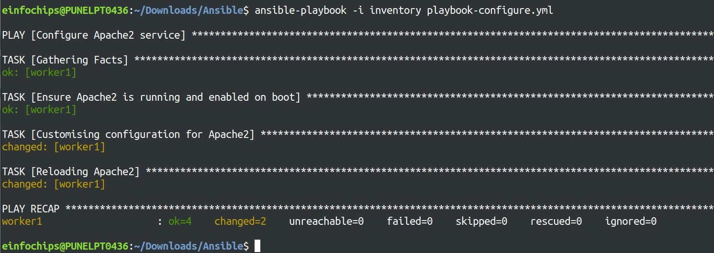<br>
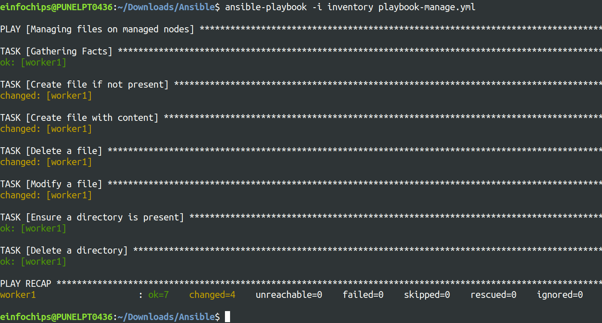

**Documentation:**
- Detailed explanation of each playbook, including the tasks and modules used.
- Guide on how to run the playbooks and interpret the results.<br>

Project 5: Ansible Playbooks - Error Handling
===========

Problem Statement: In a complex IT environment, tasks automated by Ansible playbooks may encounter errors due to various reasons such as incorrect configurations, unavailable resources, or network issues. The project focuses on implementing error handling in Ansible playbooks to ensure resilience and proper reporting of issues.<br>

**Playbook with Error Handling:**<br>
- Write a playbook that includes tasks likely to fail, such as starting a non-existent service or accessing a non-existent file.
- Implement error handling strategies using modules like block, rescue, and always.<br>
```yml
- hosts: target
  become: yes
  tasks:
    - block:
        - name: Restarting the my service with error handle
          service:
            name: myservice
            state: started
          # ignore_errors: yes
          register: result_srv

      rescue:
        - name: msg if service is fail to start
          debug:
            msg: "Failed to start the myservice. Reason: {{ result_srv.msg }} "
      
      always:
        - name: Print successful status
          debug:
            msg: "Task {{ 'failed' if result_srv.failed else 'succeeded' }}."

    - block:
        - name: modify file with error handle
          lineinfile:
            path: /home/ubuntu/temp/file_with_content.txt
            line: "New line to be added to the file"
          # ignore_errors: yes
          register: result_file

      rescue:
        - name: msg if add line fail
          debug:
            msg: "Failed to modify the file. Directory does not exit"

      always:
        - name: Print successful status
          debug:
            msg: "Task {{ 'failed' if result_file.rc != 0 else 'succeeded' }}."
```

**Logging and Notifications:**
- Configure the playbook to log errors and notify administrators of any issues encountered during execution.
- Use Ansible modules to send notifications via email or other communication channels.<br>
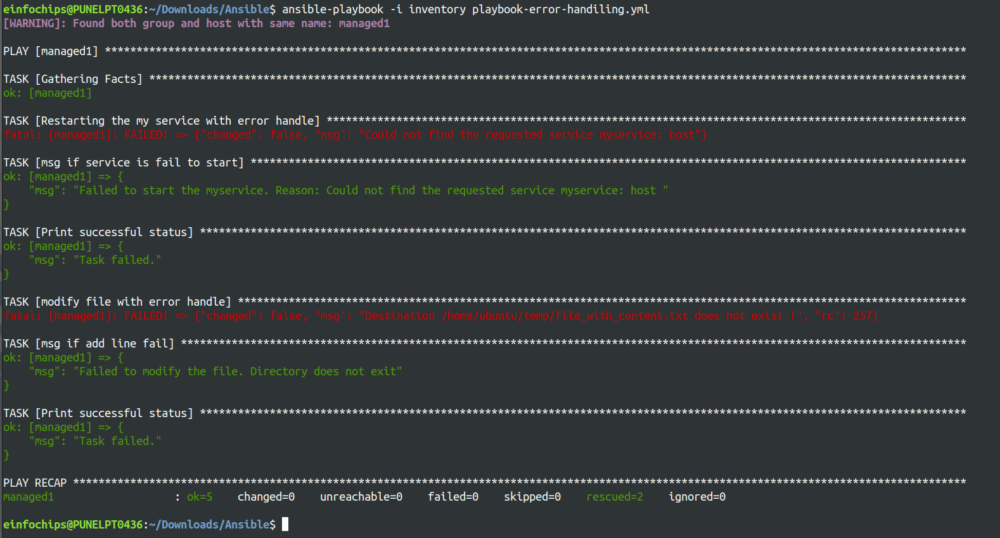

**Documentation:**
- Comprehensive guide on error handling in Ansible playbooks, including examples of common scenarios and solutions.
- Detailed instructions on setting up logging and notifications for error handling.
