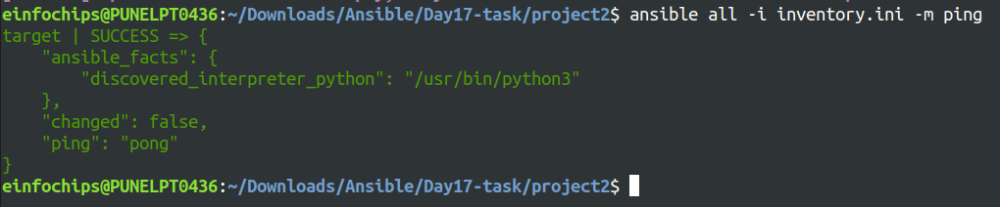
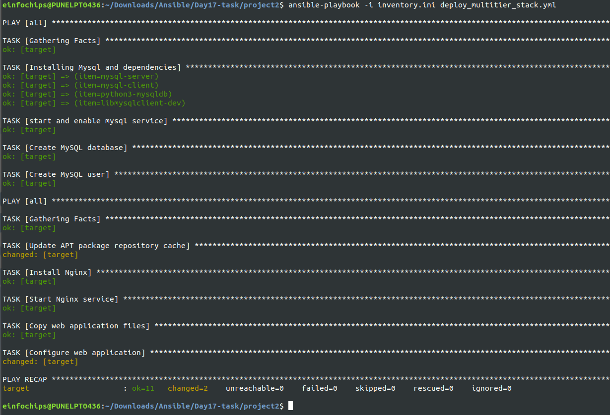

Project 02
======
**Objective:** Automate the setup of a multi-tier web application stack with separate database and application servers using Ansible.
### Problem Statement
**Objective:** Automate the deployment and configuration of a multi-tier web application stack consisting of:
1. **Database Server:** Set up a PostgreSQL database server on one Ubuntu instance.
2. **Application Server:** Set up a web server (e.g., Apache or Nginx) on another Ubuntu instance to host a web application.
3. **Application Deployment:** Ensure the web application is deployed on the application server and is configured to connect to the PostgreSQL database on the database server.
4. **Configuration Management:** Use Ansible to automate the configuration of both servers, including the initialization of the database and the deployment of the web application.

### **Deliverables**
#### 1. Ansible Inventory File
> **Filename:** inventory.ini
```ini
[web]
target ansible_host=000.000.000.000 ansible_user=user ansible_private_key=/path/to/the/private/key.pem
```
**Content:** Defines the database server and application server instances, including their IP addresses and connection details.<br>


#### 2. Ansible Playbook
> **Filename:** deploy_multitier_stack.yml
```yaml
---
- hosts: all
  become: yes
  vars:
    mysql_root_password: "passw0rd"
    mysql_db_name: "database"
    mysql_user: "appuser"
    mysql_user_password: "appuser@123"

  tasks:
    - name: Installing Mysql  and dependencies
      package:
       name: "{{item}}"
       state: present
       update_cache: yes
      loop:
       - mysql-server
       - mysql-client 
       - python3-mysqldb
       - libmysqlclient-dev

    - name: start and enable mysql service
      service:
        name: mysql
        state: started
        enabled: yes

    - name: Create MySQL database
      mysql_db:
        name: "{{ mysql_db_name }}"
        state: present
        login_user: root
        login_password: "{{ mysql_root_password }}"

    - name: Create MySQL user
      mysql_user:
        name: "{{ mysql_user }}"
        password: "{{ mysql_user_password }}"
        priv: "{{ mysql_db_name }}.*:ALL"
        state: present
        login_user: root
        login_password: "{{ mysql_root_password }}"
       
- hosts: all
  become: yes
  tasks:
    - name: Update APT package repository cache
      apt:
        update_cache: yes

    - name: Install Nginx
      apt:
        name: nginx
        state: present

    - name: Start Nginx service
      service:
        name: nginx
        state: started
        enabled: yes

    - name: Copy web application files
      copy:
        src: /home/DevopsTraining/DevopsTraining/Day17/project2/files/index.html
        dest: /var/www/html/
        owner: www-data
        group: www-data
        mode: '0755'

    - name: Configure web application
      template:
        src: templates/app_config.php.j2
        dest: /var/www/html/config.php
        owner: www-data
        group: www-data
        mode: '0644'
```
**Content:** Automates:
The deployment and configuration of the PostgreSQL database server.
The setup and configuration of the web server.
The deployment of the web application and its configuration to connect to the database.

#### 3. Jinja2 Template
> **Filename:** templates/app_config.php.j2
```php
<?php
    define('DB_SERVER', '127.0.0.1');
    define('DB_USERNAME', 'appuser');
    define('DB_PASSWORD', 'appuser@123');
    define('DB_DATABASE', 'database');
?>
```
**Content:** Defines a configuration file for the web application that includes placeholders for dynamic values such as database connection details.



#### 4. Application Files
> **Filename:** files/index.html (or equivalent application files)
- **Content:** Static or basic dynamic content served by the web application.
```html
<!DOCTYPE html>
<html lang="en">
<head>
    <meta charset="UTF-8">
    <meta name="viewport" content="width=device-width, initial-scale=1.0">
    <title>Welcome to Webserver</title>
</head>
<body>
    <h1>Welcome to My Web Application</h1>
    <p>Testing Web application to test the mysql database connection.</p>
</body>
</html>
```