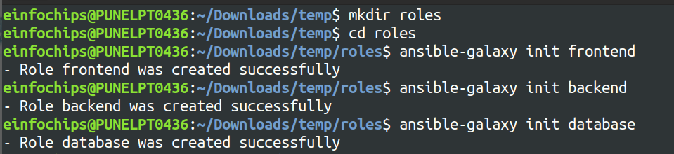
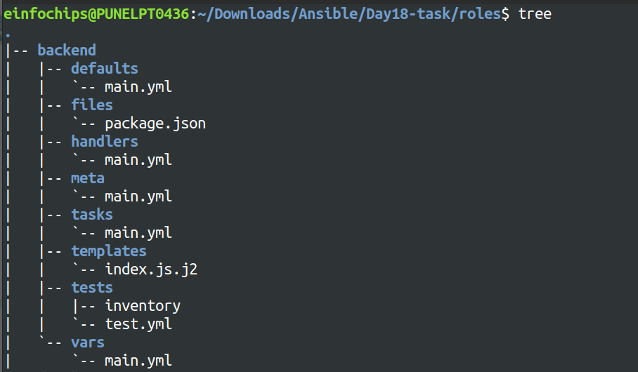
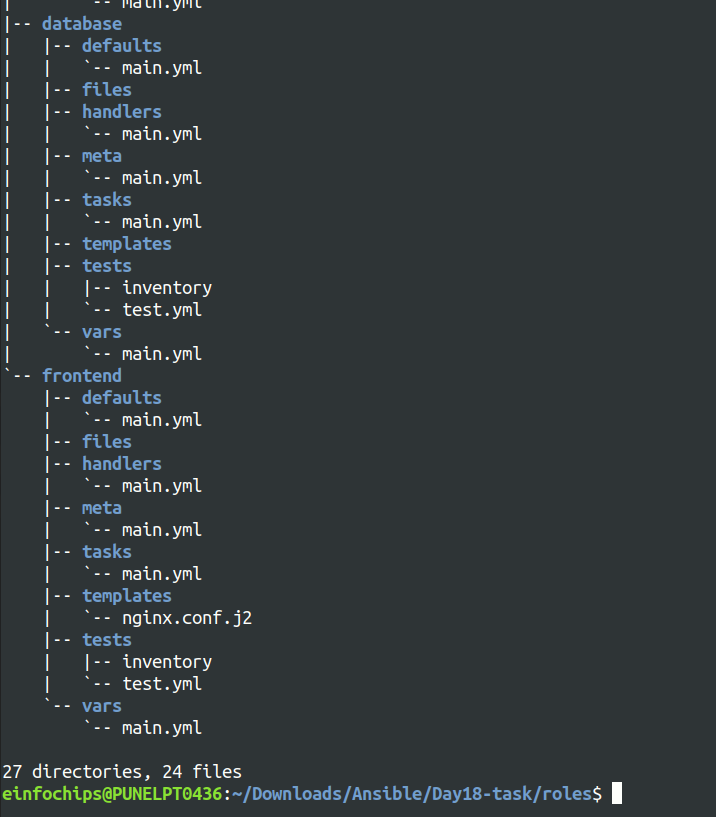
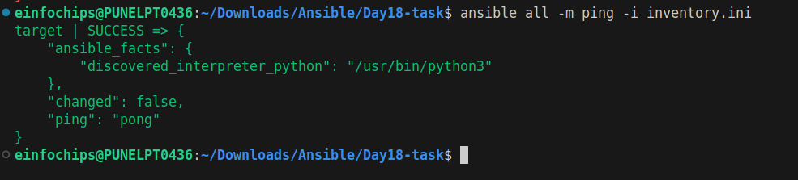
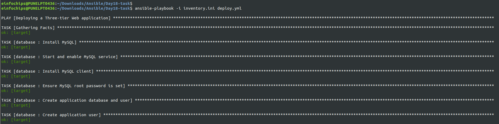
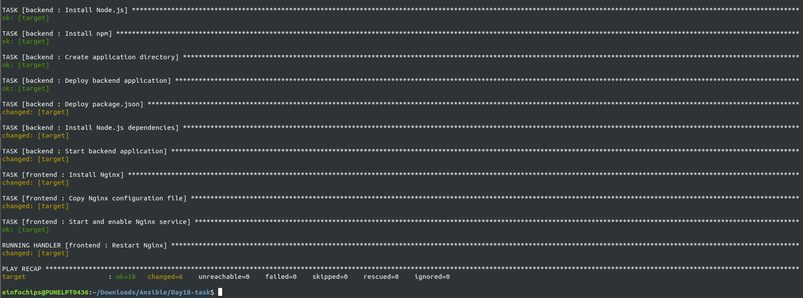
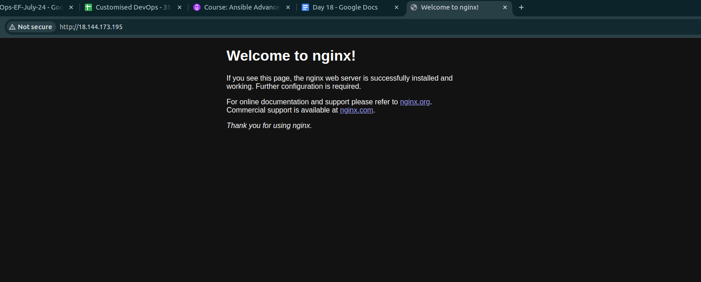
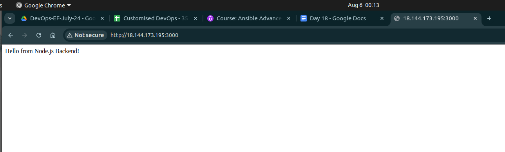

Project 01
=======

### Problem Statement
You are tasked with deploying a three-tier web application (frontend, backend, and database) using Ansible roles. The frontend is an Nginx web server, the backend is a Node.js application, and the database is a MySQL server. Your solution should use Ansible Galaxy roles where applicable and define appropriate role dependencies. The deployment should be automated to ensure that all components are configured correctly and can communicate with each other.

#### Steps and Deliverables
1. **Define Project Structure**
- Create a new Ansible project with a suitable directory structure to organize roles, playbooks, and inventory files.
```bash
# to create the roles directory for frontend, backend and database use bellow command
$ ansible-galaxy init frontend
$ ansible-galaxy init backend
$ ansible-galaxy init database
```




2. **Role Selection and Creation**
- Select appropriate roles from Ansible Galaxy for each tier of the application:
    - Nginx for the frontend.
    - Node.js for the backend.
    - MySQL for the database.

> [frontend tasks file](roles/frontend/tasks/main.yml)
```yml
---
- name: Install Nginx
  apt:
    name: nginx
    state: present
    update_cache: yes

- name: Copy Nginx configuration file
  template:
    src: nginx.conf.j2
    dest: /etc/nginx/nginx.conf
  notify: Restart Nginx

- name: Start and enable Nginx service
  service:
    name: nginx
    state: started
    enabled: yes
```

> [frontend handlers file](roles/frontend/handlers/main.yml)
```yaml
---
- name: Restart Nginx
  service:
    name: nginx
    state: restarted
```

> [frontend vars file](roles/frontend/vars/main.yml)
```yml
server_name: 0.0.0.0   # ip address of the ec2 instance
root_dir: /usr/share/nginx/html
backend_host: 0.0.0.0  # ip address of backend host
backend_port: <port>   # port on which backend is listening

```

> [frontend template file](roles/frontend/templates/nginx.conf.j2)
```jinja2
events {}

http {
    server {
        listen 80;

        server_name {{ server_name }};

        location / {
            root {{ root_dir }};
            index index.html;
        }

        location /api/ {
            proxy_pass http://{{ backend_host }}:{{ backend_port }}/;
            proxy_set_header Host $host;
            proxy_set_header X-Real-IP $remote_addr;
            proxy_set_header X-Forwarded-For $proxy_add_x_forwarded_for;
            proxy_set_header X-Forwarded-Proto $scheme;
        }
    }
}
```

> [backend tasks file](roles/backend/tasks/main.yml)
```yml
- name: Install Node.js
  apt:
    name: nodejs
    state: present
    update_cache: yes

- name: Install npm
  apt:
    name: npm
    state: present

- name: Create application directory
  file:
    path: /usr/src/app
    state: directory

- name: Deploy backend application
  template:
    src: index.js.j2
    dest: /usr/src/app/index.js

- name: Deploy package.json
  copy:
    src: ../files/package.json
    dest: /usr/src/app/package.json

- name: Install Node.js dependencies
  npm:
    path: /usr/src/app
    state: present

- name: Start backend application
  shell: node /usr/src/app/index.js &
```

> [backend vars file](roles/backend/vars/main.yml)
```yml
db_host: <host_name>              # database host name
db_user: <user_name>              # database user name
db_password: <user_password>      # user password
db_name: tesDB                    # database name
```

> [backend template files](roles/backend/templates/index.js.j2)
```js
const express = require('express');
const mysql = require('mysql');
const app = express();
const port = 3000;

const connection = mysql.createConnection({
    host: '{{ db_host }}',
    user: '{{ db_user }}',
    password: '{{ db_password }}',
    database: '{{ db_name }}'
});

connection.connect((err) => {
    if (err) {
        console.error('Error connecting to the database:', err);
        return;
    }
    console.log('Connected to the MySQL database.');
});

app.get('/', (req, res) => {
    res.send('Hello from Node.js Backend!');
});

app.get('/data', (req, res) => {
    connection.query('SHOW DATABASES;', (err, results) => {
        if (err) throw err;
        res.send(results);
    });
});

app.listen(port, () => {
    console.log(`App running on http://localhost:${port}`);
});
```

> [database tasks file](roles/database/tasks/main.yml)
```yml
# tasks file for database
---
- name: Install MySQL
  apt:
    name: mysql-server
    state: present
  become: yes

- name: Start and enable MySQL service
  service:
    name: mysql
    state: started
    enabled: yes
  become: yes

- name: Install MySQL client
  apt:
    name: mysql-client
    state: present
  become: yes

- name: Ensure MySQL root password is set
  mysql_user:
    name: root
    host: localhost
    password: '{{ db_root_password }}'
    check_implicit_admin: yes
  become: yes

- name: Create application database and user
  mysql_db:
    name: '{{ db_name }}'
    state: present
  become: yes

- name: Create application user
  mysql_user:
    name: '{{ db_user }}'
    password: '{{ db_password }}'
    priv: '{{ db_name }}.*:ALL'
    state: present
  become: yes
```

> [database var files](roles/database/vars/main.yml)
```yml
db_user: <user_name>                # database user name
db_password: <user_password>        # database user pass
db_root_password: <root_password>   # root user password
db_name: testDB                     # database name
```
- Create any custom roles needed for specific configurations that are not covered by the Galaxy roles.

3. **Dependencies Management** 
- Define dependencies for each role in the meta/main.yml file.
- Ensure that the roles have appropriate dependencies, such as ensuring the database is set up before deploying the backend.
> [frontend meta file](roles/frontend/meta/main.yml)
```yml
---
dependencies:
  - role: backend
```

> [backend meta file](roles/backend/meta/main.yml)
```yml
---
dependencies:
  - role: database
```

4. **Inventory Configuration** 
- Create an inventory file that defines the groups of hosts for each tier (frontend, backend, database).
- Ensure proper group definitions and host variables as needed.

> [inventory file](inventory.ini)
```ini
frontend_server ansible_host=<host_IP> ansible_ssh_private_key_file=<ssh_private_key> ansible_user=ubuntu

backend_server ansible_host=<host_IP> ansible_ssh_private_key_file=<ssh_private_key> ansible_user=ubuntu

database_server ansible_host=<host_IP> ansible_ssh_private_key_file=<ssh_private_key> ansible_user=ubuntu
```
```bash
# use the bellow command to check if inventory file is correct and we can connect to nodes

$ ansible -i inventory.ini -m ping all
```



5. **Playbook Creation** 
- Create a playbook (deploy.yml) that includes and orchestrates the roles for deploying the application.
- Ensure the playbook handles the deployment order and variable passing between roles.
> [playbook file](deploy.yml)
```yml
- name: Deploying a Three-tier Web application
  hosts: all
  become: yes

  roles:
    - frontend
    - backend
    - database
```
```bash
# use the bellow command to run the playbook

$ ansible-playbook -i inventory.ini deploy.yml
```





6. **Role Customization and Variable Definition** 
- Customize the roles by defining the necessary variables in group_vars or host_vars as needed for the environment.
- Ensure sensitive data like database credentials are managed securely.

> [backend/vars](roles/backend/vars/main.yml)<br>
> [database/vars](roles/database/vars/main.yml)

7. **Testing and Validation** 
- Create a separate playbook for testing the deployment (test.yml) that verifies each tier is functioning correctly and can communicate with the other tiers.
- Use Ansible modules and tasks to check the status of services and applications.

> [test.yml file](test.yml)
```yml
- name: Testing the connection
  hosts: web_app
  
  tasks:
    - name: Testing Nodes connection
      ping:
```

8. **Documentation** 
- Document the setup process, including any prerequisites, role dependencies, and how to run the playbooks.
- Include a README.md file that provides an overview of the project and instructions for use.

<center>
<a src='README.md'>README File</a>
</center>
<br>





### Deliverables
1. **Ansible Project Directory Structure**
    - Organized directory structure with roles, playbooks, inventory, and configuration files.

1. **Role Definitions and Dependencies**
    - meta/main.yml files for each role defining dependencies.
    - Customized roles with necessary configurations.

1. **Inventory File**
    - Inventory file defining groups and hosts for frontend, backend, and database tiers.

1. **Playbook for Deployment (deploy.yml)**
    - Playbook that orchestrates the deployment of the three-tier application.

1. **Playbook for Testing (test.yml)**
    - Playbook that verifies the deployment and functionality of each tier.
