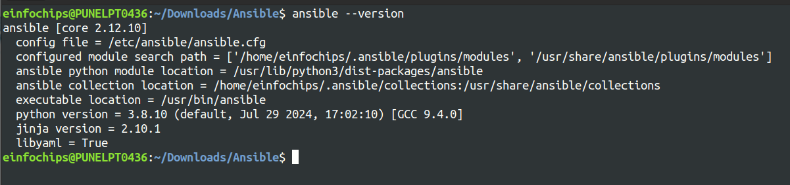

Project Overview
======

In this capstone project, you will create a comprehensive automated deployment pipeline for a web application on an AWS EC2 instance running Ubuntu using Ansible. You will follow best practices for playbooks and roles, implement version control, document and maintain your code, break down tasks into roles, write reusable and maintainable code, and use dynamic inventory scripts. This project will culminate in a fully functional deployment, demonstrating your mastery of Ansible for infrastructure automation.

## Project Objectives

- Set up an AWS EC2 instance as a worker node.
- Implement Ansible playbooks and roles following best practices.
- Use version control to manage Ansible codebase.
- Document Ansible roles and playbooks.
- Break down deployment tasks into reusable roles.
- Write reusable and maintainable Ansible code.
- Use dynamic inventory scripts to manage AWS EC2 instances.
- Deploy a web application on the EC2 instance.
- Project Components and Milestones

### Milestone 1: Environment Setup
**Objective:** Configure your development environment and AWS infrastructure.

**Tasks:**
Launch an AWS EC2 instance running Ubuntu.
Install Ansible and Git on your local machine or control node.




**Deliverables:**
AWS EC2 instance running Ubuntu.
Local or remote control node with Ansible and Git installed.

### Milestone 2: Create Ansible Role Structure
**Objective:**  Organize your Ansible project using best practices for playbooks and roles.

**Tasks:**
Use Ansible Galaxy to create roles for web server, database, and application deployment.
Define the directory structure and initialize each role.


**Deliverables:**
Ansible role directories for webserver, database, and application.

### Milestone 3: Version Control with Git
**Objective:** Implement version control for your Ansible project.

**Tasks:**
Initialize a Git repository in your project directory.
Create a .gitignore file to exclude unnecessary files.
Commit and push initial codebase to a remote repository.


**Deliverables:**
Git repository with initial Ansible codebase.
Remote repository link (e.g., GitHub).


### Milestone 4: Develop Ansible Roles
**Objective:** Write Ansible roles for web server, database, and application deployment.

**Tasks:**
Define tasks, handlers, files, templates, and variables within each role.
Ensure each role is modular and reusable.

> [frontend tasks file](roles/frontend/tasks/main.yml)
```yml
---
- name: Install Nginx
  apt:
    name: nginx
    state: present
    update_cache: yes

- name: Copy Nginx configuration file
  template:
    src: nginx.conf.j2
    dest: /etc/nginx/nginx.conf
  notify: Restart Nginx

- name: Start and enable Nginx service
  service:
    name: nginx
    state: started
    enabled: yes
```

> [frontend handlers file](roles/frontend/handlers/main.yml)
```yaml
---
- name: Restart Nginx
  service:
    name: nginx
    state: restarted
```

> [frontend vars file](roles/frontend/vars/main.yml)
```yml
server_name: 0.0.0.0   # ip address of the ec2 instance
root_dir: /usr/share/nginx/html
backend_host: 0.0.0.0  # ip address of backend host
backend_port: <port>   # port on which backend is listening

```

> [frontend template file](roles/frontend/templates/nginx.conf.j2)
```jinja2
events {}

http {
    server {
        listen 80;

        server_name {{ server_name }};

        location / {
            root {{ root_dir }};
            index index.html;
        }

        location /api/ {
            proxy_pass http://{{ backend_host }}:{{ backend_port }}/;
            proxy_set_header Host $host;
            proxy_set_header X-Real-IP $remote_addr;
            proxy_set_header X-Forwarded-For $proxy_add_x_forwarded_for;
            proxy_set_header X-Forwarded-Proto $scheme;
        }
    }
}
```

> [backend tasks file](roles/backend/tasks/main.yml)
```yml
- name: Install Node.js
  apt:
    name: nodejs
    state: present
    update_cache: yes

- name: Install npm
  apt:
    name: npm
    state: present

- name: Create application directory
  file:
    path: /usr/src/app
    state: directory

- name: Deploy backend application
  template:
    src: index.js.j2
    dest: /usr/src/app/index.js

- name: Deploy package.json
  copy:
    src: ../files/package.json
    dest: /usr/src/app/package.json

- name: Install Node.js dependencies
  npm:
    path: /usr/src/app
    state: present

- name: Start backend application
  shell: node /usr/src/app/index.js &
```

> [backend vars file](roles/backend/vars/main.yml)
```yml
db_host: <host_name>              # database host name
db_user: <user_name>              # database user name
db_password: <user_password>      # user password
db_name: tesDB                    # database name
```

> [backend template files](roles/backend/templates/index.js.j2)
```js
const express = require('express');
const mysql = require('mysql');
const app = express();
const port = 3000;

const connection = mysql.createConnection({
    host: '{{ db_host }}',
    user: '{{ db_user }}',
    password: '{{ db_password }}',
    database: '{{ db_name }}'
});

connection.connect((err) => {
    if (err) {
        console.error('Error connecting to the database:', err);
        return;
    }
    console.log('Connected to the MySQL database.');
});

app.get('/', (req, res) => {
    res.send('Hello from Node.js Backend!');
});

app.get('/data', (req, res) => {
    connection.query('SHOW DATABASES;', (err, results) => {
        if (err) throw err;
        res.send(results);
    });
});

app.listen(port, () => {
    console.log(`App running on http://localhost:${port}`);
});
```

> [database tasks file](roles/database/tasks/main.yml)
```yml
# tasks file for database
---
- name: Install MySQL
  apt:
    name: mysql-server
    state: present
  become: yes

- name: Start and enable MySQL service
  service:
    name: mysql
    state: started
    enabled: yes
  become: yes

- name: Install MySQL client
  apt:
    name: mysql-client
    state: present
  become: yes

- name: Ensure MySQL root password is set
  mysql_user:
    name: root
    host: localhost
    password: '{{ db_root_password }}'
    check_implicit_admin: yes
  become: yes

- name: Create application database and user
  mysql_db:
    name: '{{ db_name }}'
    state: present
  become: yes

- name: Create application user
  mysql_user:
    name: '{{ db_user }}'
    password: '{{ db_password }}'
    priv: '{{ db_name }}.*:ALL'
    state: present
  become: yes
```

> [database var files](roles/database/vars/main.yml)
```yml
db_user: <user_name>                # database user name
db_password: <user_password>        # database user pass
db_root_password: <root_password>   # root user password
db_name: testDB                     # database name
```

**Deliverables:**
Completed Ansible roles for webserver, database, and application.

### Milestone 5: Documentation and Maintenance
**Objective:** Document your Ansible roles and playbooks for future maintenance.

**Tasks:**
Create [README.md](README.md) files for each role explaining purpose, variables, tasks, and handlers.
Add comments within your playbooks and roles to explain complex logic.

**Deliverables:**
[README.md](README.md) files for webserver, database, and application roles.
Well-documented playbooks and roles.

### Milestone 6: Dynamic Inventory Script
**Objective:** Use dynamic inventory scripts to manage AWS EC2 instances.

**Tasks:**
Write a Python script that queries AWS to get the list of EC2 instances.
Format the output as an Ansible inventory.
```py
#!/usr/bin/env python3

import json
import boto3

def get_inventory():
    ec2 = boto3.client(service_name='ec2', region_name='us-west-1')  # Specify your region
    response = ec2.describe_instances(Filters=[{'Name': 'tag:Name', 'Values': ['Chirag']}])
    
    inventory = {
        'all': {
            'hosts': [],
            'vars': {}
        },
        '_meta': {
            'hostvars': {}
        }
    }
    
    ssh_key_file = '/home/path/to/the/ssh/key.pem'  # Path to your SSH private key file
    ssh_user = 'ubuntu'  # SSH username
    
    for reservation in response['Reservations']:
        for instance in reservation['Instances']:
            public_dns = instance.get('PublicDnsName', instance['InstanceId'])
            inventory['all']['hosts'].append(public_dns)
            inventory['_meta']['hostvars'][public_dns] = {
                'ansible_host': instance.get('PublicIpAddress', instance['InstanceId']),
                'ansible_ssh_private_key_file': ssh_key_file,
                'ansible_user': ssh_user
            }

    return inventory

if __name__ == '__main__':
    print(json.dumps(get_inventory()))
```

**Deliverables:**
Dynamic inventory script to fetch EC2 instance details.

```bash
# before running the dynamic-inventory update the inventory path in ansible.cfg
$ cat << EOF >> ansible.cfg
> [defaults]
> inventory=/path/to/the/dynamic/inventory.py
> EOF 
```

```sh
# to check if dynamic inventory works correctly use below command
$ anisble all --list-hosts
$ ansible all -m ping
```


### Milestone 7: Playbook Development and Deployment
**Objective:** Create and execute an Ansible playbook to deploy the web application.

**Tasks:**
Develop a master playbook that includes all roles.
Define inventory and variable files for different environments.
Execute the playbook to deploy the web application on the EC2 instance.

```sh
# to run the ansible playbook using dynamic inventory
$ ansible-playbook deploy.yml
```


**Deliverables:**
Ansible playbook for web application deployment.
Successfully deployed web application on the EC2 instance


