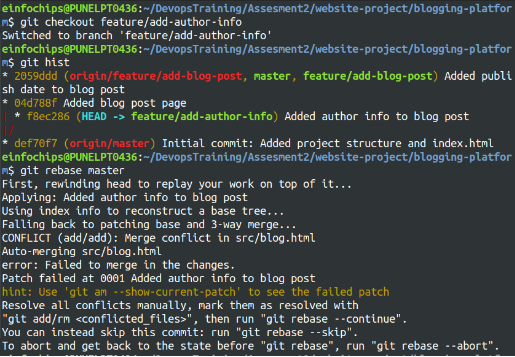
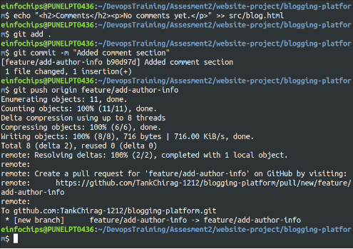

**Git Project**

**Objective:**
You will work on a project involving a simple website. You will learn and practise various Git concepts including branching, merging, handling merge conflicts, rebasing, pulling, versioning, and rolling back changes. This project is designed to be completed in 1 hour.


**Project Setup**

1. **Install Git**: Ensure Git is installed on your system. Verify with git --version.

**Set Up Git**: Configure your Git username and email:

> git config --global user.name "Your Name"

> git config --global user.email "your.email@example.com"


2. **Create a GitHub Repository**:
- Go to GitHub and create a new repository named website-project.

Clone the repository to your local machine:

> git clone https://github.com/your-username/website-project.git

3. **Initialize the Project**:

Navigate to the project directory:

> cd website-project


Create initial project structure: 
```
mkdir src
touch src/index.html

echo "<!DOCTYPE html><html><head><title>My Website</title></head><body><h1>Welcome to my website!</h1></body></html>" > src/index.html
```
Commit and push the initial project structure: 

> git add .
> git commit -m "Initial commit: Added project structure and index.html"

> git push origin master


**Exercise 1: Branching and Basic Operations (10 minutes) Create a New Branch**:

> git checkout -b feature/add-about-page


1\. **Add a New Page**:

Create about.html:

> touch src/about.html
```
echo "<!DOCTYPE html><html><head><title>About Us</title></head><body><h1>About Us</h1></body></html>" > src/about.html
```


Commit and push changes:
```
git add src/about.html
git commit -m "Added about page"
git push origin feature/add-about-page
```


**Exercise 2: Merging and Handling Merge Conflicts (15 minutes) Create Another Branch**:
```
git checkout master
git checkout -b feature/update-homepage
```


1. **Update the Homepage**:

Modify index.html:
```
echo "<p>Updated homepage content</p>" >> src/index.html Commit and push changes:
git add src/index.html
git commit -m "Updated homepage content" git push origin feature/update-homepage
```


2. **Create a Merge Conflict**:

Modify index.html on the feature/add-about-page branch: 
```
git checkout feature/add-about-page
echo "<p>Conflict content</p>" >> src/index.html
git add src/index.html
git commit -m "Added conflicting content to homepage" git push origin feature/add-about-page
```


3. **Merge and Resolve Conflict**:

Attempt to merge feature/add-about-page into master:
```
git checkout master
git merge feature/add-about-page git push origin master
```


**Exercise 3: Rebasing (10 minutes)**

1\. **Rebase a Branch**:

Rebase feature/update-homepage onto master:
```
git checkout feature/update-homepage 
git rebase master
```


- Resolve any conflicts that arise during rebase.

**Push the Rebased Branch**:

> git push -f origin feature/update-homepage


**Exercise 4: Pulling and Collaboration (10 minutes)**

1. **Pull Changes from Remote**:

Ensure the master branch is up-to-date:

> git checkout master git pull origin master


2. **Simulate a Collaborator's Change**:
   1. Make a change on GitHub directly (e.g., edit index.html).
3. **Pull Collaborator's Changes**:

Pull the changes made by the collaborator: 
> git pull origin master


**Exercise 5: Versioning and Rollback (15 minutes)**

1. **Tagging a Version**:

Tag the current commit as v1.0:
```
git tag -a v1.0 -m "Version 1.0: Initial release" 
git push origin v1.0
```


2. **Make a Change that Needs Reversion**:

Modify index.html:
```
echo "<p>Incorrect update</p>" >> src/index.html git add src/index.html
git commit -m "Incorrect update" 
git push origin master
```


3. **Revert to a Previous Version**:

Use git revert to undo the last commit:
```
git revert HEAD
git push origin master
git reset --hard v1.0
git push -f origin master
```


**Extra Activities (10 minutes)**

1. **Stashing Changes**:

Make some local changes without committing:

> echo "<p>Uncommitted changes</p>" >> src/index.html 

Stash the changes:

> git stash


Apply the stashed changes: 
> git stash apply


2. **Viewing Commit History**:

Use git log to view commit history: 
> git log --oneline


3. **Cherry-Picking Commits**:

Create a new branch and cherry-pick a commit from another branch and solving the conflict if any:

> git checkout -b feature/cherry-pick


> git cherry-pick <commit-hash> git cherry-pick --continue


> git push origin feature/cherry-pick


4. **Interactive Rebase**:

Use interactive rebase to squash commits:

> git checkout master git rebase -i HEAD~3


**Collaborative Blogging Platform**

**Objective:**

You will work on a project to collaboratively develop a simple blogging platform. You will practice various Git concepts including branching, merging, handling merge conflicts, rebasing, pulling, versioning, rolling back changes, stashing, and cherry-picking commits. The project is designed to be completed in 1.5 Hours

1. **Create a GitHub Repository**:
- Go to GitHub and create a new repository named blogging-platform.

Clone the repository to your local machine:

> git clone https://github.com/your-username/blogging-platform.git

2. **Initialize the Project**:

Navigate to the project directory: 
> cd blogging-platform

Create initial project structure: 
```
mkdir src
touch src/index.html
echo "<!DOCTYPE html><html><head><title>Blogging Platform</title></head><body><h1>Welcome to the Blogging Platform! </h1></body></html>" > src/index.html
```
Commit and push the initial project structure: 
```
git add .
git commit -m "Initial commit: Added project structure and index.html"
git push origin master
```


**Exercise 1: Branching and Adding Features (20 minutes)**

**Create a New Branch for Blog Post Feature**: 

> git checkout -b feature/add-blog-post

1\. **Add a Blog Post Page**:

Create blog.html:
```
touch src/blog.html
echo "<!DOCTYPE html><html><head><title>Blog Post</title></head><body><h1>My First Blog Post</h1></body></html>" > src/blog.html
```
Commit and push changes:

```
git add src/blog.html
git commit -m "Added blog post page" git push origin feature/add-blog-post![ref2]
```


**Exercise 2: Collaborating with Merging and Handling Merge Conflicts (25 minutes)**

1. **Create Another Branch for Author Info**:

```
git checkout master
git checkout -b feature/add-author-info
```


2. **Add Author Info to Blog Page**:

Modify blog.html:
```
echo "<p>Author: John Doe</p>" >> src/blog.html Commit and push changes:
git add src/blog.html
git commit -m "Added author info to blog post" git push origin feature/add-author-info
```


3. **Create a Merge Conflict**:

Modify blog.html on the feature/add-blog-post branch:
```
git checkout feature/add-blog-post
echo "<p>Published on: July 10, 2024</p>" >> src/blog.html git add src/blog.html
git commit -m "Added publish date to blog post"
git push origin feature/add-blog-post
```


4. **Merge and Resolve Conflict**:

Attempt to merge feature/add-blog-post into master: 
```
git checkout master
git merge feature/add-blog-post
git push origin master
```


**Exercise 3: Rebasing and Feature Enhancement (25 minutes)**

1. **Rebase a Branch for Comment Feature**:

Rebase feature/add-author-info onto master:
```
git checkout feature/add-author-info
git rebase master
```



- Resolve any conflicts that arise during rebase.


2. **Add Comment Section**:

Modify blog.html to add a comment section:
```
echo "<h2>Comments</h2><p>No comments yet.</p>" >> src/blog.html git add src/blog.html

git commit -m "Added comment section"

git push origin feature/add-author-info
```


**Exercise 4: Pulling and Simulating Collaboration (20 minutes)![ref3]**

1. **Pull Changes from Remote**:

Ensure the master branch is up-to-date:

> git checkout master git pull origin master


2. **Simulate a Collaborator's Change**:
- Make a change on GitHub directly (e.g., edit blog.html to add a new comment).
3. **Pull Collaborator's Changes**:

Pull the changes made by the collaborator: 
> git pull origin master


**Exercise 5: Versioning and Rollback (30 minutes)![ref3]**

1. **Tagging a Version**:

Tag the current commit as v1.0:

> git tag -a v1.0 -m "Version 1.0: Initial release" git push origin v1.0


2. **Make a Change that Needs Reversion**:

Modify blog.html:
```
echo "<p>Incorrect comment</p>" >> src/blog.html git add src/blog.html

git commit -m "Incorrect comment update"

git push origin master
```


3. **Revert to a Previous Version**:

Use git revert to undo the last commit:
```
git revert HEAD
git push origin master
```
Alternatively, reset to a specific commit (use with caution:git reset --hard v1.0)


**Extra Activities (25 minutes)![ref1]**

1. **Stashing Changes**:

Make some local changes without committing:
```
echo "<p>Uncommitted changes</p>" >> src/blog.html Stash the changes:

git stash
```


Apply the stashed changes: git stash apply


2. **Viewing Commit History**:

Use git log to view commit history: 
> git log --oneline


3. **Cherry-Picking Commits**:

Create a new branch and cherry-pick a commit from another branch: 
> git checkout -b feature/cherry-pick


```
git cherry-pick <commit-hash>

git push origin feature/cherry-pick
```


4. **Interactive Rebase**:

Use interactive rebase to squash commits: 

> git checkout master
> git rebase -i HEAD~3


------------------

**Git Cherry Pick**

**Scenario:**

- You have two branches: branch-A and branch-B.
- You made a bug fix commit on branch-A that you now want to apply to branch-B without merging all changes from branch-A into branch-B.

**Steps:**

**Identify the Commit**:

First, find the commit hash of the bug fix commit on branch-A:

> git log --oneline branch-A

1\. Suppose the commit hash is abcdef1234567890.

**Switch to branch-B**:

Ensure you are on branch-B where you want to apply the bug fix:

> git checkout branch-B

2\. **Cherry-pick the Commit**:

Apply the bug fix commit from branch-A to branch-B:

> git cherry-pick abcdef1234567890

3\. This command applies the changes introduced by the commit abcdef1234567890 onto branch-B.

**Resolve Conflicts (if any)**: 
> git cherry-pick --continue

4\. **Commit the Cherry-picked Changes**:

After resolving conflicts (if any), commit the cherry-picked changes on branch-B:

> git commit

5\. This creates a new commit on branch-B that includes the changes from branch- A's selected commit.

**Git Stash**

**Step 1: Initialize a Git Repository**

First, create a new directory for your project and initialize a Git repository:

> mkdir git-stash-example ; cd git-stash-example ; git init

**Step 2: Add and Commit Files**

Create some files and add content to them:

> echo "This is file1.txt" > file1.txt echo "This is file2.txt" > file2.txt

Add these files to the staging area and commit them:

> git add file1.txt file2.txt
> git commit -m "Initial commit - Added file1.txt and file2.txt"

**Step 3: Modify Files**

Make some changes to file1.txt:

> echo "Updated content in file1.txt" >> file1.txt

**Step 4: Use git stash**

Now, let's use git stash to temporarily store the changes in file1.txt without committing them:

> git stash save "WIP: Work in progress changes"

This command saves your changes (in this case, the update to file1.txt) to a stash with a message "WIP: Work in progress changes".

**Step 5: Verify Stash**

You can verify the stash list using:

> git stash list

It should show something like:

stash@{0}: On master: WIP: Work in progress changes

**Step 6: Check Working Directory Status** Check the status of your working directory: git status

It should indicate that your working directory is clean (no changes). **Step 7: Apply Stashed Changes**

Let's apply the stashed changes back into your working directory: git stash pop

**Step 8: Verify Changes** Check the changes in file1.txt:

cat file1.txt

**Step 9: Commit Stashed Changes**

If you are satisfied with the changes, commit them:

git add file1.txt

git commit -m "Updated file1.txt with stashed changes"
