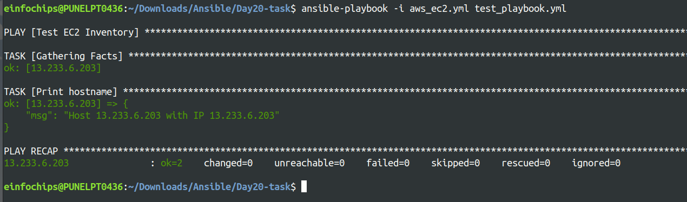
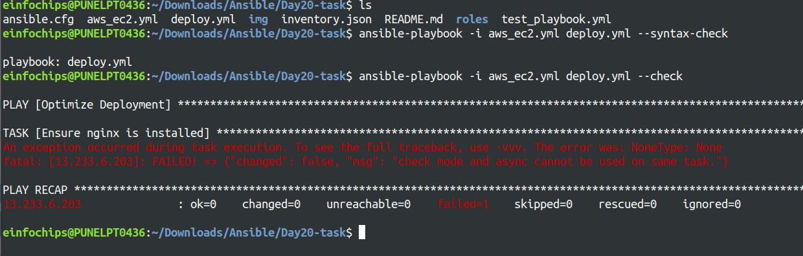
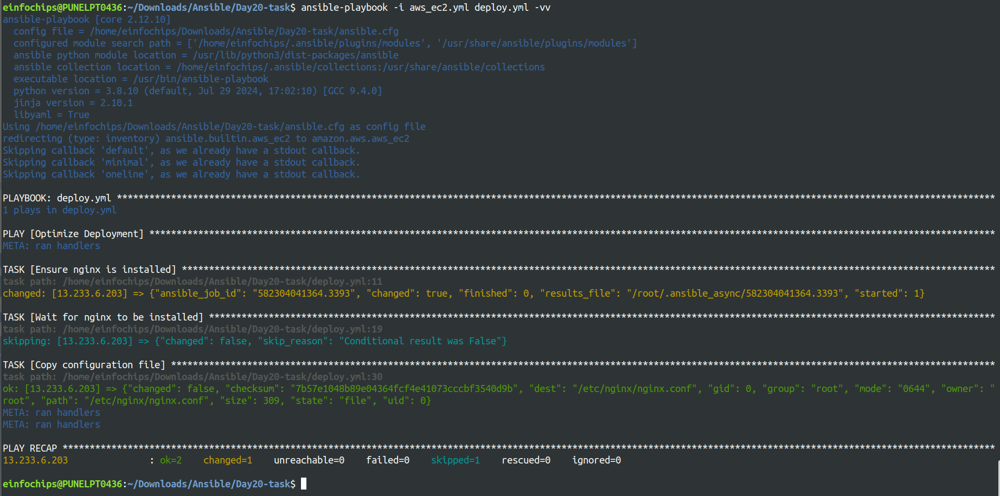
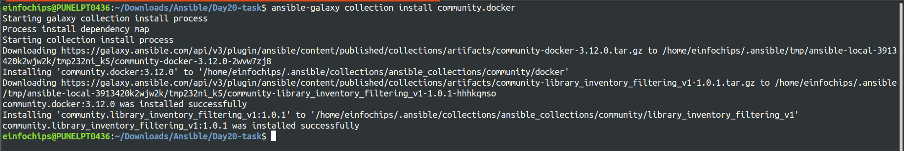
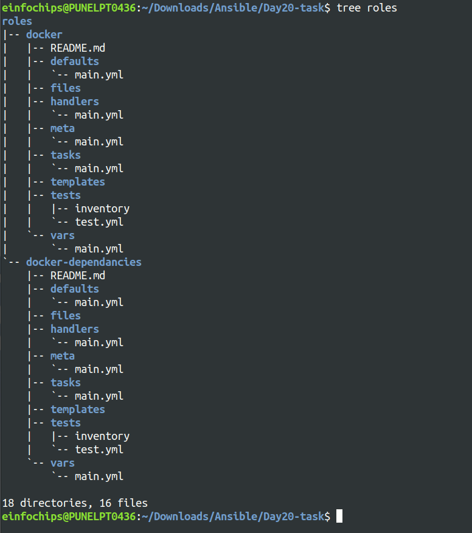
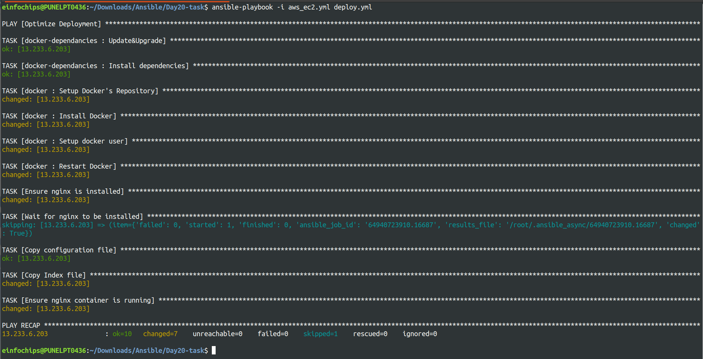
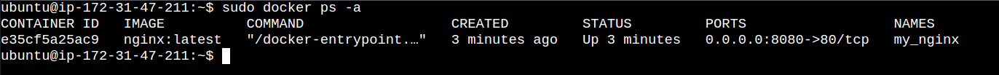
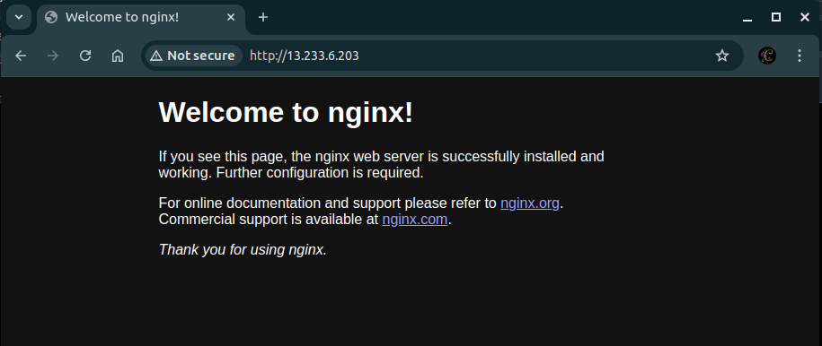

Project 01
======

### 1. Inventory Plugins
- **Activity:** Configure a dynamic inventory plugin to manage a growing number of web servers dynamically. Integrate the plugin with Ansible to automatically detect and configure servers in various environments.

[aws_ec2.yml](aws_ec2.yml)

[inventory.json](inventory.json)



- **Deliverable:** Dynamic inventory configuration file or script, demonstrating the ability to automatically update the inventory based on real-time server data.


### 2. Performance Tuning
- **Activity:** Tune Ansible performance by adjusting settings such as parallel execution (forks), optimizing playbook tasks, and reducing playbook run time.

```conf
[defaults]
private_key_file = /home/einfochips/Downloads/Ansible/ansible-new.pem
remote_user = ubuntu
host_key_checking = False
forks = 10
gathering = smart
fact_caching = jsonfile
fact_caching_connection = /tmp/ansible_cache

[inventory]
enable_plugins = aws_ec2,yaml,ini
inventory=/home/einfochips/Downloads/Ansible/Day20-task/aws_ec2.yml

[ssh_connection]
ssh_args = -o ControlMaster=auto -o ControlPersist=60s
pipelining = True
```

- **Deliverable:** Optimized ansible.cfg configuration file, performance benchmarks, and documentation detailing changes made for performance improvement.

### 3. Debugging and Troubleshooting Playbooks
- **Activity:** Implement debugging strategies to identify and resolve issues in playbooks, including setting up verbose output and advanced error handling.





- **Deliverable:** Debugged playbooks with enhanced error handling and logging, including a troubleshooting guide with common issues and solutions.
### 4. Exploring Advanced Modules
- **Activity:** Use advanced Ansible modules such as docker_container to manage containerized applications and aws_ec2 for AWS infrastructure management, demonstrating their integration and usage.

```bash
$ ansible-galaxy collection install community.docker
$ ansible-galaxy init roles/docker
$ ansible-galaxy init roles/docker-dependancies
```



- **Deliverable:** Playbooks showcasing the deployment and management of Docker containers and AWS EC2 instances, along with documentation on the benefits and configurations of these advanced modules.



