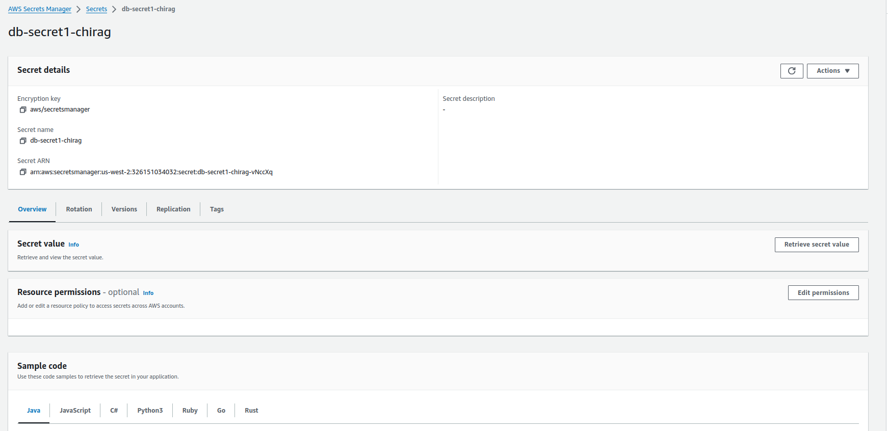
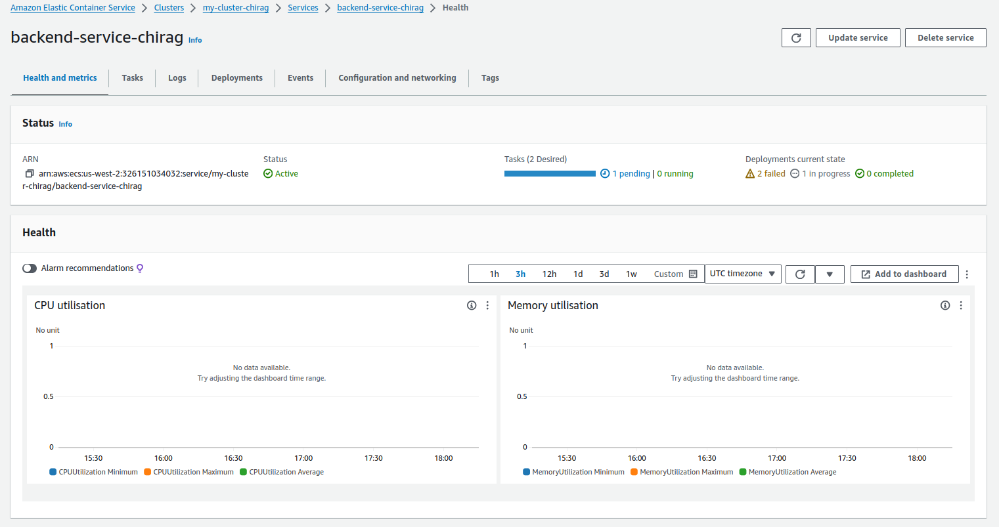
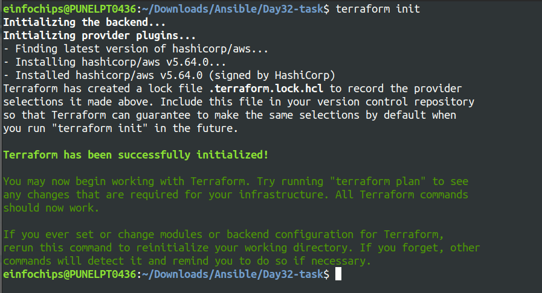
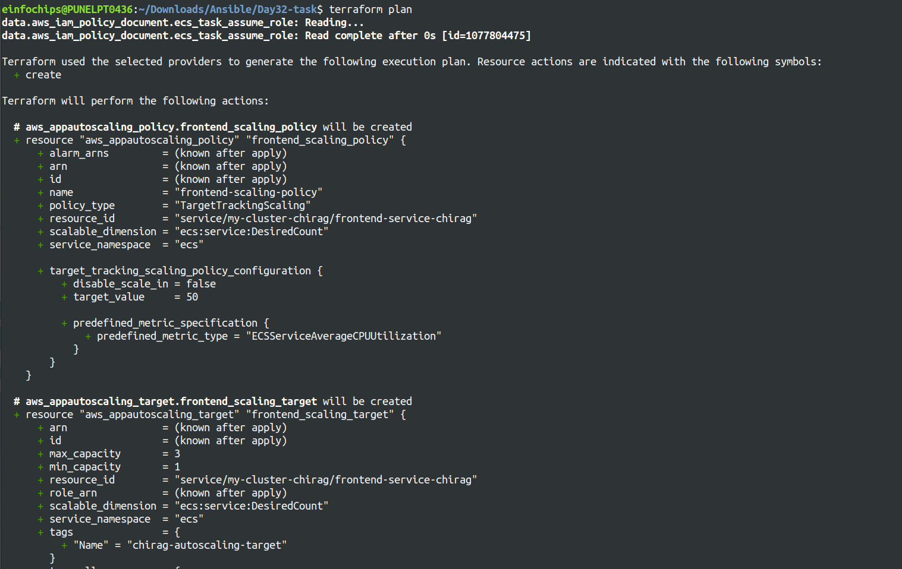
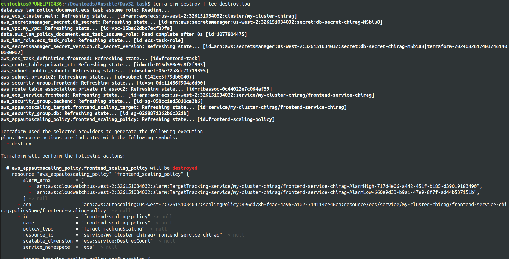
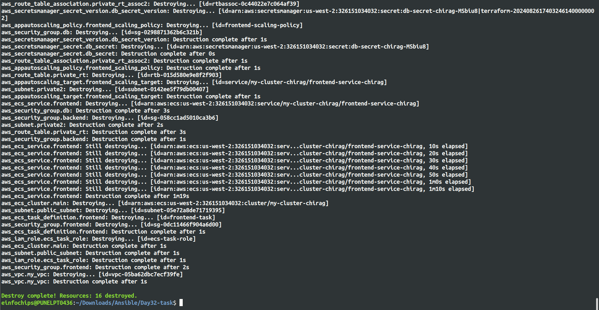

# Deploying a Multi-Tier Web Application Using Amazon ECS (Without Load Balancer and API Gateway)

## Project Overview

This project is designed to test your knowledge of Amazon ECS (Elastic Container Service) by deploying a multi-tier web application on AWS without using a Load Balancer or API Gateway. The project involves setting up an ECS cluster, defining task definitions, creating services, and ensuring proper networking and security configurations using VPC, subnets, security groups, and IAM roles.


## Project Objectives

- Set up an ECS Cluster using the Fargate launch type.
- Deploy a web application consisting of multiple containers (frontend and backend).
- Implement direct communication between frontend and backend services.
- Manage ECS tasks, services, and scaling policies.
- Ensure network security with VPC, subnets, security groups, and IAM roles.

## Project Requirements

- **ECS Cluster**
    - Create an ECS Cluster using the Fargate launch type.

- **Task Definitions**
    - Define task definitions for web and backend services.

- **Services**
    - Create ECS services for each tier (frontend and backend) without using a Load Balancer or API Gateway.

- **Security Groups**
    - Configure security groups to allow traffic between services directly.

- **IAM Roles**
    - Create and assign IAM roles for ECS tasks.

- **VPC and Networking**
    - Create a VPC with public and private subnets, ensuring proper routing of traffic without a NAT gateway.

- **Secrets Management**
    - Use AWS Secrets Manager or SSM Parameter Store to manage database credentials.

- **Scaling**
    - Implement auto-scaling policies for the ECS services.

## Project Deliverables

1. **ECS Cluster Setup**
- Create an ECS cluster using the Fargate launch type.

```bash
# ECS Cluster
resource "aws_ecs_cluster" "main" {
name = "my-cluster-chirag"  # cluster name
}
```

- Ensure the cluster is running in a VPC with public and private subnets. [VPC.tf](vpc.tf)

```bash
# Provider Configuration
provider "aws" {
  region = "us-west-2"
}

# VPC Setup
resource "aws_vpc" "my_vpc" {
  cidr_block = "<vpc-cidr>"
  tags = {
    Name = "chirag-vpc"
  }
}

# Create an Internet Gateway
resource "aws_internet_gateway" "my_igw" {
  vpc_id = aws_vpc.my_vpc.id

  tags = {
    Name = "MyIGW-chirag"
  }
}

# Create a public subnet
resource "aws_subnet" "public_subnet" {
  vpc_id                  = aws_vpc.my_vpc.id
  cidr_block              = "<pub-subnet-cidr>"
  availability_zone       = "us-west-2a"
  map_public_ip_on_launch = true

  tags = {
    Name = "pub-sub-chirag"
  }
}


resource "aws_subnet" "private1" {
  vpc_id     = aws_vpc.my_vpc.id
  cidr_block = "<pri-subnet-cidr>"
  availability_zone = "us-west-2a"
  map_public_ip_on_launch = false
  tags = {
    Name = "pri1-sub-chirag"
  }
}

resource "aws_subnet" "private2" {
  vpc_id     = aws_vpc.my_vpc.id
  cidr_block = "<pri-subnet-cidr>"
  availability_zone = "us-west-2b"
  map_public_ip_on_launch = false
  tags = {
    Name = "pri2-sub-chirag"
  }
}

# Create a route table for the public subnet
resource "aws_route_table" "public_rt" {
  vpc_id = aws_vpc.my_vpc.id

  route {
    cidr_block = "0.0.0.0/0"
    gateway_id = aws_internet_gateway.my_igw.id
  }

  tags = {
    Name = "Pub-RT-chirag"
  }
}

# Create a route table for the private subnet
resource "aws_route_table" "private_rt" {
    vpc_id = aws_vpc.my_vpc.id
    
    tags = {
        Name = "Pri-RT-chirag"
    }
}

# create subnet group of private subnet1 and private subnet2
resource "aws_db_subnet_group" "rds_subnet_group" {
  name       = "rds_subnet_group"
  subnet_ids = [aws_subnet.private1.id, aws_subnet.private2.id]
  tags = {
    Name = "RDS Subnet Group"
  }
}

# Associate the private subnet 1 with the private route table

resource "aws_route_table_association" "private_rt_assoc1" {
    subnet_id      = aws_subnet.private1.id    
    route_table_id = aws_route_table.private_rt.id
}

# Associate the private subnet 2 with the private route table

resource "aws_route_table_association" "private_rt_assoc2" {
    subnet_id      = aws_subnet.private2.id    
    route_table_id = aws_route_table.private_rt.id
}

# Associate the public subnet with the public route table
resource "aws_route_table_association" "public_rt_association" {
  subnet_id      = aws_subnet.public_subnet.id
  route_table_id = aws_route_table.public_rt.id
}
```


2. **Task Definitions**
- Create task definitions for two services:
    - Frontend Service: A container running an NGINX server serving static content.
    - Backend Service: A container running a Python Flask API connected to an RDS instance.

```bash
# Frontend Service Task Definition
resource "aws_ecs_task_definition" "frontend" {
  family                   = "frontend-task"
  network_mode             = "awsvpc"
  requires_compatibilities = ["FARGATE"]
  cpu                      = "256"
  memory                   = "512"
  tags = {
    Name = "chirag-frontend-task-def"
  }

  container_definitions = jsonencode([
    {
      name      = "frontend"
      image     = "<docker-image-uri>"
      cpu       = 256
      memory    = 512
      essential = true
      portMappings = [
        {
          containerPort = 80
          hostPort      = 80
        }
      ]
    }
  ])
  execution_role_arn = aws_iam_role.ecs_task_role.arn
}

# Backend Service Task Definition
resource "aws_ecs_task_definition" "backend" {
  family                   = "backend-task"
  network_mode             = "awsvpc"
  requires_compatibilities = ["FARGATE"]
  cpu                      = "512"
  memory                   = "1024"
  tags = {
    Name = "chirag-backend-task-def"
  }

  container_definitions = jsonencode([
    {
      name      = "backend"
      image     = "<docker-image-uri>"
      cpu       = 512
      memory    = 1024
      essential = true
      portMappings = [
        {
          containerPort = 5000
          hostPort      = 5000
        }
      ]
      environment = [
        {
          name  = "DB_HOST"
          value = "${aws_db_instance.mysql.endpoint}"
        },
        {
          name  = "DB_USER"
          value = "<db-user-name>"
        },
        {
          name  = "DB_PASS"
          value = "${aws_secretsmanager_secret_version.db_secret_version.secret_string}"
        }
      ]
      secrets = [
        {
          name      = "db_pass_chirag"
          valueFrom = "${aws_secretsmanager_secret_version.db_secret_version.arn}"
        }
      ]
    }
  ])
  execution_role_arn = aws_iam_role.ecs_task_role.arn
}
```

- Define CPU and memory requirements for each container.
- Configure environment variables and secrets for connecting to the database.


3. **RDS Instance Setup**
- Launch an RDS instance using the free tier template with MySQL.
- Ensure the RDS instance is in a private subnet, accessible only by the backend service.
- Store database credentials in AWS Secrets Manager or SSM Parameter Store.
```bash
# RDS MySQL Instance
resource "aws_db_instance" "mysql" {
  allocated_storage    = 20
  engine               = "mysql"
  engine_version       = "5.7"
  instance_class       = "db.t3.micro"
  db_name              = "<database-name>"
  username             = "<user-name>"
  password             = aws_secretsmanager_secret_version.db_secret_version.secret_string
  db_subnet_group_name = aws_db_subnet_group.rds_subnet_group.name
  vpc_security_group_ids = [aws_security_group.db.id]
  publicly_accessible = false
  skip_final_snapshot = true
  tags = {
    Name = "RDS-chirag"
  }
}

# Secret Manager
resource "aws_secretsmanager_secret" "db_secret" {
  name = "DB-day32-chirag"
}
 
resource "aws_secretsmanager_secret_version" "db_secret_version" {
  secret_id     = aws_secretsmanager_secret.db_secret.id
  secret_string = jsonencode({ password = "<user-pass>" })
}
```




4. **ECS Services Setup**
    - Deploy the frontend and backend services using ECS.
    - Ensure that the frontend service can communicate directly with the backend service using the backend service's private IP or DNS name.
```bash
# Frontend Service
resource "aws_ecs_service" "frontend" {
  name            = "<frontend-service-name>"
  cluster         = aws_ecs_cluster.main.id
  desired_count   = 1
  launch_type = "FARGATE"
  task_definition = aws_ecs_task_definition.frontend.arn

  network_configuration {
    subnets         = [aws_subnet.public_subnet.id]
    security_groups = [aws_security_group.frontend.id]
    assign_public_ip = true
  }
  tags = {
    Name = "chirag-frontend-service"
  }
}

# Backend Service
resource "aws_ecs_service" "backend" {
  name            = "<backend-service-name>"
  cluster         = aws_ecs_cluster.main.id
  task_definition = aws_ecs_task_definition.backend.arn
  launch_type = "FARGATE"
  desired_count   = 2

  network_configuration {
    subnets         = [aws_subnet.private1.id, aws_subnet.private2.id]
    security_groups = [aws_security_group.backend.id]
  }
  tags = {
    Name = "chirag-backend-service"
  }
}
```




5. **Networking and Security**
- Set up a VPC with public subnets for the frontend service and private subnets for the backend service and RDS.
- Create security groups to:
    - Allow the frontend service to communicate with the backend service.
    - Allow the backend service to connect to the RDS instance.

> Terraform file to create security groups => [Security_Group.tf](security_group.tf)

- Ensure that the frontend service is accessible from the internet while restricting access to the backend service.
- Create IAM roles and policies for ECS tasks to allow access to S3, Secrets Manager, and other required services.
```bash
# Create IAM Role
resource "aws_iam_role" "ecs_task_role" {
  name               = "ecs-task-role"
  assume_role_policy = data.aws_iam_policy_document.ecs_task_assume_role.json
  tags = {
    Name = "chirag-ecs-task-role"
  }
}

data "aws_iam_policy_document" "ecs_task_assume_role" {
  statement {
    actions = ["sts:AssumeRole"]

    principals {
      type        = "Service"
      identifiers = ["ecs-tasks.amazonaws.com"]
    }
  }
}
```


6. **Scaling and Monitoring**
    - Implement auto-scaling policies based on CPU and memory usage for both services.
    - Set up CloudWatch alarms to monitor service performance and trigger scaling events.
```bash
# Auto Scaling (Example for Frontend)
resource "aws_appautoscaling_target" "frontend_scaling_target" {
  max_capacity       = 3
  min_capacity       = 1
  resource_id        = "service/${aws_ecs_cluster.main.name}/${aws_ecs_service.frontend.name}"
  scalable_dimension = "ecs:service:DesiredCount"
  service_namespace  = "ecs"
  tags = {
    Name = "chirag-autoscaling-target"
  }
}

resource "aws_appautoscaling_policy" "frontend_scaling_policy" {
  name                   = "frontend-scaling-policy"
  policy_type            = "TargetTrackingScaling"
  resource_id            = aws_appautoscaling_target.frontend_scaling_target.resource_id
  scalable_dimension     = aws_appautoscaling_target.frontend_scaling_target.scalable_dimension
  service_namespace      = aws_appautoscaling_target.frontend_scaling_target.service_namespace

  target_tracking_scaling_policy_configuration {
    target_value       = 50.0
    predefined_metric_specification {
      predefined_metric_type = "ECSServiceAverageCPUUtilization"
    }
  }
}
```

7. **Deployment and Validation**
- Deploy the multi-tier web application using the ECS services.
- Validate the communication between the frontend and backend services.
- Test the application to ensure it functions as expected.
- Monitor the application’s performance using CloudWatch and other AWS monitoring tools.

> $ terraform init => <br>


> $ terraform plan => [plan.log](logs/plan.log)



> $ terraform apply => [apply.log](logs/apply.log)


> final output =>


8. **Resource Cleanup**
- Once the deployment is validated, ensure that all AWS resources are properly terminated:
    - Stop and delete ECS tasks and services.
    - Delete the ECS cluster.
    - Terminate the RDS instance.
    - Clean up any associated S3 buckets, IAM roles, and security groups.

> $ terraform destroy => [destroy.log](logs/destroy.log)



