# Deploy Prometheus and Grafana on Kubernetes using Helm Charts

This guide will walk you through deploying Prometheus and Grafana on a Kubernetes cluster using Helm charts.

## Prerequisites

- A Kubernetes cluster (Minikube)
```bash
# to install the minikube use below commands

curl -LO https://storage.googleapis.com/minikube/releases/latest/minikube-linux-amd64
sudo install minikube-linux-amd64 /usr/local/bin/minikube

minikube start
```
- Helm installed on your local machine
```bash
# to install helm use below commands
curl https://raw.githubusercontent.com/helm/helm/main/scripts/get-helm-3 | bash
helm repo add stable https://charts.helm.sh/stable

helm repo update
```
- kubectl configured to access your Kubernetes cluster
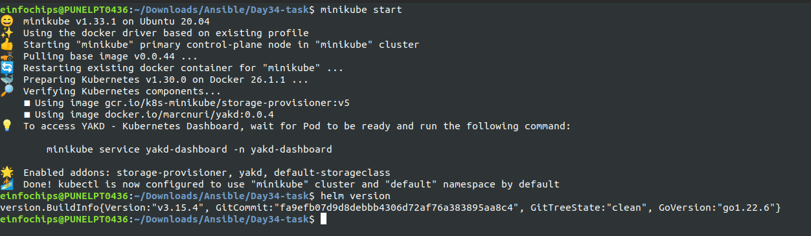

## 1. Add Helm Repositories

- First, you need to add the Helm repositories that contain the charts for Prometheus and Grafana.

```bash
helm repo add prometheus-community https://prometheus-community.github.io/helm-charts
helm repo add grafana https://grafana.github.io/helm-charts
```

- Update your Helm repositories to ensure you have the latest charts.
```bash
helm repo update
```
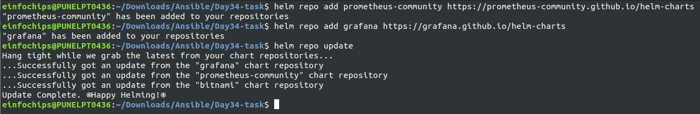

Optional Steps to search for helm packages :
```bash
helm search hub Prometheus
```
Or else you can go to the Artifact Hub repository and search for the Prometheus helm chart.

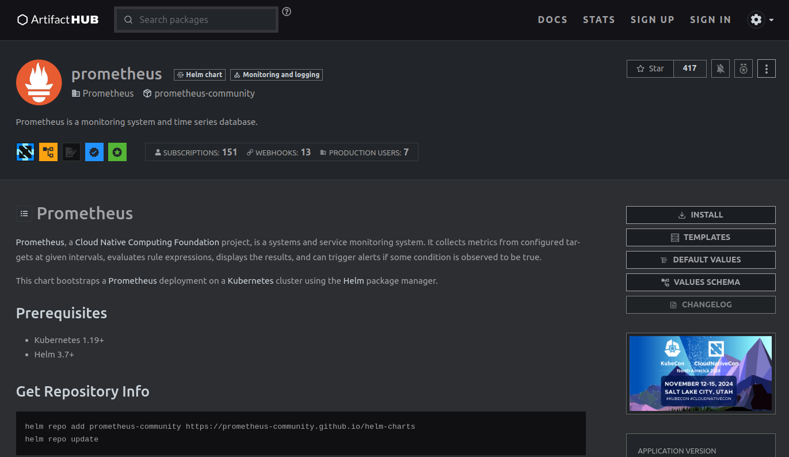


## 2. Install Prometheus

- Create a namespace for Prometheus.
```bash
kubectl create namespace monitoring
```
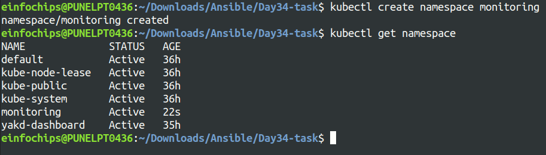

- Install Prometheus using Helm.
```bash
helm install prometheus prometheus-community/prometheus --namespace monitoring
```
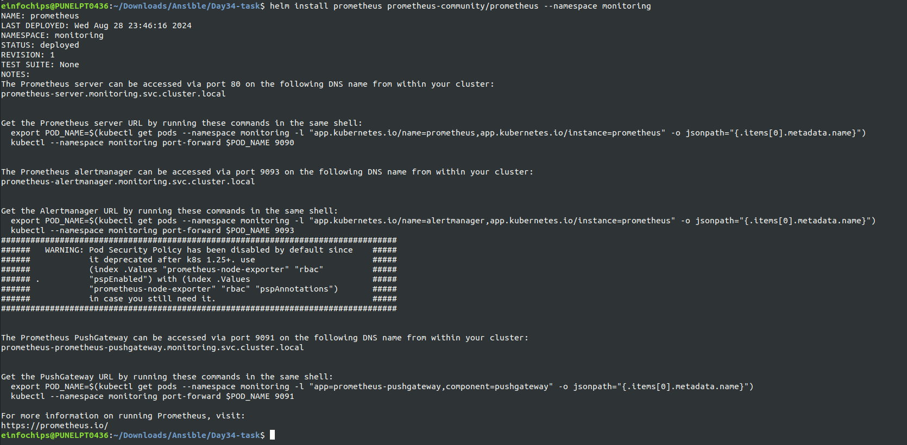

## 3. Install Grafana

Install Grafana using Helm.
```bash
helm install grafana grafana/grafana --namespace monitoring
```
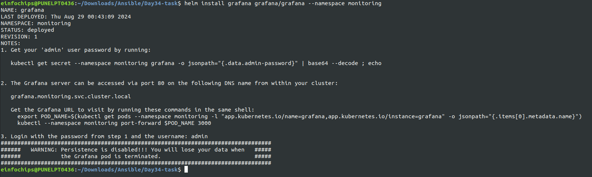

## 4. Access Grafana Dashboard

To access the Grafana dashboard, you need to set up port forwarding.
```bash
kubectl port-forward service/grafana 3002:80 --namespace monitoring
```
Open your browser and navigate to http://localhost:3002. 

- The default username is admin, and the password can be retrieved with the following command:
```bash
kubectl get secret --namespace monitoring grafana -o jsonpath="{.data.admin-password}" | base64 --decode ; echo
```
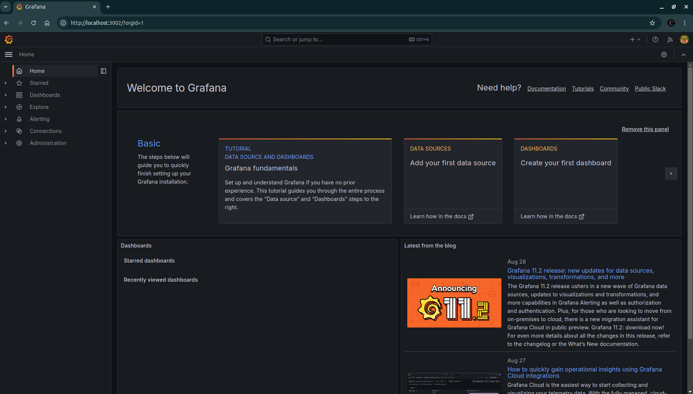

## 5. Access Prometheus Dashboard (Optional)
- You can also access the Prometheus dashboard by port-forwarding the Prometheus service.
```bash
kubectl port-forward service/prometheus-server 9091:80 --namespace monitoring
```

Open your browser and navigate to http://localhost:9091.

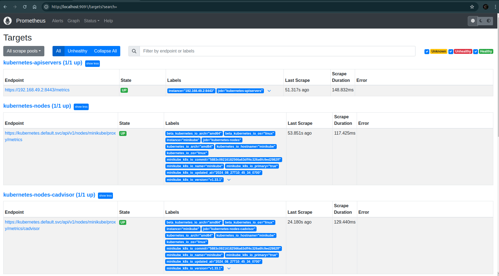

## 6.Configure Grafana to Use Prometheus as a Data Source
1. Log in to Grafana.
2. Click on the gear icon (⚙️) to go to Configuration and select Data Sources.
3. Click on Add data source.

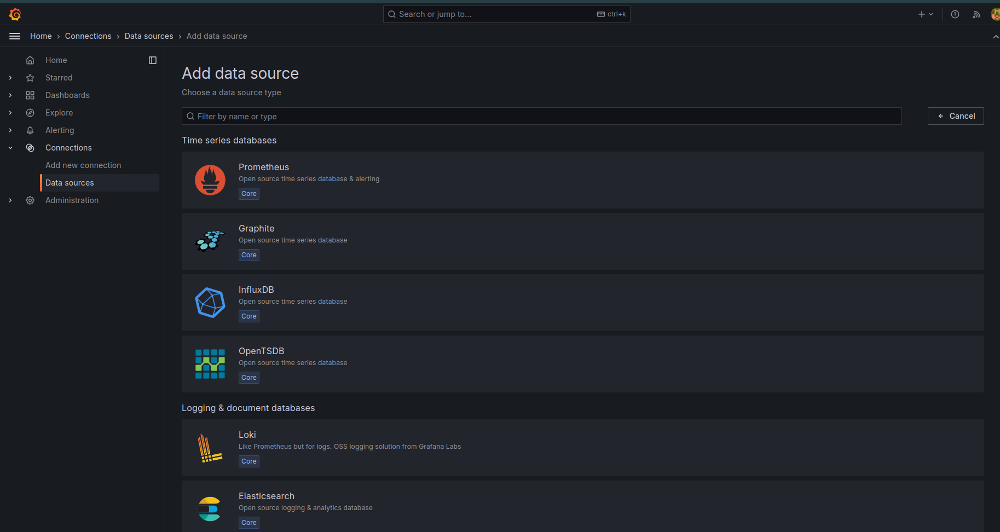

4. Choose Prometheus from the list and In the HTTP section, set the URL to http://prometheus-server.monitoring.svc.cluster.local..
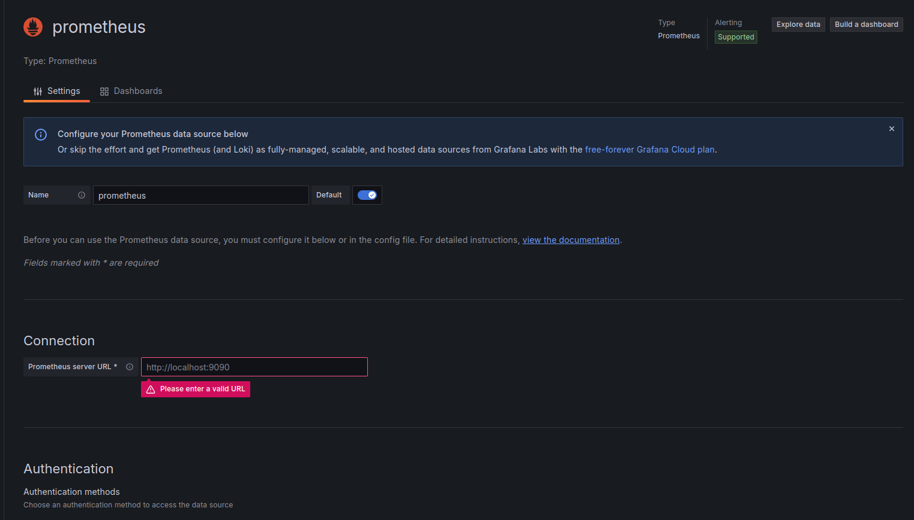

5. Click Save & Test to verify the connection.

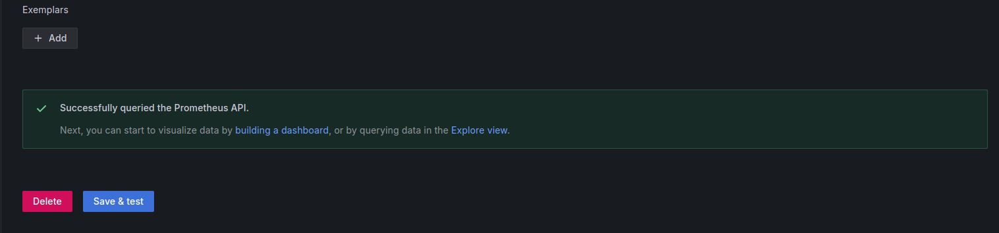

## 7. (Optional) Set Up Grafana Dashboards for Prometheus
Grafana provides a set of pre-configured dashboards for Prometheus. To import these dashboards:

1. Go to the + icon on the left sidebar and select Import.

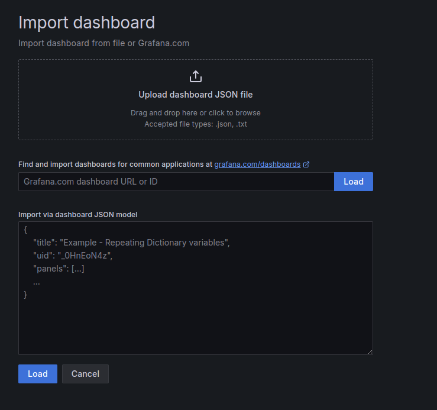

2. Enter the dashboard ID (e.g., 1860 for the Node Exporter Full dashboard)  or upload a JSON file of the dashboard configuration.

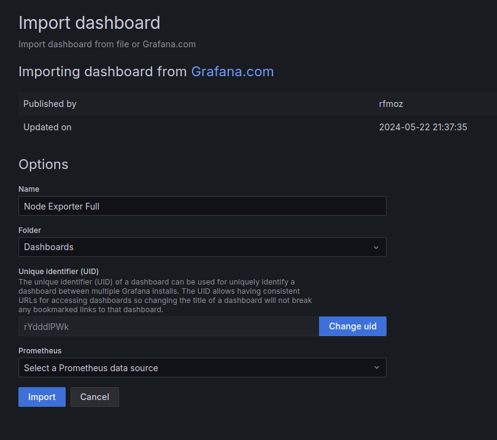

3. Select the Prometheus data source you configured earlier and Click Import.

# output :
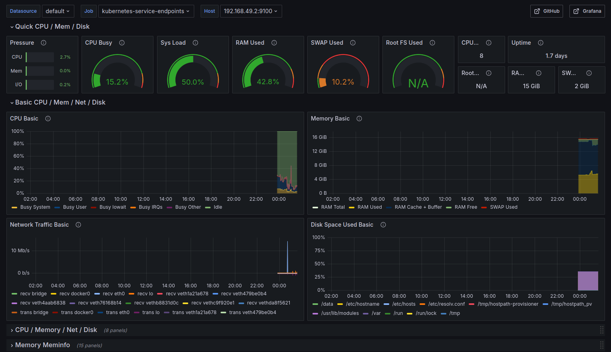

<!-- 
Additionally we can add volumes for Prometheus and grafana:

```bash 
kubectl apply -f grafana-pv.yaml
kubectl apply -f grafana-pvc.yaml
kubectl apply -f prometheus-pvc.yaml
kubectl apply -f prometheus-pvc.yaml
```
- Update Prometheus to use the persistent storage:
```bash
helm upgrade prometheus prometheus-community/prometheus --set server.persistentVolume.enabled=true --set server.persistentVolume.storageClass=local-storage --set server.persistentVolume.existingClaim=prometheus-pvc 
```
- Update Grafana to use the persistent storage:
```bash
helm upgrade grafana grafana/grafana --set persistence.enabled=true,persistence.storageClassName="local-storage",persistence.existingClaim="grafana-pvc" 
``` -->
# Conclusion
You have successfully deployed Prometheus and Grafana on your Kubernetes cluster using Helm charts. You can now monitor your cluster and applications using these tools. For further customization and configuration, refer to the Prometheus Helm chart documentation and the Grafana Helm chart documentation.