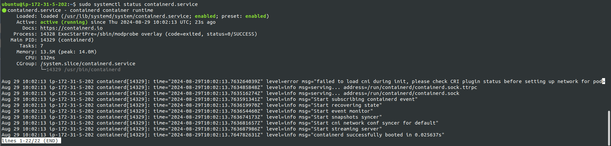

# Peoject: Monitoring Kubernetes Applications Using Prometheus and Grafana on EC2 Instances (2 Hours)

## Project Overview
In this project, we will deploy a Kubernetes application on AWS EC2 instances and set up a monitoring stack using Prometheus and Grafana. The goal is to monitor the application's performance and visualize metrics using Grafana dashboards. This project is designed to test and enhance your knowledge of deploying and configuring monitoring solutions in a Kubernetes environment on AWS.

## Project Objectives
- Deploy a Kubernetes cluster on EC2 instances.
- Install Prometheus to monitor Kubernetes cluster metrics.
- Install Grafana and configure it to visualize metrics from Prometheus.
- Create custom Grafana dashboards to monitor specific application metrics.
- Set up alerts in Grafana based on specific thresholds.
- Terminate all AWS resources after completing the project.

## Project Requirements
- **AWS EC2 Instances:** Launch a minimum of 3 t2.micro instances for the Kubernetes master and worker nodes.
- **Kubernetes Cluster:** Set up a Kubernetes cluster using Kubeadm on the EC2 instances.
- **Prometheus:** Deploy Prometheus on the Kubernetes cluster to collect metrics.
- **Grafana:** Deploy Grafana on the Kubernetes cluster and configure it to use Prometheus as a data source.
- **Custom Dashboards:** Create custom Grafana dashboards to monitor application metrics.
- **Alerting:** Set up basic alerts in Grafana for key metrics (e.g., CPU usage, memory usage).
- **Termination:** Ensure all AWS resources are terminated after the project is complete.

## Step-by-Step Project Tasks

### 1. Launch AWS EC2 Instances (20 Minutes)
- Launch two EC2 instances of type t2.medium for master node and t2.micro for worker node in the same VPC and availability zone.
> Controller Node => <br>


> Worker Node => <br>


- Configure security groups to allow SSH access (port 22) and necessary ports for Kubernetes, Prometheus, and Grafana (e.g., ports 9090, 3000).


- SSH into the instances and update the package manager.
> Controller Node => <br>


> Worker Node => <br>


### 2. Set Up a Kubernetes Cluster (30 Minutes)
- On the master node, install Kubeadm, Kubelet, and Kubectl.

#### 2.1. Installing Containerd on Master and Worker Node :
```bash
# Creating containerd configuration file with list of necessary modules that need to be loaded with containerd
cat <<EOF | sudo tee /etc/modules-load.d/k8s.conf
overlay
br_netfilter
EOF

# Load containerd modules
sudo modprobe overlay
sudo modprobe br_netfilter

# Creates configuration file for kubernetes-cri file
cat <<EOF | sudo tee /etc/sysctl.d/k8s.conf
net.bridge.bridge-nf-call-iptables  = 1
net.bridge.bridge-nf-call-ip6tables = 1
net.ipv4.ip_forward                 = 1
EOF

# Applying sysctl params
sudo sysctl --system

# Verify that the br_netfilter, overlay modules are loaded by running the following commands:
lsmod | grep br_netfilter
lsmod | grep overlay

# install containerd
sudo apt-get update
sudo apt-get -y install containerd

# Create a default config file at default location
sudo mkdir -p /etc/containerd
sudo containerd config default | sudo tee /etc/containerd/config.toml
sudo systemctl restart containerd
sudo systemctl status containerd
```
> Controller Node => <br>


> Worker Node => <br>


#### 2.2. Initialize the Kubernetes cluster using Kubeadm on Both Nodes.
```bash
sudo apt-get install -y apt-transport-https ca-certificates curl gpg
curl -fsSL https://pkgs.k8s.io/core:/stable:/v1.29/deb/Release.key | sudo gpg --dearmor -o /etc/apt/keyrings/kubernetes-apt-keyring.gpg
echo 'deb [signed-by=/etc/apt/keyrings/kubernetes-apt-keyring.gpg] https://pkgs.k8s.io/core:/stable:/v1.29/deb/ /' | sudo tee /etc/apt/sources.list.d/kubernetes.list
sudo apt-get update
sudo apt-get install -y kubelet kubeadm kubectl

# Fixate version to prevent upgrades
sudo apt-mark hold kubelet kubeadm kubectl
```


#### 2.3. Join the worker nodes to the master node to complete the cluster setup.
```bash
# initialise the kubeadm in master node
sudo kubeadm init

# to start using cluster, we need to run below as a regular user
mkdir -p $HOME/.kube
sudo cp -i /etc/kubernetes/admin.conf $HOME/.kube/config
sudo chown $(id -u):$(id -g) $HOME/.kube/config

kubectl get nodes
```


```bash
# Generate the kubeadm token using below cmd
kubeadm token create --print-join-command

# before using the token to join worker node use the below cmd to install calico networking on Master Node
kubectl apply -f https://raw.githubusercontent.com/projectcalico/calico/v3.25.0/manifests/calico.yaml

# use the token given by above command in the worker node
sudo kubeadm join <token>
```


- Verify that the cluster is working by deploying a sample application (e.g., Nginx).


### 3. Deploy Prometheus on Kubernetes (20 Minutes)
- Create a Kubernetes namespace for monitoring tools.
```bash
# install the helm on the Master Node
# to install helm use below commands
curl https://raw.githubusercontent.com/helm/helm/main/scripts/get-helm-3 | bash
helm repo add stable https://charts.helm.sh/stable
helm repo update
```


- Use a Helm chart to deploy Prometheus or manually deploy Prometheus using Kubernetes manifests.
```bash
# use the below cmd to add the prometheus repo
helm repo add prometheus-community https://prometheus-community.github.io/helm-charts
helm repo update
```


```bash
# create the namespace for prometheus
kubectl create namespace prometheus

# install prometheus using helm
helm install prometheus prometheus-community/prometheus --namespace prometheus
```


```bash
# use below command to expose the prometheus service on the 9090 port
kubectl port-forward service/prometheus --address 0.0.0.0 9090:80 --namespace prometheus
```
- Verify that Prometheus is collecting metrics from the Kubernetes cluster.


### 4. Deploy Grafana on Kubernetes (20 Minutes)
- Deploy Grafana in the monitoring namespace.
```bash
# create namespace for grafana
kubectl create namespace grafana
# Add the helm repo for grafana
helm repo add grafana https://grafana.github.io/helm-charts

# Install the grafana usng helm
helm install grafana grafana/grafana --namespace grafana
```


```bash
# to get the grafana login password for admin user use below cmd
kubectl get secret --namespace grafana grafana -o jsonpath="{.data.admin-password}" | base64 --decode ; echo

# use below command to expose the grafana service on the 3000 port
kubectl port-forward service/grafana --address 0.0.0.0 3000:80 --namespace grafana
```

- Expose Grafana using a Kubernetes service and set up port forwarding or a LoadBalancer for external access.


- Configure Grafana to use Prometheus as a data source.
- Verify that Grafana can visualize metrics from Prometheus.


### 5. Create and Configure Custom Dashboards (20 Minutes)
- Create custom dashboards in Grafana to monitor key metrics such as CPU usage, memory usage, pod status, and network traffic.
- Save the dashboards for future use.
- Share the dashboard URLs for easy access.

### 6. Clean Up Resources (10 Minutes)
- After completing the project, delete all Kubernetes resources (Prometheus, Grafana, and sample application)
```bash
helm uninstall grafana -n grafana
helm uninstall prometheus -n prometheus
```
