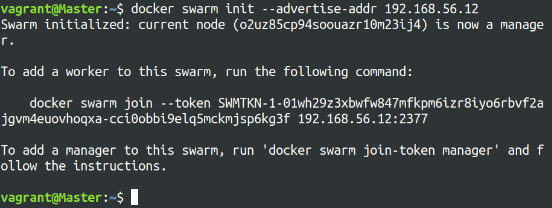
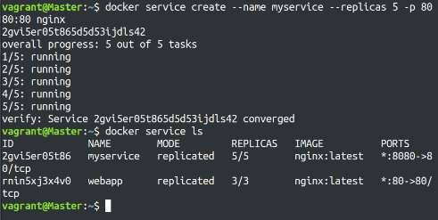
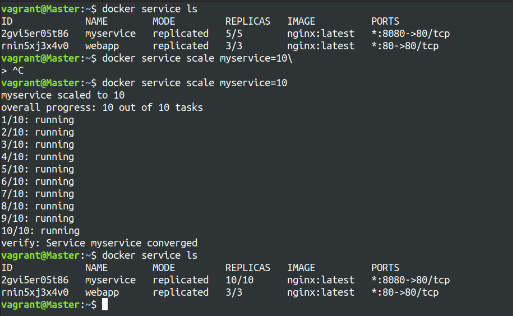
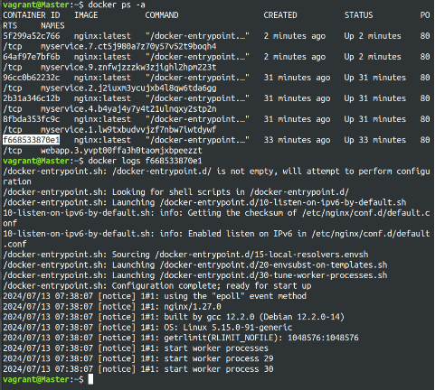
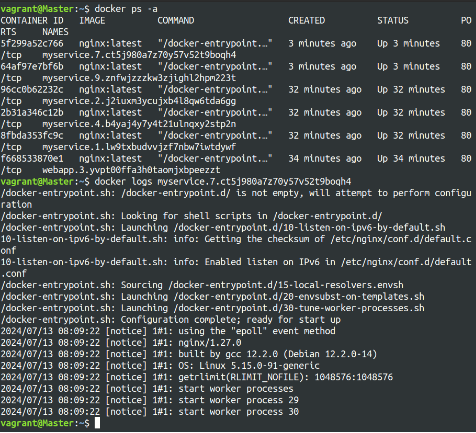

**Docker Swarm**

Docker Swarm is a container orchestration tool that allows you to manage a cluster of Docker nodes as a single logical system. It provides several benefits, such as scalability, high availability, load balancing, and simplified deployment. Here are some use cases and examples of how Docker Swarm can be utilized:

1. **High Availability Web Application**

**Use Case:** Deploying a web application that requires high availability and redundancy. **Example:**

- Create a Swarm cluster with multiple manager and worker nodes.
- Deploy a replicated service for the web application.
- Docker Swarm ensures that if one node fails, another node takes over, maintaining the application's availability.

**Steps:**

**Initialize Swarm:**

> docker swarm init --advertise-addr \<MANAGER-IP\>



**Add Worker Nodes:** On each worker node:

> docker swarm join --token \<WORKER-TOKEN\> \<MANAGER-IP\>:2377


**Deploy a Web Application:**

> docker service create --name webapp --replicas 3 -p 80:80 nginx

**Check Service Status:** 

> docker service ls


2. **Continuous Integration/Continuous Deployment (CI/CD) Pipeline**

**Use Case:** Automating the deployment of applications with a CI/CD pipeline. 

**Example:**
- Use Docker Swarm to deploy applications automatically when new code is committed.
- Integrate with CI/CD tools like Jenkins, GitLab CI, or GitHub Actions.

**Steps:**

**Initialize Swarm and Deploy Jenkins:**

> docker service create --name jenkins --replicas 1 -p 8080:8080 jenkins/jenkins


1. **Configure Jenkins to Deploy to Swarm:**
- Set up Jenkins with necessary plugins for Docker and Docker Swarm.
- Create a Jenkins pipeline that builds Docker images and deploys them to the Swarm cluster.
2. **Automate Deployment:**
- Configure Jenkins to trigger builds and deployments on code changes.
3. **Load Balancing and Scaling Services**

**Use Case:** Distributing traffic across multiple instances of a service for load balancing and scaling.

**Example:**

- Deploy a service with multiple replicas.
- Docker Swarm automatically load balances requests across these replicas.

**Steps:**

**Initialize Swarm:**

> docker swarm init

**Deploy a Service with Load Balancing:**

> docker service create --name myservice --replicas 5 -p 8080:80 nginx



**Scale the Service:**

> docker service scale myservice=10



4. **Microservices Architecture**

**Use Case:** Deploying a microservices-based application with multiple interdependent services.

**Example:**

- Use Docker Swarm to manage the deployment and scaling of each microservice.
- Ensure communication between services through the Swarm network.

**Steps:**

**Initialize Swarm:**
```
docker swarm init **Deploy Microservices:**
docker service create --name service1 --replicas 3 -p 5000:5000 my\_microservice1
docker service create --name service2 --replicas 2 -p 5001:5001 my\_microservice2
```

1\. **Ensure Services Communicate:**

- Use Docker Swarm's service discovery to enable communication between services using their service names.

**Docker Logs**

To view the logs of a container, you can use the following command: docker logs \<container_name_or_id\>



**Options**

Here are some useful options for the docker logs command:

- **-f, --follow**: Follow log output (similar to tail -f).
- **--tail**: Show only the last N lines of log output.
- **-t, --timestamps**: Show timestamps for each log entry.
- **--since**: Show logs since a specific time (e.g., 2022-07-01T13:23:37 or 10m for last 10 minutes).
- **--until**: Show logs up until a specific time.
1. **Viewing Logs of a Container**

> docker logs my\_container



2. **Following Logs in Real-Time** 
> docker logs -f my\_container
2. **Showing the Last 10 Lines of Logs** 

> docker logs --tail 10 my\_container
2. **Showing Logs with Timestamps** 
> docker logs -t my\_container
2. **Showing Logs Since a Specific Time**

> docker logs --since "2023-07-11T15:00:00" my\_container

6. **Combining Options**

> docker logs -f --tail 10 --since "10m" my\_container
