**Project 01**
======
**Objectives:**

- Create and manage Docker volumes for data persistence.
- Set up a Docker network for container communication.
- Use Docker Compose to manage multi-container applications.
- View and manage Docker logs.
- Deploy the application using Docker Swarm.

**Step-by-Step Guide**

## 1. **Create Docker Volumes**

Docker volumes are used to persist data generated by and used by Docker containers. 
```bash
docker volume create wordpress\_data
docker volume create mysql\_data
```

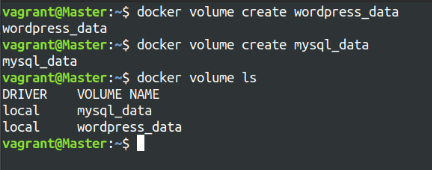

## 2. **Create a Docker Network**

Create a custom network for the containers to communicate.
```bash
docker network create wordpress_network
```
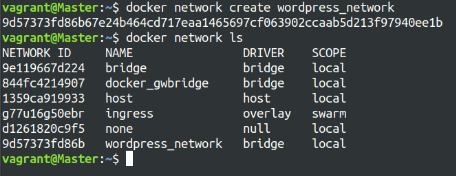

## 3. **Write a Docker Compose File**

Create a `docker-compose.yml` file to define and manage the services.
```yaml
version: '3.3'
services:
db:
   image: mysql:5.7
   volumes:
- mysql\_data:/var/lib/mysql
   networks:

- wordpress\_network
   environment:
   MYSQL\_ROOT\_PASSWORD: example
   MYSQL\_DATABASE: wordpress
   MYSQL\_USER: wordpress
   MYSQL\_PASSWORD: wordpress
wordpress:
   image: wordpress:latest
   volumes:

- wordpress\_data:/var/www/html
   networks:

- wordpress\_network
   ports: "8000:80"
   environment:
   WORDPRESS\_DB\_HOST: db:3306
   WORDPRESS\_DB\_USER: wordpress
   WORDPRESS\_DB\_PASSWORD: wordpress       WORDPRESS\_DB\_NAME: wordpress

volumes:
   mysql\_data:
   wordpress\_data:

networks:
   wordpress\_network:
```
## 4. **Deploy the Application with Docker Compose**

Run the following command to start the services defined in the `docker-compose.yml` file. 
```
docker-compose up -d
```
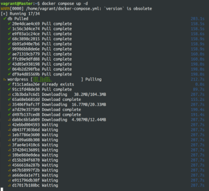

- Verify that the containers are running.
```
docker-compose ps
```
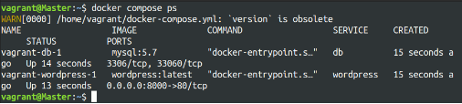

- Access the WordPress setup by navigating to http://localhost:8000.


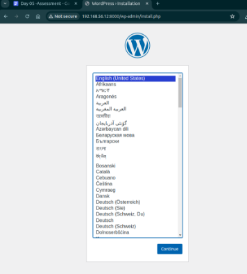

## 5. **Manage Docker Logs**
- View logs for a specific servic and follow logs for real-time updates.
```bash
docker-compose logs wordpress
docker-compose logs -f wordpress
```
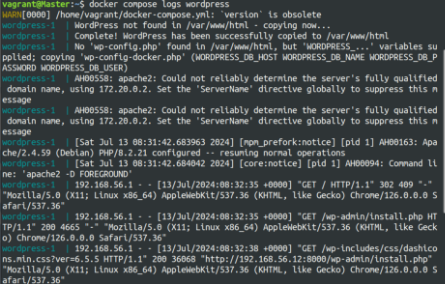

## 6. **Deploy the Application Using Docker Swarm**

Docker Swarm is a native clustering and orchestration tool for Docker.

- Initialize Docker Swarm and convert the Docker Compose file to a Docker Stack file, docker-stack.yml.
```bash
docker swarm init
```
```yaml
version: '3.3'
services:
    db:
     image: mysql:5.7
      volumes:
      - mysql_data:/var/lib/mysql
      networks:
      - wordpress_network
      environment:
        MYSQL_ROOT_PASSWORD: example  
        MYSQL_DATABASE: wordpress
        MYSQL_USER: wordpress
        MYSQL_PASSWORD: wordpress
      deploy:
        replicas: 1
    wordpress:
      image: wordpress:latest
      volumes:
      - wordpress_data:/var/www/html
    networks:
      - wordpress_network
    ports:
      - "8000:80"
    environment:
      WORDPRESS_DB_HOST: db:3306
      WORDPRESS_DB_USER: wordpress
      WORDPRESS_DB_PASSWORD: wordpress
      WORDPRESS_DB_NAME: wordpress
    deploy:
      replicas: 1
    volumes:
      mysql_data:
      wordpress_data:
    networks: wordpress_network
```
- Deploy the stack using Docker Swarm.
```
docker stack deploy -c docker-stack.yml wordpress_stack
```
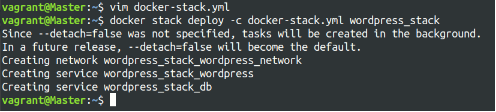

- Verify the stack is running.
```
docker stack services wordpress_stack
```
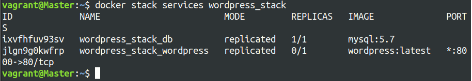

**Project 02:** 
=======

**Objectives:**

- Deploy an application across multiple Docker Swarm worker nodes.
- Place specific components on designated nodes.
- Monitor and troubleshoot using Docker logs.
- Modify and redeploy the application.


**Step-by-Step Guide**

## 1. **Initialize Docker Swarm and Join Worker Nodes** On the manager node, initialize Docker Swarm: 
```bash
docker swarm init --advertise-addr <MANAGER-IP>
```
Join the worker nodes to the swarm. On each worker node, run the command provided by the docker swarm init output:
```
docker swarm join --token <SWARM-TOKEN> <MANAGER-IP>:2377 
```
- Verify the nodes have joined:
```
docker node ls
```
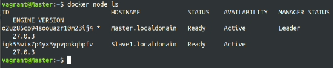

## 2. **Label Nodes for Specific Component Placement**

Label nodes to specify where certain components should run. For example, label a node for the database service:
```
docker node update --label-add db=true <NODE-ID> 
```
Label another node for the application service:
```
docker node update --label-add app=true <NODE-ID>
```
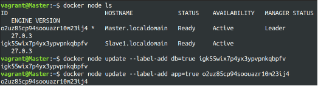

Verify the labels:
```
docker node inspect <NODE-ID>
```
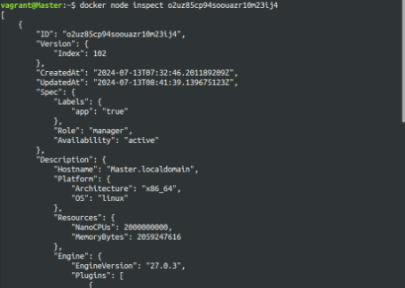

## 3. **Create a Docker Stack File**

Create a docker-stack.yml file to define the services and node placement constraints: 
```yaml
version: '3.8'

services:
  db:
    image: mysql:5.7
    volumes:
      - mysql_data:/var/lib/mysql
    networks:
      - app_network
    environment:
      MYSQL_ROOT_PASSWORD: example
      MYSQL_DATABASE: appdb
      MYSQL_USER: user
      MYSQL_PASSWORD: password
    deploy:
      placement:
        constraints:
          - node.labels.db == true

  app:
    image: your-app-image
    networks:
      - app_network
    ports:
      - "8000:80"
    environment:
      DB_HOST: db
    deploy:
      replicas: 2
      placement:
        constraints:
          - node.labels.app == true
volumes:
  mysql_data:
networks:
  app_network:
```

## 4. **Deploy the Application**

Deploy the stack using Docker Swarm:
```bash
docker stack deploy -c docker-stack.yml app_stack docker stack services app_stack
```
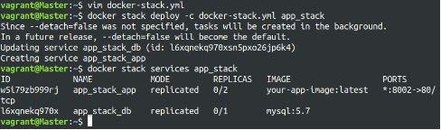

## 5. **Monitor and Troubleshoot Using Docker Logs** Check the logs for the services:
```bash
docker service logs app_stack_db docker service logs app_stack_app
```
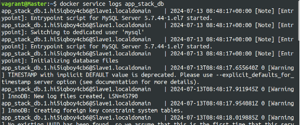

Follow the logs in real-time to monitor issues: 
```bash
docker service logs -f app_stack_app
```
## 6. **Modify and Re-deploy the Application**

Make modifications to the application or the stack file as needed. For example, change the number of replicas:
```yaml
services:
  app:
    deploy:
      replicas: 3
```
Update the stack with the new configuration: 
```bash
docker stack deploy -c docker-stack.yml app_stack
```
Verify the changes:
```bash
docker stack services app_stack
```