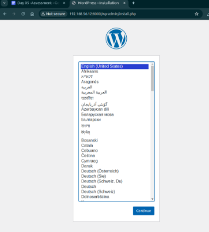
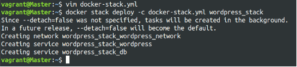
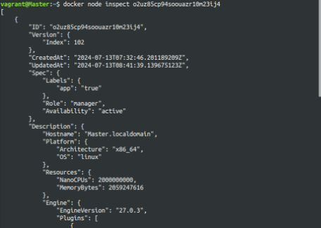

**Project 01**

**Objectives:**

- Create and manage Docker volumes for data persistence.
- Set up a Docker network for container communication.
- Use Docker Compose to manage multi-container applications.
- View and manage Docker logs.
- Deploy the application using Docker Swarm.

**Project Outline:**

1. **Create Docker Volumes**
1. **Create a Docker Network**
1. **Write a Docker Compose File**
1. **Deploy the Application with Docker Compose**
1. **Manage Docker Logs**
1. **Deploy the Application Using Docker Swarm**

**Step-by-Step Guide**

1. **Create Docker Volumes**

Docker volumes are used to persist data generated by and used by Docker containers. 
```
docker volume create wordpress\_data
docker volume create mysql\_data
```


2. **Create a Docker Network**

Create a custom network for the containers to communicate.

> docker network create wordpress\_network


3. **Write a Docker Compose File**

Create a docker-compose.yml file to define and manage the services.
```
version: '3.3'
services:
db:
   image: mysql:5.7
   volumes:
- mysql\_data:/var/lib/mysql
   networks:

- wordpress\_network
   environment:
   MYSQL\_ROOT\_PASSWORD: example
   MYSQL\_DATABASE: wordpress
   MYSQL\_USER: wordpress
   MYSQL\_PASSWORD: wordpress
wordpress:
   image: wordpress:latest
   volumes:

- wordpress\_data:/var/www/html
   networks:

- wordpress\_network
   ports: "8000:80"
   environment:
   WORDPRESS\_DB\_HOST: db:3306
   WORDPRESS\_DB\_USER: wordpress
   WORDPRESS\_DB\_PASSWORD: wordpress       WORDPRESS\_DB\_NAME: wordpress

volumes:
   mysql\_data:
   wordpress\_data:

networks:
   wordpress\_network:
```
4. **Deploy the Application with Docker Compose**

Run the following command to start the services defined in the docker-compose.yml file. 

> docker-compose up -d


- Verify that the containers are running.

> docker-compose ps


- Access the WordPress setup by navigating to http://localhost:8000.




5. **Manage Docker Logs**
- View logs for a specific service.

> docker-compose logs wordpress

- Follow logs for real-time updates.

> docker-compose logs -f wordpress


6. **Deploy the Application Using Docker Swarm**

Docker Swarm is a native clustering and orchestration tool for Docker.

- Initialize Docker Swarm.

> docker swarm init

- Convert the Docker Compose file to a Docker Stack file, docker-stack.yml.
```
version: '3.3'

services:
    db:
     image: mysql:5.7
      volumes:
- mysql\_data:/var/lib/mysql
      networks:
- wordpress\_network
      environment:
        MYSQL\_ROOT\_PASSWORD: example       MYSQL\_DATABASE: wordpress
        MYSQL\_USER: wordpress
        MYSQL\_PASSWORD: wordpress
      deploy:
        replicas: 1
    wordpress:
      image: wordpress:latest
      volumes:
- wordpress\_data:/var/www/html
    networks:
- wordpress\_network
    ports:
- "8000:80"
    environment:
      WORDPRESS\_DB\_HOST: db:3306
      WORDPRESS\_DB\_USER: wordpress
      WORDPRESS\_DB\_PASSWORD: wordpress       WORDPRESS\_DB\_NAME: wordpress
    deploy:
      replicas: 1
volumes:
  mysql\_data:
  wordpress\_data:
networks:
  wordpress\_network
- Deploy the stack using Docker Swarm.
```

> docker stack deploy -c docker-stack.yml wordpress\_stack



- Verify the stack is running.

> docker stack services wordpress\_stack


**Project 02:** 

**Objectives:**

- Deploy an application across multiple Docker Swarm worker nodes.
- Place specific components on designated nodes.
- Monitor and troubleshoot using Docker logs.
- Modify and redeploy the application.


**Project Outline:**

1. **Initialize Docker Swarm and Join Worker Nodes**
1. **Label Nodes for Specific Component Placement**
1. **Create a Docker Stack File**
1. **Deploy the Application**
1. **Monitor and Troubleshoot Using Docker Logs**
1. **Modify and Redeploy the Application**

**Step-by-Step Guide**

1. **Initialize Docker Swarm and Join Worker Nodes** On the manager node, initialize Docker Swarm: docker swarm init --advertise-addr \<MANAGER-IP\>

Join the worker nodes to the swarm. On each worker node, run the command provided by the docker swarm init output:

> docker swarm join --token \<SWARM-TOKEN\> \<MANAGER-IP\>:2377 Verify the nodes have joined:

> docker node ls


2. **Label Nodes for Specific Component Placement**

Label nodes to specify where certain components should run. For example, label a node for the database service:

>docker node update --label-add db=true <NODE-ID> Label another node for the application service:

> docker node update --label-add app=true <NODE-ID>


Verify the labels:

> docker node inspect <NODE-ID>



3. **Create a Docker Stack File**

Create a docker-stack.yml file to define the services and node placement constraints: 
```
version: '3.8'
services:
  db:
    image: mysql:5.7
    volumes:
- mysql\_data:/var/lib/mysql
    networks:
- app\_network
    environment:
      MYSQL\_ROOT\_PASSWORD: example       MYSQL\_DATABASE: appdb
      MYSQL\_USER: user
      MYSQL\_PASSWORD: password
    deploy:
      placement:
        constraints:
- node.labels.db == true
  app:
    image: your-app-image
    networks:

- app\_network
    ports:

- "8000:80"
    environment:
      DB\_HOST: db
    deploy:
      replicas: 2
      placement:
        constraints:

- node.labels.app == true
volumes:
  mysql\_data:

networks:
  app\_network:
```

4. **Deploy the Application**

Deploy the stack using Docker Swarm:
```
docker stack deploy -c docker-stack.yml app\_stack docker stack services app\_stack
```


5. **Monitor and Troubleshoot Using Docker Logs** Check the logs for the services:
```
   docker service logs app\_stack\_db docker service logs app\_stack\_app
```


Follow the logs in real-time to monitor issues: >docker service logs -f app\_stack\_app

6. **Modify and Redeploy the Application**

Make modifications to the application or the stack file as needed. For example, change the number of replicas:
```
services:
  app:
    deploy:
      replicas: 3
```
Update the stack with the new configuration: 

> docker stack deploy -c docker-stack.yml app\_stack

Verify the changes:

> docker stack services app\_stack
