**Project 01**
======
Deploying a Node.js App Using Minikube Kubernetes

**Overview**

This project guides you through deploying a Node.js application using Minikube Kubernetes. You'll use Git for version control, explore branching and fast-forward merges, and set up Kubernetes services and deployment pods, including ClusterIP and NodePort service types.

**Prerequisites**

- Minikube installed
- kubectl installed
- Git installed
- Node.js installed (https://nodejs.org/en/download/package-manager/all#debian-and-ubuntu-based-linux-distributions)

## **Project Steps**

### **1. Set Up Git Version Control**

#### 1.1. **Initialize a Git Repository**

- Create a new directory for your project and initialize a Git repository:
```bash
mkdir nodejs-k8s-project
cd nodejs-k8s-project
git init
```

#### 1.2. **Create a Node.js Application** 

- Initialize a Node.js project:
```bash
npm init -y
```
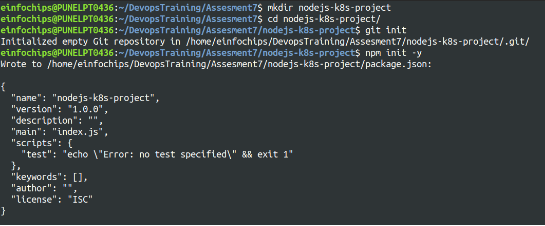

- Install Express.js:
```bash
npm install express
```
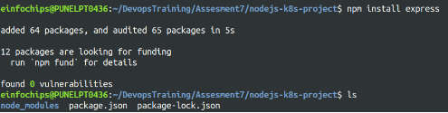

- Create an index.js file with the following content:
```js
const express = require('express');
const app = express();
const port = 3000;
app.get('/', (req, res) => { 
   res.send('Hello, Kubernetes!');
});

app.listen(port, () => {
   console.log(`App running at http://localhost:${port}`);
});
```
- Create a .gitignore file to ignore node_modules:
```bash
node_modules
```
#### 1.3. **Commit the Initial Code**

- Add files to Git and Commit the changes:
```bash
git add .
git commit -m "Initial commit with Node.js app"
```

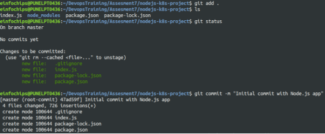

### 2. **Branching and Fast-Forward Merge**

#### 2.1. **Create a New Branch**

- Create and switch to a new branch feature/add-route: 
```bash
git checkout -b feature/add-route
```
#### 2.2. **Implement a New Route** 

- Modify index.js to add a new route: 
```js
app.get('/newroute', (req, res) => { 
   res.send ('This is a new route!'); 
});
```
- Commit the changes:
```bash
git add .
git commit -m "Add new route"
```
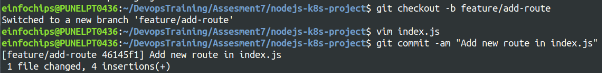


- Switch back to the main branch and Merge the feature/add-route branch using fast-forward then Delete the feature branch:
```bash
git checkout main
git merge --ff-only feature/add-route
git branch -d feature/add-route
```

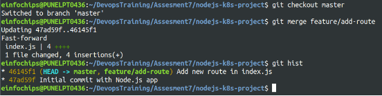

### 3. **Containerize the Node.js Application**

#### 3.1. **Create a Dockerfile**

Create a Dockerfile with the following content:
```Dockerfile
FROM node:14 
WORKDIR /app
COPY package*.json ./ RUN npm install
COPY . .
EXPOSE 3000
CMD ["node", "index.js"]
```

#### 3.2. **Build and Test the Docker Image** 
Build the Docker image:
```bash
docker build -t nodejs-k8s-app .
```
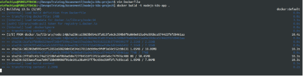

Run the Docker container to test: 
```bash
docker run -p 3000:3000 nodejs-k8s-app
```
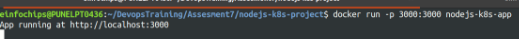

Access http://localhost:3000 to see the app running.

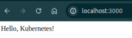

### 4. **Deploying to Minikube Kubernetes**

#### 4.1. **Start Minikube**

Start Minikube: 
```bash
minikube start
```
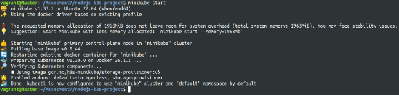

#### 4.2. **Create Kubernetes Deployment and Service Manifests** 

Create a deployment.yaml file:
```yaml
apiVersion: apps/v1
kind: Deployment
metadata:
  name: nodejs-app
spec:
  replicas: 2
  selector:
    matchLabels:
      app: nodejs-app
  template:
    metadata:
      labels:
        app: nodejs-app
    spec:
      containers:
      - name: nodejs-app
        image: nodejs-k8s-app:latest
        ports:
        - containerPort: 3000
```
Create a service.yaml file for ClusterIP:
```yaml
apiVersion: v1
kind: Service
metadata:
  name: nodejs-service
spec:
  selector:
    app: nodejs-app
  ports:
  - protocol: TCP
    port: 80
    targetPort: 3000
  type: ClusterIP
```

Create a service-nodeport.yaml file for NodePort:
```yaml
apiVersion: v1
kind: Service
metadata:
  name: nodejs-service-nodeport
spec:
  selector:
    app: nodejs-app
  ports:
  - protocol: TCP
    port: 80
    targetPort: 3000
    nodePort: 30001
  type: NodePort
```
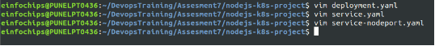

#### 4.3. **Apply Manifests to Minikube**

Apply the deployment:
```bash
kubectl apply -f deployment.yaml
```
Apply the ClusterIP service:
```bash
kubectl apply -f service.yaml
```
Apply the NodePort service:
```bash
kubectl apply -f service-nodeport.yaml
```
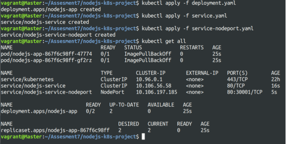

#### 4.4. **Access the Application**

Get the Minikube IP:
```bash
minikube ip
```
- Access the application using the NodePort:
```bash
curl http://<minikube-ip>:30001
```


### 6. **Making Changes to the Node.js Application**

#### 6.1. **Create a New Branch for Changes**

Create and switch to a new branch feature/update-message:
```bash
git checkout -b feature/update-message
```
#### 6.2. **Update the Application**

Modify index.js to change the message:
```js
const express = require('express');
const app = express();
const port = 3000;

app.get('/', (req, res) => {
    res.send('Hello, Kubernetes! Updated version.');
});

app.get('/newroute', (req, res) => {
    res.send('This is a new route!');
});

app.listen(port, () => {
    console.log(`App running at http://localhost:${port}`);
});
```
#### 6.3. **Commit the Changes**

Add and commit the changes:
```bash
git add .
git commit -m "Update main route message"
```
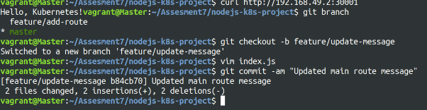

### 7. **Merge the Changes and Rebuild the Docker Image**
#### 7.1. **Merge the Feature Branch**

Switch back to the main branch and Merge the feature/update-message branch:
```bash
git checkout main
git merge --ff-only feature/update-message
```

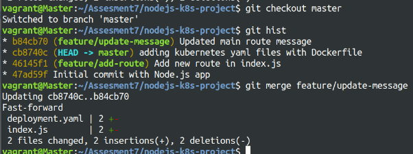

Delete the feature branch:
```bash
git branch -d feature/update-message
```
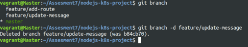

#### 7.2. **Rebuild the Docker Image**

Rebuild the Docker image with a new tag: 
```bash
docker build -t nodejs-k8s-app:v2 .
```
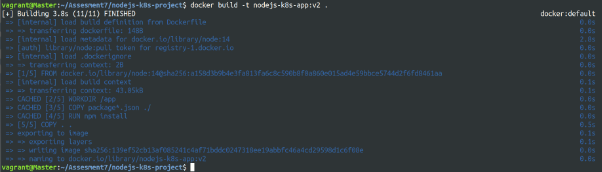

### 8. **Update Kubernetes Deployment**

#### 8.1. **Update the Deployment Manifest**

Modify deployment.yaml to use the new image version:
```yaml
apiVersion: apps/v1
kind: Deployment
metadata:
  name: nodejs-app
spec:
  replicas: 2
  selector:
    matchLabels:
      app: nodejs-app
  template:
    metadata:
      labels:
        app: nodejs-app
    spec:
      containers:
      - name: nodejs-app
        image: nodejs-k8s-app:v2
        ports:
        - containerPort: 3000
```

#### 8.2. **Apply the Updated Manifest** 

Apply the updated deployment: 
```bash
kubectl apply -f deployment.yaml
```
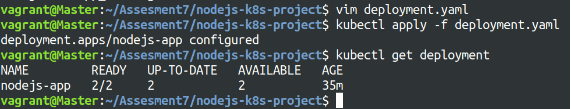

#### 8.3. **Verify the Update**

Check the status of the deployment:
```bash
kubectl rollout status deployment/nodejs-app
```
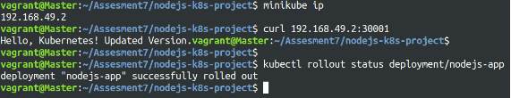

### 9. **Access the Updated Application**

#### 9.1. **Access Through ClusterIP Service**

Forward the port to access the ClusterIP service: 
```bash
kubectl port-forward service/nodejs-service 8080:80
```
- Open your browser and navigate to http://localhost:8080 to see the updated message.

#### 9.2. **Access Through NodePort Service**

- Access the application using the NodePort: 
```bash
curl http://<minikube-ip>:30001
```


**Project 02** 
=====
Deploying a Python Flask App Using Minikube Kubernetes

**Overview**

This project guides you through deploying a Python Flask application using Minikube Kubernetes. You'll use Git for version control, explore branching and fast-forward merges, and set up Kubernetes services and deployment pods, including ClusterIP and NodePort service types.

**Prerequisites**

- Minikube installed
- kubectl installed
- Git installed
- Python installed

**Project Steps**

## 1. **Set Up Git Version Control**
### 1.1. **Initialize a Git Repository**

Create a new directory for your project: 
```bash
mkdir flask-k8s-project
cd flask-k8s-project
```

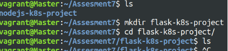

Initialize a Git repository:
```bash
git init
```
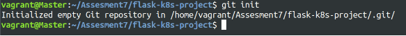

### 1.2. **Create a Python Flask Application** 

Create a virtual environment:
```bash
python -m venv venv
source venv/bin/activate
```
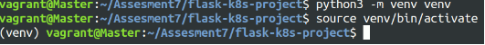

Install Flask: 
```bash
pip install Flask
```
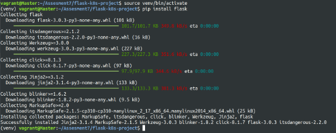

Create an app.py file with the following content:
```py
from flask import Flask

app = Flask(__name__)

@app.route('/')
def hello_world():
    return 'Hello, Kubernetes!'

if __name__ == '__main__':
    app.run(host='0.0.0.0', port=5000)
```
Create a requirements.txt file to list the dependencies: Flask

Create a .gitignore file to ignore venv:
```
venv
```
### 1.3. **Commit the Initial Code** 

Add files to Git and Commit the changes:
```bash
git add .
git commit -m "Initial commit with Flask app"
```
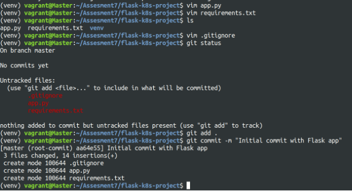

## 2. **Branching and Fast-Forward Merge**
### 2.1. **Create a New Branch**

Create and switch to a new branch feature/add-route: 
```bash
git checkout -b feature/add-route
```
### 2.2. **Implement a New Route**

Modify app.py to add a new route: 
```py
@app.route('/newroute')
def new_route():
    return 'This is a new route!'
```

Commit the changes:
```bash
git add .
git commit -m "Add new route"
```
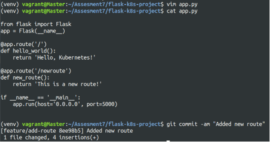

### 2.3. **Merge the Branch Using Fast-Forward**

Switch back to the main branch and Merge the feature/add-route branch using fast-forward then Delete the feature branch:
```bash
git checkout main
git merge --ff-only feature/add-route
git branch -d feature/add-route
```
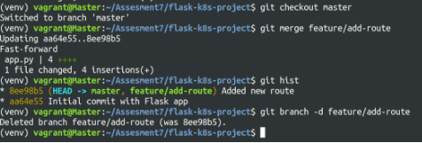

## 3. **Containerize the Flask Application**
### 3.1. **Create a Dockerfile**

Create a Dockerfile with the following content: 
```Dockerfile
FROM python:3.8-slim
WORKDIR /app
COPY requirements.txt requirements.txt 
RUN pip install -r requirements.txt
COPY . .
EXPOSE 5000
CMD ["python", "app.py"]
```

### 3.2. **Build and Test the Docker Image** Build the Docker image:
```bash
docker build -t flask-k8s-app .
```
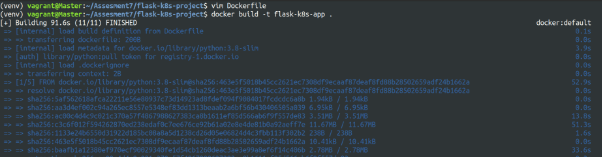

Run the Docker container to test:
```bash
docker run -p 5000:5000 flask-k8s-app
```
- Access http://localhost:5000 to see the app running.

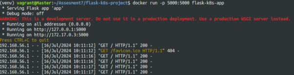

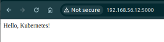

## 4. **Deploying to Minikube Kubernetes**
### 4.1. **Start Minikube** 

Start Minikube: 
```bash
minikube start
```
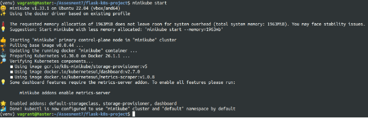

### 4.2. **Create Kubernetes Deployment and Service Manifests** 

Create a deployment.yaml file:
```yaml
apiVersion: apps/v1
kind: Deployment
metadata:
  name: flask-app
spec:
  replicas: 2
  selector:
    matchLabels:
      app: flask-app
  template:
    metadata:
      labels:
        app: flask-app
    spec:
      containers:
      - name: flask-app
        image: flask-k8s-app:latest
        ports:
        - containerPort: 5000
```

Create a service.yaml 

```yaml
apiVersion: v1
kind: Service
metadata:
  name: flask-service
spec:
  selector:
    app: flask-app
  ports:
  - protocol: TCP
    port: 80
    targetPort: 5000
  type: ClusterIP
```

Create a service-nodeport.yaml 
```yaml
apiVersion: v1
kind: Service
metadata:
  name: flask-service-nodeport
spec:
  selector:
    app: flask-app
  ports:
  - protocol: TCP
    port: 80
    targetPort: 5000
    nodePort: 30001
  type: NodePort
```

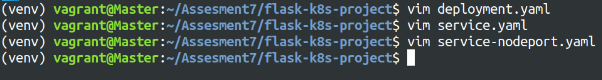

### 4.3. **Apply Manifests to Minikube** 

Apply the deployment:
```bash
kubectl apply -f deployment.yaml
```
Apply the ClusterIP service:
```bash
kubectl apply -f service.yaml
```
Apply the NodePort service:
```bash
kubectl apply -f service-nodeport.yaml
```
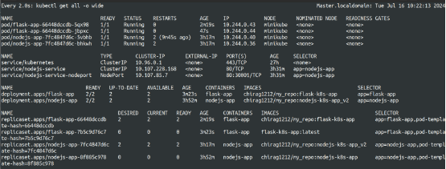

### 4.4. **Access the Application**

Get the Minikube IP:
```bash
minikube ip
```
Access the application using the NodePort: 
```bash
curl http://<minikube-ip>:30002
```
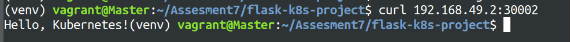

## 5. **Clean Up**

Stop Minikube: 
```bash
minikube stop
```
Delete Minikube cluster: 
```bash
minikube delete
```
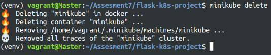

## 6. **Making Changes to the Flask Application**
### 6.1. **Create a New Branch for Changes**

Create and switch to a new branch feature/update-message: 
```bash
git checkout -b feature/update-message
```
### 6.2. **Update the Application**

Modify app.py to change the message: 
```py
@app.route('/')
def hello_world():
    return 'Hello, Kubernetes! Updated version.'

@app.route('/newroute')
def new_route():
    return 'This is a new route!'
```

### 6.3. **Commit the Changes**

Add and commit the changes:
```bash
git add .
git commit -m "Update main route message"
```
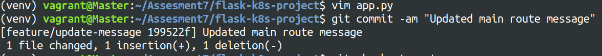

## 7. **Merge the Changes and Rebuild the Docker Image**
### 7.1. **Merge the Feature Branch**

Switch back to the main branch and Merge the feature/update-message branch then Delete the feature branch:
```bash
git checkout main
git merge --ff-only feature/update-message 
git branch -d feature/update-message
```
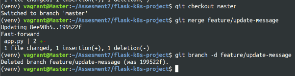

### 7.2. **Rebuild the Docker Image**

Rebuild the Docker image with a new tag: 
```bash
docker build -t flask-k8s-app:v2 .
```
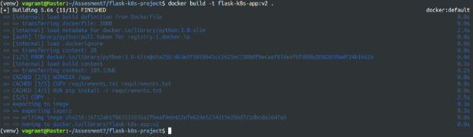

## 8. **Update Kubernetes Deployment**
### 8.1. **Update the Deployment Manifest**

Modify deployment.yaml to use the new image version: 
```yaml
apiVersion: apps/v1
kind: Deployment
metadata:
  name: flask-app
spec:
  replicas: 2
  selector:
    matchLabels:
      app: flask-app
  template:
    metadata:
      labels:
        app: flask-app
    spec:
      containers:
      - name: flask-app
        image: flask-k8s-app:v2
        ports:
        - containerPort: 5000
```
### 8.2. **Apply the Updated Manifest**

Apply the updated deployment: 
```bash
kubectl apply -f deployment.yaml
```
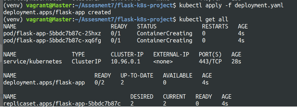

### 8.3. **Verify the Update**

Check the status of the deployment:
```bash
kubectl rollout status deployment/flask-app
```
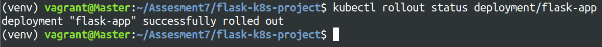

## 9. **Access the Updated Application**

Forward the port to access the ClusterIP service: 
```bash
kubectl port-forward service/flask-service 8080:80
```
- Open your browser and navigate to http://localhost:8080 to see the updated message.

- Access Through NodePort Service

Access the application using the NodePort: 
```bash
curl http://<minikube-ip>:30001
```
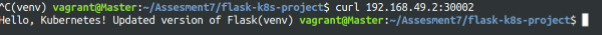
