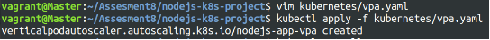

Project 01
======
In this project, you will develop a simple Node.js application, deploy it on a local Kubernetes cluster using Minikube, and configure various Kubernetes features. The project includes Git version control practices, creating and managing branches, and performing rebases. Additionally, you will work with ConfigMaps, Secrets, environment variables, and set up vertical and horizontal pod autoscaling.

**Step-by-step**
## 1. Setup Minikube and Git Repository

Start Minikube
```bash
minikube start
```


### **1.2 Set Up Git Repository**

**Create a new directory for your project**:
```bash
mkdir nodejs-k8s-project
cd nodejs-k8s-project
```
**Initialize Git repository:** 
```bash
git init
```
**Create a .gitignore file:** 
```bash
node_modules/
.env
```
**Add and commit initial changes:** 
```bash
git add .
git commit -m "Initial commit"
```


## 2. **Develop a Node.js Application**

### 2.1. **Create the Node.js App**

Initialize the Node.js project:
```bash
npm init -y   
npm install express 
body-parser
```


**Create app.js:**
```js
const express = require('express');
const bodyParser = require('body-parser'); 
const app = express();
const PORT = process.env.PORT || 3000;
app.use(bodyParser.json());
app.get('/', (req, res) => {   
    res.send('Hello, World!'); });
app.listen(PORT, () => {
    console.log(`Server is running on port ${PORT}`); });
```

**Update package.json** to include a start script:
```json
"scripts": {
    "start": "node app.js" 
}
```


### 2.2. **Commit the Node.js Application**

Add and commit changes:
```bash
git add .
git commit -m "Add Node.js application code"
```
<br>


## 3. **Create Dockerfile and Docker Compose**

### 3.1. **Create a Dockerfile**

**Add Dockerfile:**
```Dockerfile
FROM node:18
# Set the working directory
WORKDIR /usr/src/app
# Copy package.json and package-lock.json
COPY package*.json ./
# Install dependencies
RUN npm install
# Copy the rest of the application code
COPY . .
# Expose the port on which the app runs
EXPOSE 3000
# Command to run the application
CMD [ "npm", "start" ]
```

**Create a .dockerignore file:**
```bash
node\_modules
.npm
```
### 3.2. **Create docker-compose.yml (optional for local testing)**

**Add docker-compose.yml:**
```yml
version: '3'
services:
  app:
    build: .
    ports:
      - "3000:3000"
```
**Add and commit changes:**
```bash
git add Dockerfile docker-compose.yml
git commit -m "Add Dockerfile and Docker Compose configuration"
```

<br>

## 4. **Build and Push Docker Image**

### 4.1. **Build Docker Image:**
```bash
docker build -t nodejs-app:latest .
```


### 4.2. **Push Docker Image to Docker Hub Tag and push the image**:
```bash
docker tag nodejs-app:latest chirag1212/nodejs-app:latest docker push chirag1212/nodejs-app:latest
```


**Add and commit changes:**
```bash
git add .
git commit -m "Build and push Docker image"
```


## 5. **Create Kubernetes Configurations**<br>

### 5.1. **Create Kubernetes Deployment**

**Create kubernetes/deployment.yaml:**
```yml
apiVersion: apps/v1
kind: Deployment
metadata:
  name: nodejs-app-deployment
spec:
  replicas: 2
  selector:
    matchLabels:
      app: nodejs-app
  template:
    metadata:
      labels:
        app: nodejs-app
    spec:
      containers:
      - name: nodejs-app
        image: your-dockerhub-username/nodejs-app:latest
        ports:
        - containerPort: 3000
        env:
        - name: PORT
          valueFrom:
            configMapKeyRef:
              name: app-config
              key: PORT
        - name: NODE_ENV
          valueFrom:
            secretKeyRef:
              name: app-secrets
              key: NODE_ENV
```

### 5.2. **Create ConfigMap and Secret**
 
**Create kubernetes/configmap.yaml:**
```yaml
apiVersion: v1
kind: ConfigMap
metadata:
  name: app-config
data:
  PORT: "3000"
```
**Create kubernetes/secret.yaml**:
```yaml
apiVersion: v1
kind: Secret
metadata:
  name: app-secrets
type: Opaque
data:
  NODE_ENV: cHJvZHVjdGlvbmFs # Base64 encoded value for "production"
```
**Add and commit Kubernetes configurations:**
```bash 
git add kubernetes/
git commit -m "Add Kubernetes deployment, configmap, and secret"
```


### 5.3. **Apply Kubernetes Configurations** 

Apply the ConfigMap and Secret:
```bash
kubectl apply -f kubernetes/configmap.yaml 
kubectl apply -f kubernetes/secret.yaml
```
**Apply the Deployment**:
```bash
kubectl apply -f kubernetes/deployment.yaml
```


## 6. **Implement Autoscaling**
### 6.1. **Create Horizontal Pod Autoscaler**

**Create kubernetes/hpa.yaml**: 
```yml
apiVersion: autoscaling/v2beta2
kind: HorizontalPodAutoscaler
metadata:
  name: nodejs-app-hpa
spec:
  scaleTargetRef:
    apiVersion: apps/v1
    kind: Deployment
    name: nodejs-app-deployment
  minReplicas: 2
  maxReplicas: 5
  metrics:
  - type: Resource
    resource:
      name: cpu
      target:
        type: Utilization
        averageUtilization: 50
```
**Apply the HPA**:
```bash
kubectl apply -f kubernetes/hpa.yaml
```


### 6.2. **Create Vertical Pod Autoscaler** 

Create kubernetes/vpa.yaml: 
```yml
apiVersion: autoscaling.k8s.io/v1beta2
kind: VerticalPodAutoscaler
metadata:
  name: nodejs-app-vpa
spec:
  targetRef:
    apiVersion: apps/v1
    kind: Deployment
    name: nodejs-app-deployment
  updatePolicy:
    updateMode: "Auto"
```
**Apply the VPA**:
```bash
kubectl apply -f kubernetes/vpa.yaml
```


## 7. **Test the Deployment**
### 7.1. **Check the Status of Pods, Services, and HPA** 

**Verify the Pods**:
```bash
kubectl get pods
```


**Verify the Services**: 
```bash
kubectl get svc
```


**Verify the HPA**: 
```bash
kubectl get hpa
```


### 7.2. **Access the Application and Expose the Service**:
```bash
kubectl expose deployment nodejs-app-deployment --type=NodePort -- name=nodejs-app-service
```


Get the Minikube IP and Service Port: 
```bash
minikube service nodejs-app-service --url
```


- Access the Application in your browser using the URL obtained from the previous command.


## 8. **Git Version Control**
### 8.1. **Create a New Branch for New Features**

Create and switch to a new branch:
```bash
git checkout -b feature/new-feature 
```
Make changes and commit:
```bash
git add .
git commit -m "Add new feature"
```


Push the branch to the remote repository: 
```bash
git push origin feature/new-feature
```


### 8.2. **Rebase Feature Branch on Main Branch**

Switch to the main branch and pull the latest changes:
```bash
git checkout main git pull origin main
```


Rebase the feature branch: 
```bash
git checkout feature/new-feature git rebase main
```


Resolve conflicts if any, and continue the rebase:
```bash
git add .
git rebase --continue
```
Push the rebased feature branch:
```bash
git push origin feature/new-feature --force
```


## 9. **Final Commit and Cleanup**

Merge feature branch to main: 
```bash
git checkout main
git merge feature/new-feature
```


Push the changes to the main branch: 
```bash
git push origin main
```


Clean up:
```bash
git branch -d feature/new-feature
git push origin --delete feature/new-feature
```


**Project 02**
======

Deploy a Node.js application to Kubernetes with advanced usage of ConfigMaps and Secrets. Implement Horizontal Pod Autoscaler (HPA) with both scale-up and scale-down policies. The project will include a multi-environment configuration strategy, integrating a Redis cache, and monitoring application metrics.

**Project Setup**

## 1. **Initialize a Git Repository**

Create a new directory for your project and initialize Git: 
```bash
mkdir nodejs-advanced-k8s-project
cd nodejs-advanced-k8s-project
git init
```


## 2. **Create Initial Files**

Create the initial Node.js application and Docker-related files: 

```bash
npm init -y
npm install express redis body-parser
```

**2.1. app.js**

```js
const express = require('express');
const bodyParser = require('body-parser');
const redis = require('redis');
const app = express();
const PORT = process.env.PORT || 3000;

// Connect to Redis
const redisClient = redis.createClient({
  url: `redis://${process.env.REDIS_HOST}:${process.env.REDIS_PORT}`
});
redisClient.on('error', (err) => console.error('Redis Client Error', err));

app.use(bodyParser.json());

app.get('/', async (req, res) => {
  const visits = await redisClient.get('visits');
  if (visits) {
    await redisClient.set('visits', parseInt(visits) + 1);
  } else {
    await redisClient.set('visits', 1);
  }
  res.send(`Hello, World! You are visitor number ${visits || 1}`);
});

app.listen(PORT, () => {
  console.log(`Server is running on port ${PORT}`);
});
```

**2.2. Dockerfile**

```Dockerfile
FROM node:18

WORKDIR /usr/src/app

COPY package*.json ./

RUN npm install

COPY . .

EXPOSE 3000

CMD ["npm", "start"]
```

**2.3. .dockerignore**
```vim
node_modules
.npm
```

### 2.1. **Build and push Docker image:**

```bash
docker build -t chirag1212/nodejs-advanced-app:latest .
```


```bash
docker push chirag1212/nodejs-advanced-app:latest
```


## 2. **Advanced Kubernetes Configuration**
### 2.1. **Deployment Configuration**

Create `kubernetes/deployment.yaml` to deploy the Node.js application with Redis dependency:
```yaml
apiVersion: apps/v1
kind: Deployment
metadata:
  name: nodejs-advanced-app-deployment
spec:
  replicas: 2
  selector:
    matchLabels:
      app: nodejs-advanced-app
  template:
    metadata:
      labels:
        app: nodejs-advanced-app
    spec:
      containers:
      - name: nodejs-advanced-app
        image: your-dockerhub-username/nodejs-advanced-app:latest
        ports:
        - containerPort: 3000
        env:
        - name: PORT
          valueFrom:
            configMapKeyRef:
              name: app-config
              key: PORT
        - name: REDIS_HOST
          valueFrom:
            configMapKeyRef:
              name: redis-config
              key: REDIS_HOST
        - name: REDIS_PORT
          valueFrom:
            configMapKeyRef:
              name: redis-config
              key: REDIS_PORT
        - name: NODE_ENV
          valueFrom:
            secretKeyRef:
              name: app-secrets
              key: NODE_ENV
      - name: redis
        image: redis:latest
        ports:
        - containerPort: 6379
```

### 2.2. **ConfigMap for Application and Redis**

Create kubernetes/configmap.yaml to manage application and Redis configurations:
```yaml
apiVersion: v1
kind: ConfigMap
metadata:
  name: app-config
data:
  PORT: "3000"

---
apiVersion: v1
kind: ConfigMap
metadata:
  name: redis-config
data:
  REDIS_HOST: "redis"
  REDIS_PORT: "6379"
```

### 2.3. **Secret for Sensitive Data**

Create kubernetes/secret.yaml to manage sensitive environment variables: 
```yaml
apiVersion: v1
kind: Secret
metadata:
  name: app-secrets
type: Opaque
data:
  NODE_ENV: cHJvZHVjdGlvbg== # Base64 encoded value for "production"
```

### 2.4. **Service Configuration**

Create kubernetes/service.yaml to expose the Node.js application:
```yaml
apiVersion: v1
kind: Service
metadata:
  name: nodejs-advanced-app-service
spec:
  selector:
    app: nodejs-advanced-app
  ports:
  - protocol: TCP
    port: 80
    targetPort: 3000
  type: LoadBalancer
```
### 2.5. **Horizontal Pod Autoscaler with Scale-Up and Scale-Down Policies**

Create kubernetes/hpa.yaml to manage autoscaling:
```yaml
apiVersion: autoscaling/v2beta2
kind: HorizontalPodAutoscaler
metadata:
  name: nodejs-advanced-app-hpa
spec:
  scaleTargetRef:
    apiVersion: apps/v1
    kind: Deployment
    name: nodejs-advanced-app-deployment
  minReplicas: 2
  maxReplicas: 5
  metrics:
  - type: Resource
    resource:
      name: cpu
      target:
        type: Utilization
        averageUtilization: 50
  - type: Resource
    resource:
      name: memory
      target:
        type: Utilization
        averageUtilization: 70
  behavior:
    scaleUp:
      stabilizationWindowSeconds: 30
      selectPolicy: Max
      policies:
      - type: Pods
        value: 2
        periodSeconds: 30
      - type: Resource
        resource: cpu
        value: 2
        periodSeconds: 30
    scaleDown:
      stabilizationWindowSeconds: 30
      selectPolicy: Min
      policies:
      - type: Pods
        value: 1
        periodSeconds: 30
      - type: Resource
        resource: memory
        value: 1
        periodSeconds: 30
```
### 2.6. **Vertical Pod Autoscaler Configuration**

Create kubernetes/vpa.yaml to manage vertical scaling:
```yaml
apiVersion: autoscaling.k8s.io/v1beta2
kind: VerticalPodAutoscaler
metadata:
  name: nodejs-advanced-app-vpa
spec:
  targetRef:
    apiVersion: apps/v1
    kind: Deployment
    name: nodejs-advanced-app-deployment
  updatePolicy:
    updateMode: "Auto"
```

### 2.7. **Redis Deployment**

Add a Redis deployment configuration to kubernetes/redis-deployment.yaml:
```yaml
apiVersion: apps/v1
kind: Deployment
metadata:
  name: redis-deployment
spec:
  replicas: 1
  selector:
    matchLabels:
      app: redis
  template:
    metadata:
      labels:
        app: redis
    spec:
      containers:
      - name: redis
        image: redis:latest
        ports:
        - containerPort: 6379
```

Add Redis service configuration to kubernetes/redis-service.yaml:
```yaml
apiVersion: v1
kind: Service
metadata:
  name: redis-service
spec:
  selector:
    app: redis
  ports:
  - protocol: TCP
    port: 6379
    targetPort: 6379
  type: ClusterIP
```

### 2.8. **Apply Kubernetes Configurations**

Apply all configurations to your Minikube cluster: 
```bash
kubectl apply -f kubernetes/redis-deployment.yaml
```

```bash
kubectl apply -f kubernetes/redis-service.yaml
```

```bash
kubectl apply -f kubernetes/configmap.yaml
```

```bash
kubectl apply -f kubernetes/secret.yaml
```

```bash
kubectl apply -f kubernetes/deployment.yaml
```

```bash
kubectl apply -f kubernetes/service.yaml
```

```bash
kubectl apply -f kubernetes/hpa.yaml
```

```bash
kubectl apply -f kubernetes/vpa.yaml
```


### 2.9. **Verify Deployments and Services**

Check the status of your deployments and services: 
```bash
kubectl get all
```


Access the application via Minikube:
```bash
minikube service nodejs-advanced-app-service --url
```
### 2.10. **Testing Scaling**

Simulate load on the application to test the HPA:
```bash
kubectl run -i --tty --rm load-generator --image=busybox -- restart=Never -- /bin/sh
```
- Inside the pod, run the following command to generate load
```bash
while true; do wget -q -O- http://nodejs-advanced-app-service; done
```
### 2.11. **Validate Autoscaling Behavior**

Observe the HPA behavior: 
```bash
kubectl get hpa
```
Watch the scaling events and verify that the application scales up and down based on the policies you configured.

## 3. **Project Wrap-Up**

### 3.1 Review and Clean Up

After completing the project, review the configurations and clean up the Minikube environment if needed:
```bash
minikube delete
```