## Stage 1: Setting Up the Kubernetes Cluster and Static Web App
#### 1. Set Up Minikube:
Ensure Minikube is installed and running on the local Ubuntu machine.<br>
>minikube start --addons=ingress

If your minikube is already on and want to addon ingress then use below command<br>
>minikube addons enable ingress

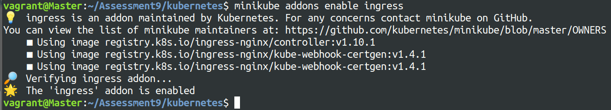

Verify the Kubernetes cluster is functioning correctly and ingress-nginx addon is installed correctly.
> `kubectl get pods -n ingress-nginx`

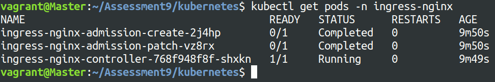

#### 2. Deploy Static Web App:
Create index.html file to display the simple message
```
<!DOCTYPE html>
<html>
<head>
    <title>My Website</title>
</head>
<body>
    <h1>Welcome to my website!</h1>
    <p>Here is your apple</p>
</body>
</html>
```

Create a Dockerfile to create an nginx image to host the above index.html file
```
FROM nginx:latest
COPY index.html /usr/share/nginx/html
EXPOSE 80
```

Build Docker image from the Dockerfile we have created using below cmd<br>
>docker build -t chirag1212/nginx-webapp:apple .

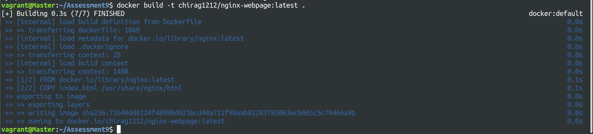

Now push the images generated to the docker hub<br>
>docker push chirag1212/nginx-webpage:apple

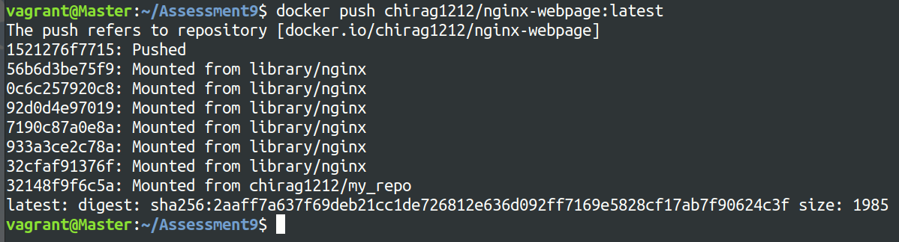

#### 3. Kubernetes Deployment:

Create two kubernetes deployment frontend-deployment and another-deployment and the respective yaml files are below
```
apiVersion: apps/v1
kind: Deployment
metadata:
  name: frontend-deployment
spec:
  selector:
    matchLabels:
      app: frontend
  replicas: 2
  template:
    metadata:
      labels:
        app: frontend
    spec:
      containers:
      - name: frontend
        image: chirag1212/nginx-webpage:apple
        ports:
        - containerPort: 80
```

**Same for the another-deployment just change the image and app name**

For the respective deployment, created two services named frontend-service and another-service and the yaml files are shown below
```
apiVersion: v1
kind: Service
metadata:
  name: frontend-service
spec:
  selector:
    app: frontend
  ports:
  - protocol: TCP
    port: 80
    targetPort: 80
```
**Same for the another-service just change selector name**

Apply the deployment and service manifests to the Kubernetes cluster.
>kubectl apply -f frontend-deployment.yaml<br>
>kubectl apply -f another-deployment.yaml<br>
>kubectl apply -f another-service.yaml<br>
>kubectl apply -f frontend-service.yaml

To check that all the deployments is successful run the below command<br>
>kubectl get all

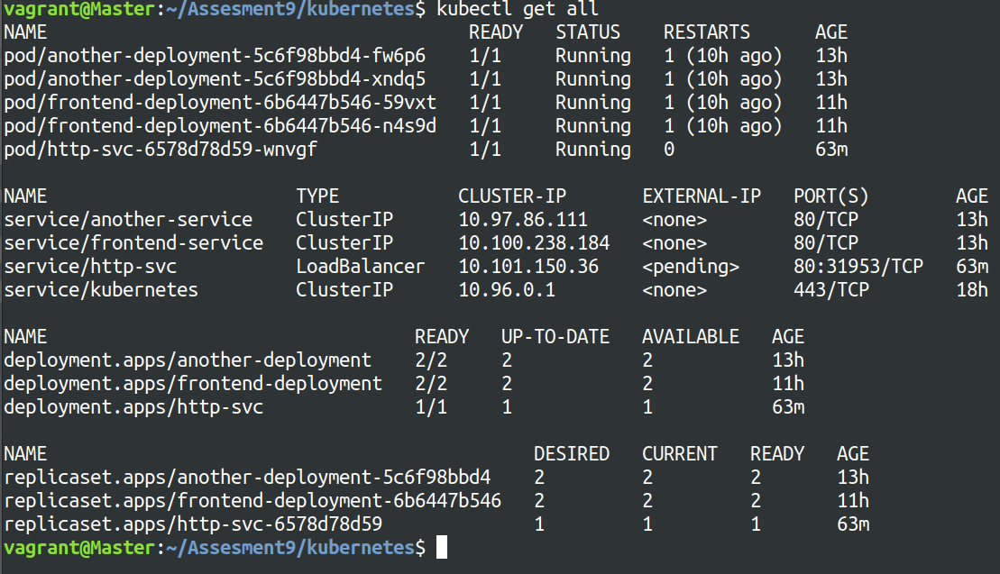

## Stage 2: Configuring Ingress Networking
#### 1. Install and Configure Ingress Controller:
Install an ingress controller (e.g., Nginx Ingress Controller) in the Minikube cluster.

`git clone https://github.com/nginxinc/kubernetes-ingress.git --branch v3.6.1.`

Verify the ingress controller is running and accessible.

`kubectl describe ingress`

#### 2. Create Ingress Resource:
create the ingress-resource.yaml file to route traffic to the web application.

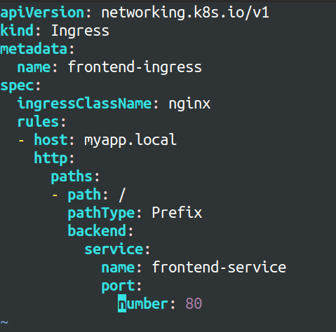

Now we add the ip address of minikube to the `/etc/hosts` file to be able to curl the nginx service  running in the pods

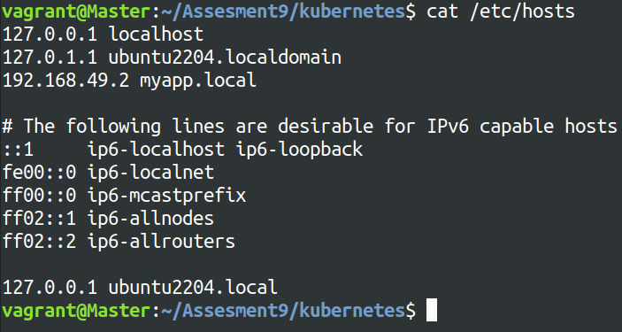

Adding the ingress rules to route the request based on the paths user are trying to access the service. Changed the previous ingress-resource.yaml file and added 2 path ‘/apple’ and ‘/orange’ and based on that ingress redirects to respective service.

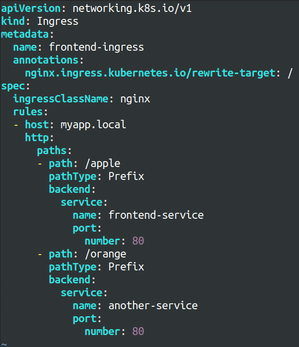

Now apply and verify the changes made to cluster<br>
>kubectl apply -f ingress-resource.yaml
>kubectl get all

when we curl the curl http://myapp.local/apple we get below output
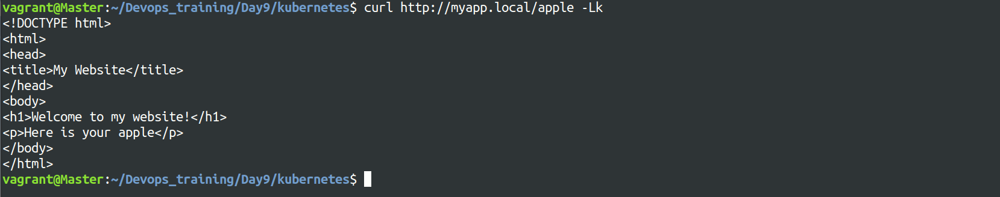

**& for http://myapp.local/orange** we get this
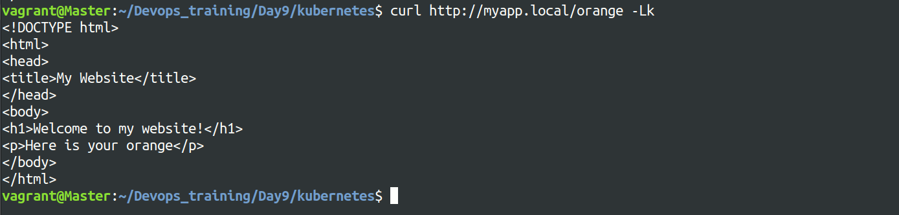

now to sercure the web application more securly we can use TLS certificate to secure the communictaion between the server and client. so to implement TLS termination first we have to create tls certificate and tls key. Creating TLS command using below command
>openssl req -x509 -sha256 -nodes -days 365 -newkey rsa:2048 -keyout tls.key -out tls.crt -subj "/CN=nginxsvc/O=nginxsvc"

it will give 2 files `tls.crt` and `tls.key`
Now create the secret for tls certificate and key using below command
>kubectl create secret tls tls-secret --cert=tls.crt --key=tls.key

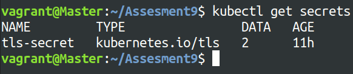

Enable sticky sessions to ensure that requests from the same client are directed to the same backend pod and to enable sticky session update the ingress-resource file and the annotations for sticky session in metadata.
```
annotations:
    nginx.ingress.kubernetes.io/rewrite-target: /
    nginx.ingress.kubernetes.io/ssl-redirect: "true"
    nginx.ingress.kubernetes.io/affinity: "cookie"
```
To verify that sticky session is established use the below command<br>
>curl -I https://myapp.local/apple -Lk

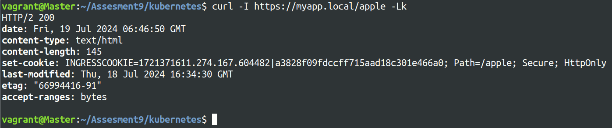

## Stage 3: Implementing Horizontal Pod Autoscaling
#### 1. Configure Horizontal Pod Autoscaler:
First enable metrics-server in minikube using below command<br>
>minikube addons enable metrics-server<br>

then to create the hpa autoscaler for both the deployments i.e. for frontend-deployment and another-deployment use the below command<br>

>kubectl autoscale deployment frontend-deployment --cpu-percent=50 --min=2 --max=5<br>
>kubectl autoscale deployment another-deployment --cpu-percent=50 --min=2 --max=5<br>
>kubectl get hpa

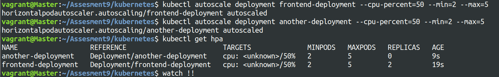

Set thresholds for minimum and maximum pod replicas and to set thresholds for both the pods edit the deployment file of respective deployment and add the below resources

```
resources:
   requests:
      cpu: 1m
      memory: 2Mi
kubectl get all
```

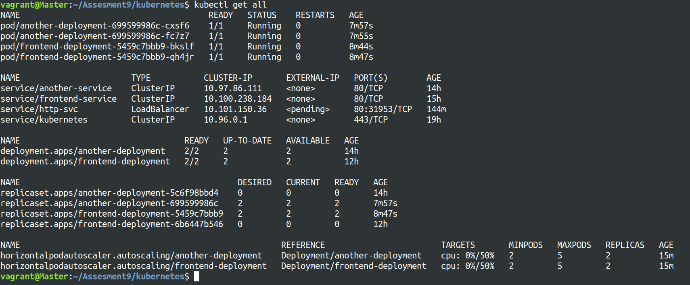

#### 2. Stress Testing:
Perform stress testing to simulate traffic and validate the HPA configuration. and to see how the autoscaler reacts to increased load run the below command to create the load-generator pod and open the sh terminal<br>

>kubectl run -i --tty load-generator --rm --image=busybox:1.28 --restart=Never -- /bin/sh <br>

then enter the below command in the terminal to send the multiple requests to the website<br>
>while sleep 0.01; do wget -q -O- http://myapp.local/apple; done

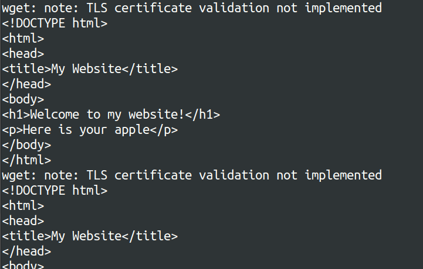

Monitor the scaling behavior and ensure the application scales up and down based on the load.
Use the `watch kubectl get all -o wide` command to monitor the behavior of 2 hpa autoscalers.

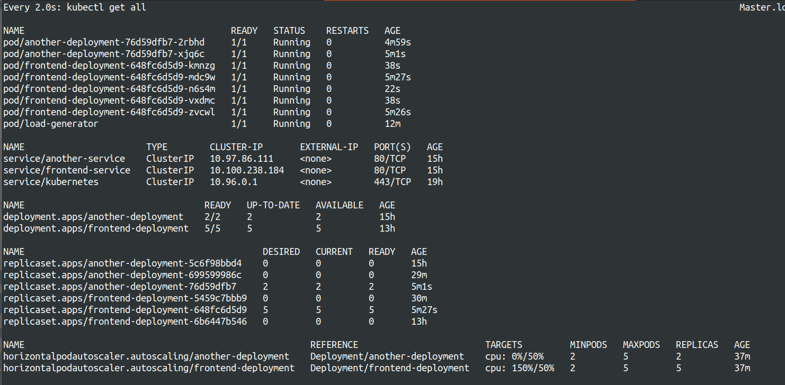

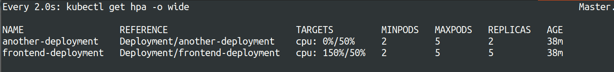

## Stage 4: Cleanup

for cleanup use the below commands
```
kubectl get all
kubectl delete all --all -n frontend
kuebctl delete all --all -n another
minikube delete
```