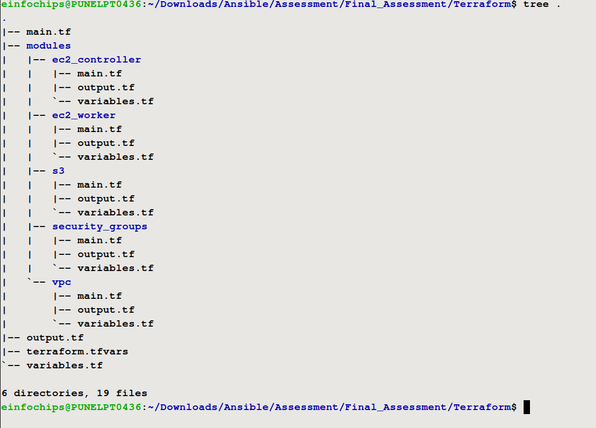
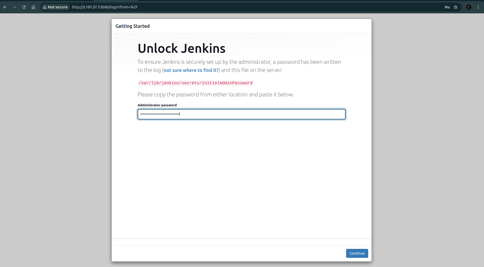

# Modular E-Commerce Application Deployment with S3 Integration

## Project Overview

In this project, participants will deploy a modular e-commerce application using AWS services and DevOps tools. The application will be set up to fetch static assets from an S3 bucket. Participants will use Terraform to manage infrastructure as code with modularization, Docker for containerization, Kubernetes for orchestration, and Helm for deployments. The goal is to create a scalable, maintainable solution that integrates various AWS services and DevOps practices.

## Project Objectives

### Link to Fruitables Website Github Repo => https://github.com/TankChirag-1212/final-Task

1. **Modular Infrastructure:** Use Terraform to create and manage modular infrastructure components.
2. **Static Asset Storage:** Store and fetch static assets from an S3 bucket.
3. **Containerization:** Package the application using Docker.
4. **Orchestration:** Deploy the application on Kubernetes.
5. **CI/CD Pipeline:** Automate the build and deployment process using Jenkins.
6. **Configuration Management:** Use Ansible for configuration management.
7. **Deployment:** Deploy the application using Helm charts.
8. **AWS Resources:** Utilize AWS EC2 free tier instances for deployment.

## Project Tasks and Timeline

### 1. Set Up AWS EC2 Instances (30 Minutes)
- Launch three EC2 instances of type `t2.micro` [1 master node(t2.medium), 2 worker nodes] within the free tier.


- Configure security groups to allow necessary ports (e.g., 22 for SSH, 80 for HTTP, 443 for HTTPS).


- SSH into the instances and prepare for Kubernetes installation.
> **Controller Node =>** <br>


> **Worker Node 1 =>**<br>


> **Worker Node 2 =>**<br>


### 2. Create and Configure S3 Bucket (30 Minutes)
- Create an S3 bucket to store static assets (e.g., product images, stylesheets).


- Upload sample static files to the S3 bucket.


- Configure bucket policy to allow read access for the application.


### 3. Set Up Kubernetes Cluster (60 Minutes)
- **On Master Node:**
  - Install Kubeadm, Kubelet, and Kubectl.
  - Initialize the Kubernetes cluster using Kubeadm.
  - Set up a network plugin (e.g., Calico, Flannel).
  
  
- **On Worker Nodes:**
  - Join worker nodes to the master node.

- **Verify Cluster:** Deploy a sample application (e.g., Nginx) to ensure the cluster is functional.


### 4. Modularize Infrastructure with Terraform (60 Minutes)
- **Create Terraform Modules:**
  - **Network Module:** Define VPC, subnets, and security groups. [VPC Module](Terraform/modules/vpc/main.tf), [Security Groups Module](Terraform/modules/security_groups/main.tf)
  - **Compute Module:** Define EC2 instances for Kubernetes nodes. [EC2-Master](Terraform/modules/ec2_controller/main.tf), [EC2-Worker](Terraform/modules/ec2_worker/main.tf)
  - **Storage Module:** Define S3 bucket for static assets. [S3 Module](Terraform/modules/s3/main.tf)

- **Main Configuration:** Create a `main.tf` file to utilize the modules and provision the entire infrastructure.
```bash
provider "aws" {
  region = "var.region_name"
}

module "ec2_controller" {
    source = "./modules/ec2_controller"
    ami = var.ami
    instance_type = var.controller_instance_type
    instance_name = var.controller_instance_name
    key_pair_name = var.key_pair_name
    public_subnet_id = module.vpc.pub_subnet_id
    security_group_id = module.security_group.controller_sg_id
}

module "ec2_worker" {
    source = "./modules/ec2_worker"
    ami = var.ami
    instance_type = var.worker_instance_type
    instance_name = var.worker_instance_name
    key_pair_name = var.key_pair_name
    public_subnet_id = module.vpc.pub_subnet_id
    security_group_id = module.security_group.worker_sg_id
}

module "vpc" {
  source = "./modules/vpc"
  vpc_cidr_ip = var.vpc_cidr_ip
  pub_subnet_cidr_ip = var.pub_subnet_cidr_ip
}

module "security_group" {
  source = "./modules/security_groups"
  my_vpc_id = module.vpc.my_vpc_id
}

module "s3" {
  source = "./modules/s3"
  bucket_name = var.bucket_name
}
```


- **Initialize and Apply:** Run `terraform init`, `terraform plan`, and `terraform apply` to provision the infrastructure.
> **terraform init =>**<br>


> **terraform plan =>** [plan.log](Terraform/logs/plan.log)<br>


> **terraform apply =>** [apply.log](Terraform/logs/apply.log)<br>


### 5. Containerize the Application with Docker (60 Minutes)
- **Dockerfile:** Write a Dockerfile for the e-commerce application.
```Dockerfile
# Use an official NGINX image as a base image
FROM nginx:alpine

# Set the working directory inside the container
WORKDIR /usr/share/nginx/html

# Copy all website files from the current directory on your host to the container
COPY . .

# Expose port 80 to allow access to the web server
EXPOSE 80

# Start NGINX server
CMD ["nginx", "-g", "daemon off;"]
```

- **Build Docker Image:** Build Docker images using the Dockerfile.


- **Push to Registry:** Push Docker images to a Docker registry (e.g., Docker Hub, Amazon ECR).


### 6. Configure Ansible for Application Deployment (30 Minutes)
- **Ansible Playbooks:** Write playbooks to configure Kubernetes nodes and deploy the application.


> Ansible Files => 
> - [Playbook.yml](Ansible/deploy.yaml)
> - [Dynamic inventory](Ansible/aws_ec2.yaml)
> - [roles/k8s_master/task/main.yml](Ansible/roles/k8s_master/tasks/main.yml)
> - [roles/k8s_nodes/task/main.yml](Ansible/roles/k8s_nodes/tasks/main.yml)
> - [roles/k8s_worker/task/main.yml](Ansible/roles/k8s_worker/tasks/main.yml)

- **Test Playbooks:** Run Ansible playbooks to ensure correct configuration.


- **Setup of Kubernetes** using Ansible in the master and 2 worker nodes


### 7. Set Up Jenkins for CI/CD (60 Minutes)
- **Deploy Jenkins:** Deploy Jenkins on Kubernetes using a Helm chart.



- **Configure Pipeline:**
  - Create a Groovy pipeline script in Jenkins for CI/CD.
  - The pipeline should include stages for:
    - **Source Code Checkout:** Pull code from the Git repository.
    - **Build Docker Image:** Build Docker images from the Dockerfile.
    - **Push Docker Image:** Push Docker image to Docker registry.
    - **Deploy to Kubernetes:** Use Helm charts to deploy the Docker image to Kubernetes.

### 8. Deploy the Application with Helm (60 Minutes)
- **Create Helm Charts:** Define Helm charts for the e-commerce application deployment, including configuration to fetch static

> **terraform destroy =>** [destroy.log](Terraform/logs/destroy.log) <br>

